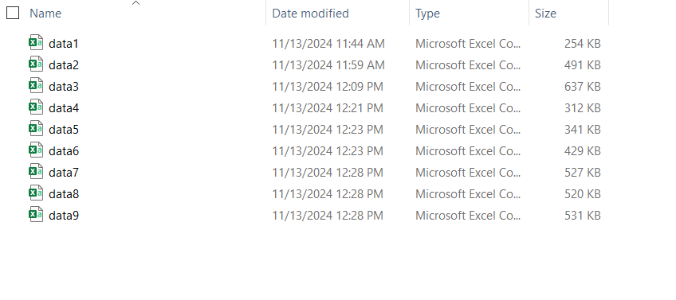
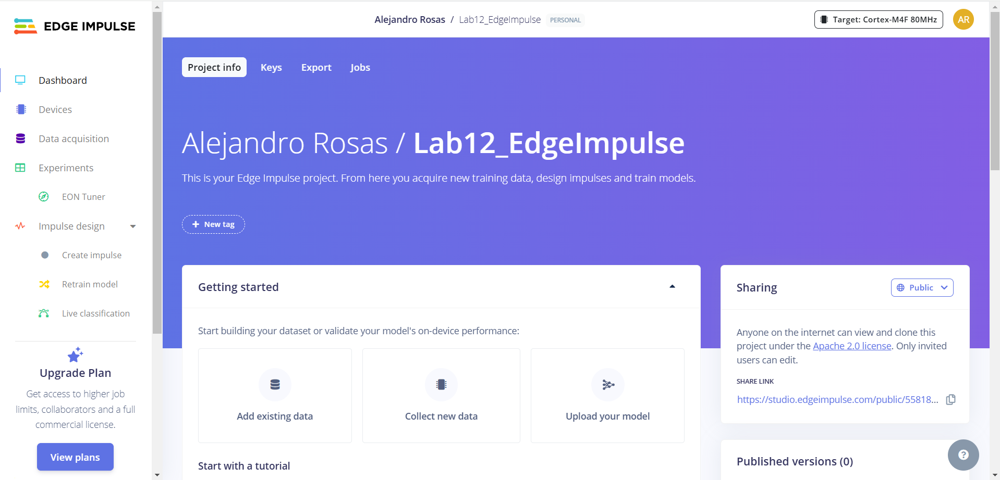
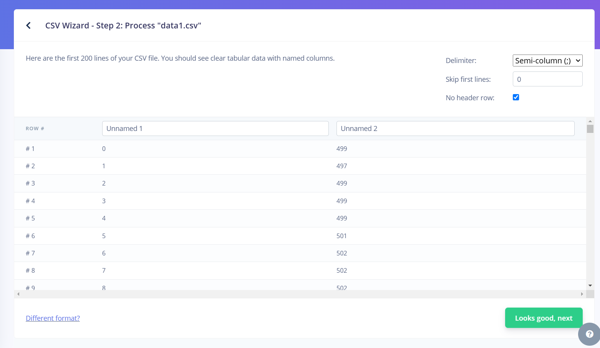
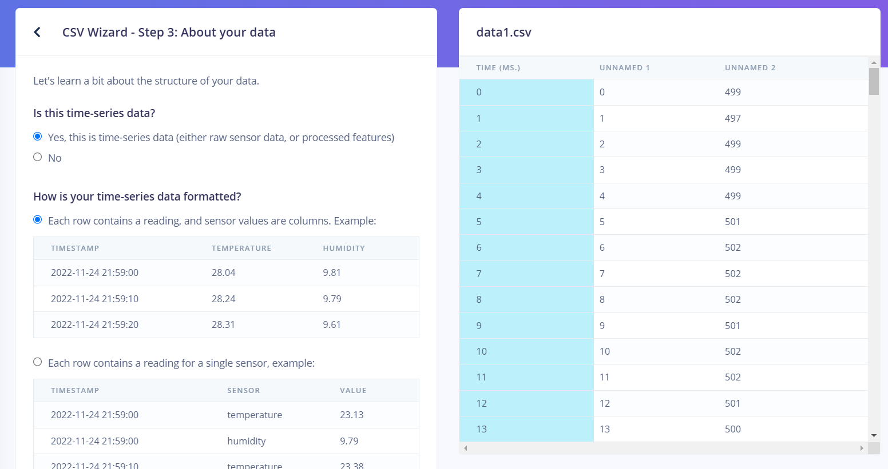
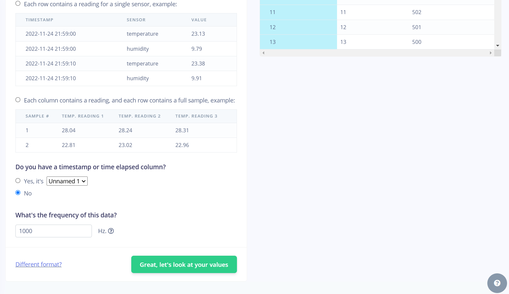
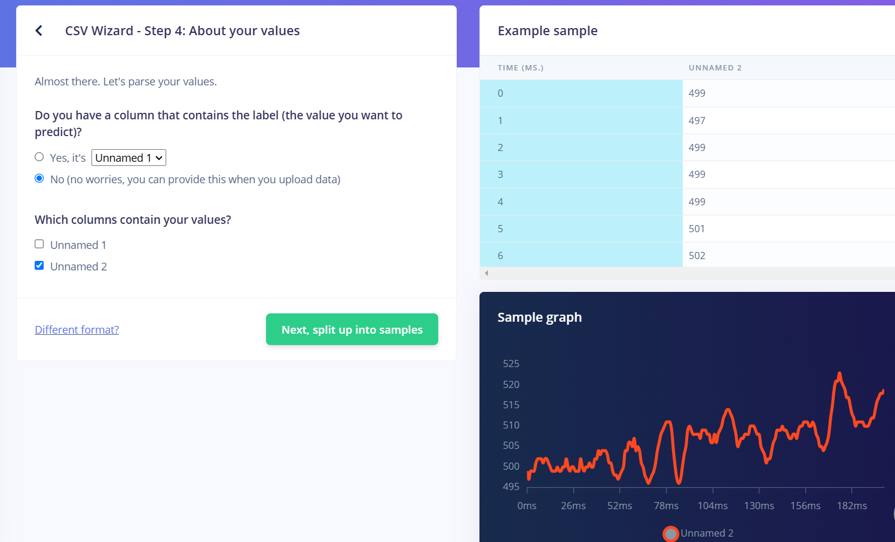
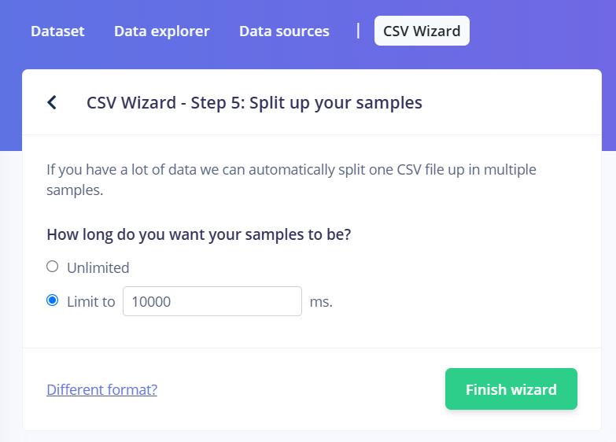
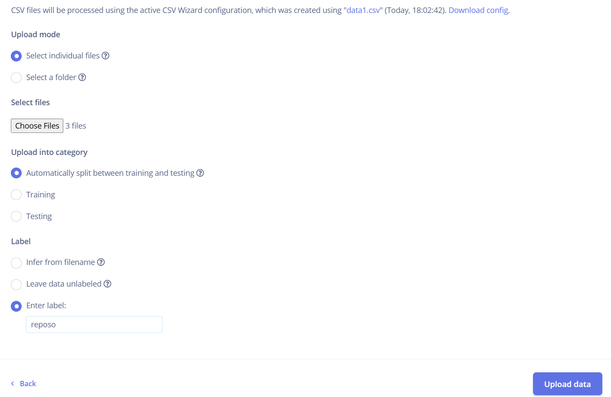
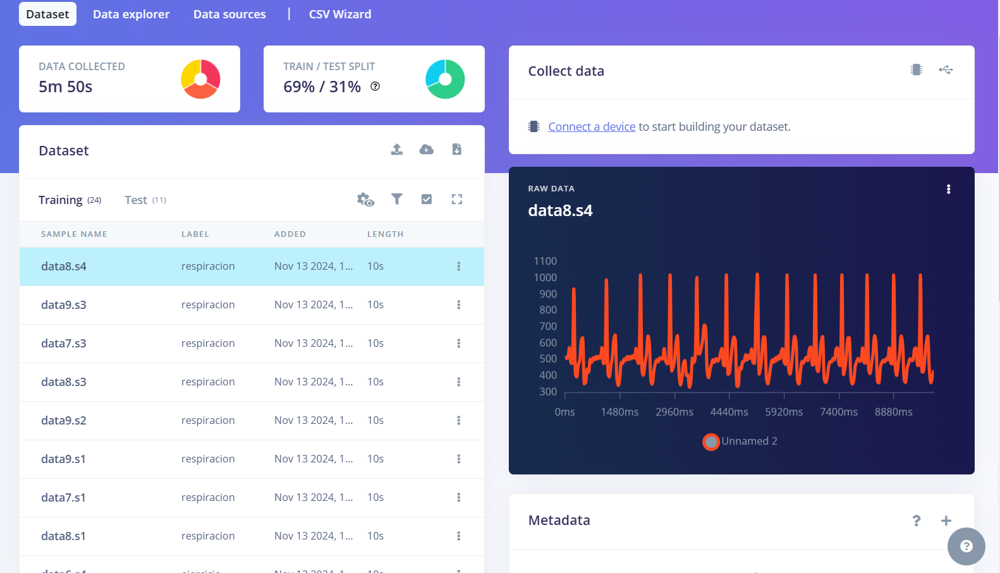

<p align=center style ="font-size:33px;"> 
<b> LAB 12: IMPORTACION DE DATA A EDGE IMPULSE </b>
 </p>

En el presente entregable, se describirá la metodología seguida para poder subir data a la plataforma Edge Impulse. La data que se subira será, en este caso, la obtenida en el Laboratorio 5, donde se extrajeron señales de ECG (3 derivadas bipolares) para tres estados en particular:

- Reposo
- Aguantando la respiración por 10 segundos
- Inmediatamente después de 5 minutos continuos de ejercicio predominantemente aeróbico.

La información de estas señales fue captada gracias al uso del Kit BITalino junto a sus electrodos. A continuación, se detallarán los pasos seguidos, desde la conversión de los archivos captados por el BITalino al formato adecuado para la subida, hasta el split de data entre *training* y *test*.

### **Conversión de archivos .txt a CSV**
La data obtenida del BITalino es guardada de forma automática en formato .txt. En ocasiones, este tipo de formato puede generar problemas al momento de subir a Edge Impulse, tal cual se vio durante el desarrollo de la sesión de laboratorio. Es debido a esto que como primer paso, se opto por convertir toda la data de .txt a .csv, formato el cual no presenta problema alguno para la subida.

Para la conversión, se implemento el siguiente código en forma de función. Este permite eliminar columnas y filas indeseadas para tener un .csv con solo la información pertinente.


```python
import numpy as np

def datos_a_CSV(data):
    # Abrir el archivo de texto
    with open(data, "r") as f:
        # Saltar las tres primeras líneas
        next(f)
        next(f)
        next(f)
        
        # Leer todas las líneas restantes
        all_data = f.readlines()   
    
    # Procesar cada línea, dividiendo por tabulaciones
    all_data = [line.strip().split('\t') for line in all_data]
    
    # Extraer la primera columna (muestra)
    sample = [int(row[0]) for row in all_data]  # Primera columna
   
    # Extraer la sexta columna (amplitud)
    amplitude = [int(row[5]) for row in all_data]  # Sexta columna (índice 5)
    amplitude = np.array(amplitude)

    with open("data1.csv", "w") as f: #Se puede cambiar el nombre data1 por cualquier otro, solo será el nombre del archivo .csv generado
        for s, a in zip(sample, amplitude):
            f.write(f"{s}; {a}\n") #Datos separados por ;
```

A continuación, se muestra un ejemplo de uso de la función. Asimismo, todos los archivos .csv obtenidos se encuentran en la carpeta *Datos en formato CSV*, dentro de la subcarpeta personal (*Alejandro*) de este laboratorio.


```python
datos_a_CSV("reposo1.txt") #reposo1.txt puede ser reemplazado por cualquier otro archivo .txt proveniente del BITalino.
```

En la siguiente imágen, podemos ver que se obtuvieron 9 archivos .csv, producto de que para cada uno de los 3 estados tenemos 3 derivadas. El que representa cada archivo se define por lo siguiente:

- data1 a data3: reposo, representando de la primera a tercera derivada (en ese orden)
- data4 a data6: ejercicio, representando de la primera a tercera derivada (en ese orden)
- data7 a data9: aguantar la respiración, representando de la primera a tercera derivada (en ese orden)

<div align="center">
  <p>

  **Figura 1: Archivos creados con la data**
  </p>
</div>
<br>

### **Creación de proyecto y configuraciones en Edge Impulse**
Teniendo ya la data convertida, se procedió a crear un nuevo proyecto en Edge Impulse llamado *Lab12_EdgeImpulse*. Se muestra una imagen del dashboard del proyecto.

<div align="center">
  <p>

  **Figura 2: Dashboard de Lab12_EdgeImpulse**
  </p>
</div>
<br>

Se configuro la subida y leída de archivos mediante la herramiente CSV Wizard de Edge Impulse. En primera instancia, se subio el archivo modelo para el CSV Wizard. Este archivo debe tener una disposición de los datos igual al resto de datos que serán subidos más adelante para que Edge Impulse sepa como leerlos y que data rescatar. Se configuro como separador (delimiter) al ";", ya que así se implemento el código de conversión del archivo de texto.

<div align="center">
  <p>

  **Figura 3: Configuración del separador y cabeceras**
  </p>
</div>
<br>

Posterior a esto, se configuro que la data era de series temporales, al igual que la frecuencia de muestreo de 1000 Hz (esta es la frecuencia con la que trabaja el BITalino). 

<div align="left">
  
  

  <p style="text-align: center;"><strong>Figura 4: Configuración de hecha en el paso 3 de CSV Wizard</strong></p>
</div>
<br>

Se selecciona la columna que contiene los datos en el CSV. En este caso, se selecciono la columna *Unnamed2* ya que esta contiene los valores de amplitud de la señal ECG.

<div align="center">
  <p>

  **Figura 5: Selección de columna de interés**
  </p>
</div>
<br>

Finalmente, para poder preservar la uniformidad de los datos, se opto por establecer una longitud para cada serie de datos. En este caso, se eligió que cada serie de datos tenga una longitud de 10 segundos.

<div align="center">
  <p>

  **Figura 6: Longitud de los segmentos de datos**
  </p>
</div>
<br>

A continuación, se muestra una imagen de la configuración ya terminada e implementada en el CSV Wizard.

<div align="center">
  <p>

  **Figura 7: Configuración finalizada en CSV Wizard**
  </p>
</div>
<br>

### **Subida de data**
Habiendo configurado el CSV Wizard, se realizó la subida de archivos. Se subieron los archivos en grupos de tres, donde cada grupo corresponde a un estado. Los 9 archivos no se suben en conjunto debido a que cada grupo de tres corresponde a un estado, por lo que tienen etiquetas diferentes. Se muestra en la imagen un ejemplo de la subida en conjunto de archivos bajo la misma etiqueta. Este proceso se hizo para la data de los otros dos estados restantes.

<div align="center">
  <p>

  **Figura 8: Subida de los tres archivos con data del estado en reposo**
  </p>
</div>
<br>

Al subir todos los archivos, se pudo apreciar que Edge Impulse separo correctamente la data en segmentos de 10 segundos de duración. No obstante, habia segmentos de menor longitud ya que la longitud total de las señales no siempre eran múltiplos de 10. Esto ocasiono que la data no estuviera correctamente distribuida entre *training* y *test*, sumado a que habia estados con más data que otros por la mayor cantidad de segmentos. Para solventar esto, se eliminaron los segmentos menores a 10 segundos, al igual que mover algunas señales entre *training* y *test* para lograr un balanceo adecuado. Finalmente, se obtuvo lo siguiente.

<div align="center">
  <p>

  **Figura 9: Dataset generado tras los ajustes adicionales**
  </p>
</div>
<br>

### **Enlace al proyecto de Edge Impulse**
Para poder visualizar al proyecto creado y al dataset, acceder al siguiente enlace: https://studio.edgeimpulse.com/public/558182/live
