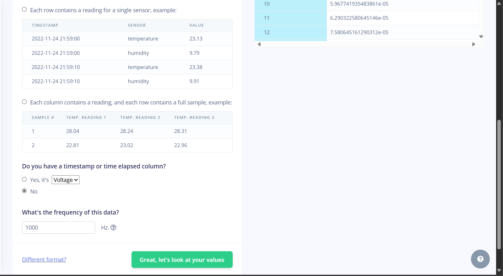

<p style="text-align: center; font-size: 1.5em;"><b>LABORATORIO 12: Edge Impulse - DataSet</b></p>

El presente laboratorio consiste en la recolección de dataset para entrenar, validar y probar un modelo de aprendizaje automático. Los datos recolectados son señales ECG, provenientes del laboratorio 5, obtenidas bajo las siguientes condiciones:

- Estado basal
- Conteniendo la respiración por 10 segundos
- Ejercicio intenso durante 5 minutos

Se utilizó el Bitalino para la adquisición de las señales, el archivo con la información es devuelta en formato .txt, por lo que es necesario convertirlo a .csv para que la herramienta CSV wizard pueda ser utilizada correctamente.

A continuación se detalla los pasos a seguir para ...:

### **PASO 1:** Conversión del Archivo **.txt** a **.csv**

<p style="text-align: justify;">
La información generada por el BITalino en un archivo .txt incluye datos que no son relevantes para nuestro análisis. Por lo tanto, ignoraremos las tres primeras líneas del archivo. Después, nos enfocaremos únicamente en la columna 6, correpondiente al índice 5. Esta columna contiene los valores de amplitud de la señal ECG expresados en bits.

Para interpretar correctamente estos datos, debemos convertir los valores de bits a voltaje. Esta conversión se basa en las especificaciones del conversor digital-analógico (DAC) del microcontrolador del BITalino, considerando el rango de bits utilizado y el voltaje de referencia del sistema. 
</p>


```python
import matplotlib.pyplot as plt 
import numpy as np

def read(archivo,Fs):
    #Esta función devuelve unicamente la amplitud de la señal contenida en el txt, la cual
    #Se encuentra en la 6 columna, index 5
    with open(archivo,"r") as senhal:
        next(senhal)
        next(senhal)
        next(senhal)
        senhal=senhal.readlines()
        amplitude=[]
        for linea in senhal:
            x=int(linea.split()[5])
            amplitude.append(x)   
        amplitude=np.array(amplitude) 
        amplitude=EmgToVoltage(amplitude)
    return amplitude

def EmgToVoltage(emg_signal, adc_resolution=10, v_ref=3.3, gain=1000, offset=1.65):
    
    # Número máximo que puede representar el ADC
    max_adc_value = 2**adc_resolution - 1
    
    # Conversión de la señal a voltios
    voltage_signal = (np.array(emg_signal) / max_adc_value) * v_ref
    
    # Restar el offset (centrar la señal en 0)
    adjusted_voltage_signal = voltage_signal - offset
    
    # Ajustar la ganancia del sensor EMG
    emg_voltage = adjusted_voltage_signal / gain
    
    return emg_voltage
```


Una vez que tenemos el .txt con la información relevante, ahora solo queda convertirlo a .csv, para ello, se utilizó la librería ***pandas***. Las señales que el grupo utilizó para el desarrollo de este laboratorio se encuentra en una carpeta llamada ***Señal_ecg***, se debe acceder a ella para obtener cada señal, y convertirla al formato que queremos. Se hace uso de bucle **for** y **diccionarios** para pasar todas las señales de manera rápida y automática.


```python
import pandas as pd

#Del Bitalino
Fs=1000

# Ruta del archivo .txt y nombre del archivo .csv de salida
#Creación de diccionarios con nombres y rutas, con la finalidad de evitar realizar cada conversión por separado
nombres_txt = {"basal":["R1","R2","R3"],"ejercicio":["derivada1","derivada2","derivada3"],"respiracion":["derivada1","derivada2","derivada3"]}
nombres_csv = {"basal":["DIBasal","DIIBasal","DIIIBasal"],
                "ejercicio":["DIEjercicio_","DIIEjercicio_","DIIIEjercicio_"],
                "respiracion":["DIRespiracion","DIIRespiracion","DIIIRespiracion"]}

#Rutas para acceder a cada carpeta
#Los .., indican que salimos de la carpeta dónde nos encontramos 
txtRuta = "../Señal_ecg/"
csvRuta = "ArchivosCSV/"

#Iterar por "keys"
for actividad in nombres_txt.keys():
    #Para facilitar el acceder a los elementos del diccionario nombres_csv
    contador = 0
    for derivada in nombres_txt[actividad]:
        ruta_completa = txtRuta+actividad+"/"+derivada+".txt" #Concatenamos la ruta  
        amplitude=read(ruta_completa,Fs)
        tabla = pd.DataFrame(amplitude)
        #Convertimos la data a CSV
        tabla.to_csv(csvRuta+nombres_csv[actividad][contador]+".csv",header=False, index=False)
        contador += 1
```

A continuación se muestran los archivos .csv creados
<div align="center">
  <p>

  **Figura 1: Archivos CSV generados**
  </p>
</div>
<br>


### **PASO 2:** Configurar CSV wizard

El CSV Wizard es una herramienta que facilita la importación y el procesamiento de datos en formato .csv dentro de Edge Impulse. Una vez configurado, los archivos que se suban siguen el mismo patrón definido durante la configuración del CSV Wizard. Esto garantiza que los datos sean interpretados correctamente por la plataforma y se asignen de manera adecuada a las características especificadas.

Los pasos se detallan en las siguientes imágenes:

<div align="center">
  <p>

  **Figura 2:** Subida del archivo de prueba.
  </p>
</div>
<br>

<div align="center">
  <p>

  **Figura 3:** Procesamos la información - label: Voltage.
  </p>
</div>
<br>

<div style="text-align: center;">
    <div style="display: flex; justify-content: center; gap: 20px;">
        
        
    </div>
    <p style="margin-top: 10px;"> 
    <b>Figura 4 y 5:</b> Detallamos las características de la señal. 
    </p>
</div>

<div style="text-align: center;">
    <div style="display: flex; justify-content: center; gap: 20px;">
        
        
    </div>
    <p style="margin-top: 10px;"> 
    <b>Figura 5 y 6:</b> Detallamos la columna que contiene la información. 
    </p>
</div>

<div align="center">
  <p>

  **Figura 7:** Definimos el tamaño de la ventana, en este caso 10s
  </p>
</div>
<br>

### **PASO 3:** Subimos las señales

En la opción de DATASET, nos dirigimos a la opción ***upload data***, esto nos abrirá una pestaña, dónde intuitivamente podemos subir los archivos. Asimismo, indicar que se pueden subir más de un archivo a la vez, por lo que estratégicamente, se optó por subir las señales correspondientes a cada actividad con su respectivo etiquetado.

<div style="text-align: center;">
    <div style="display: flex; justify-content: center; gap: 20px;">
        
        
    </div>
    <p style="margin-top: 10px;"> 
    <b>Figura 8 y 9:</b> Upload Data. 
    </p>
</div>

<div align="center">
  <p>

  **Figura 10:** Visualización de los archivos subidos.
  </p>
</div>
<br>

Una vez subido los archivos, notamos que la mayoría de las señales tienes una duración de 10 segundos, esto se debe a la configuración previa del CSV wizard, asimismo, parte de las señales se encuentran en la sección de **Training** (mayor parte) y la restante se encuentra en la sección de **Test**, dentro de estos encontraremos segmentos que son irrelevantes para el modelo, ya que son muy cortos, debido al ventaneo, es por ello que deben ser retirados.

<div align="center">
  <p>

  **Figura 10:** Segmento irrelevante.
  </p>
</div>
<br>

Para una mayor distinción entre actividades, se puede usar la herramienta filter para ver las señales de acuerdo a los parametros que se tomen.

<div align="center">
  <p>

  **Figura 10:** Función filter.
  </p>
</div>
<br>

Una vez que toda la información ha sido cargada en la plataforma, es fundamental asegurarse de que los porcentajes de datos destinados al entrenamiento y a la prueba cumplan con los requisitos establecidos para garantizar un entrenamiento adecuado del modelo. Para ello, se realiza una división (split) de las señales disponibles, asignándolas de forma manual, ya que inicialmente se designaron de manera automática a los conjuntos de entrenamiento y prueba. 

<div align="center">
  <p>

  **Figura 11:** Versión final.
  </p>
</div>
<br>

Una vez que se han alcanzado los valores adecuados para los porcentajes de datos destinados al entrenamiento y a la prueba, y se ha verificado que la distribución de las señales está equilibrada y representa todas las clases de manera adecuada, se puede considerar que el dataset está correctamente preparado y listo para su uso.

**Link:** https://studio.edgeimpulse.com/public/560010/live

<div align="center">
  <p>

  **Figura 12:** Vista General.
  </p>
</div>
<br>
