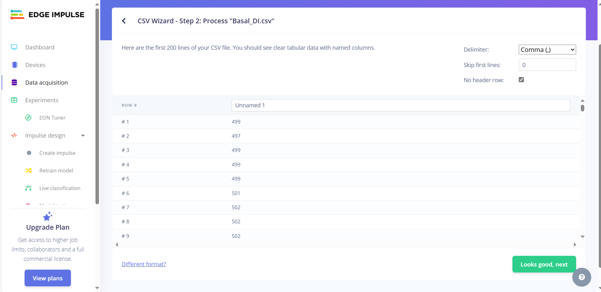
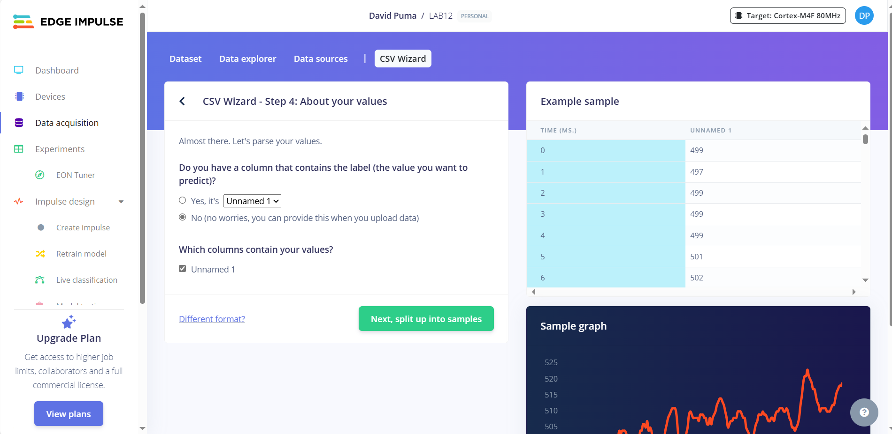

# LAB12: Importación de datos al *Edge Impulse* 

<br>

## Lista de contenidos:
1. **Lectura y creación de archivos .csv**  
2. **Edge Impulse: Configuración del CSV Wizard**
3. **Edge Impulse: Importación de datos**
4. **Link al Edge Impulse creado**

## Lectura de datos y creación de archivos .csv  
<div align="justify">
Se realizó la conversión de los datos de la señal obtenida mediante el BITalino en el laboratorio de obtención de datos de ECG. Estos datos estaban en formato .txt, por lo que era necesario la conversión a .csv.
</div>

<br>
<div aling="justify">
Se empleo la siguiente función para la obtención de la data relevante de la señal ECG:
</div>  

```python 
#Función para obtener la data relevante de los archivos txt
def obtener_dato_de_txt(archivo):
    datos = []
    marcador = False
    for linea in archivo: 
        if marcador: 
            datos.append(linea.rstrip().split("\t")[5])
        elif linea.rstrip() == "# EndOfHeader": 
            marcador = True
    return datos
```

<p align="justify">
Luego se realizó la conversión de cada archivo en formato .csv. Para esto se utilizó la librería pandas.
</p>

```python 
#Ejemplo de conversión de un archivo
import pandas as pd

with open("./Señal_ECG/respiracion/derivada3.txt","r") as archivo:
    data = obtener_dato_de_txt(archivo)
tabla = pd.DataFrame(data)
tabla.to_csv("./archivos_csv/Respiracion_DIII.csv",header=False, index=False)
```

## **Edge Impulse: Configuración del CSV Wizard**
<div align="justify">
Ahora, se ingresa a Edge Impulse y creamos nuestro proyecto. Entonces, para iniciar la importación, se ingresa a la opción de Data Acquisition. Luego se va a la opción de CSV Wizard y se realiza la configuración del CSV Wizard mediante la subida de un archivo guía.
</div>  <br>

<div align="center">
  
  <p>

  **Figura 1: Opción CSV Wizard. Subida del archivo Basal_DI**
  </p>
</div> <br>

<div align="justify">
Luego, se configuran las opciones de que la señal no presenta cabecera ni separadores.
</div>  <br>

<div align="center">
  
  <p>

  **Figura 2: Paso 2 de configuración**
  </p>
</div> <br>

<div align="justify">
El siguiente paso es configurar que la data es una serie temporal y la columna es solo de datos. También, se configura que la columna no es de tiempo y se inserta que la frecuencia de muestreo es de 1000 Hz.
</div>  <br>

<div align="center">
   
   

**Figura 3: Paso 3 de configuración**  
</div>
<br>

<div align="justify">
El siguiente paso es seleccionar manualmente la columna que contiene los datos de la señal.
</div>  <br>

<div align="center">
  
  <p>

  **Figura 4: Paso 4 de configuración**
  </p>
</div> <br>

<div align="justify">
El último paso de la configuración es segmentar la señal a 10 segundos.
</div>  <br>

<div align="center">
  
  <p>

  **Figura 5: Paso 5 de configuración**
  </p>
</div> <br>

## **Edge Impulse: Importación de datos** 
<div align="justify">
Después de realizar la configuración en CSV Wizard, se procede con la importación de los datos. Para realizar esto, nos redirigimos a la opción de Data Acquisition y Add Data. 
</div> <br>

<div align="center">
  
  <p>

  **Figura 6: Ventana para importar los datos**
  </p>
</div> <br>

<div align="justify">
Al intentar agregar los datos, aparece una ventana donde se tiene que seleccionar el archivo, agruparlo a entrenamiento o testeo y etiquetarlo.
</div> <br>

<div align="center">
  
  <p>

  **Figura 7: Ventana para la subida de archivos, agrupación y etiquetado**
  </p>
</div> <br>

<div align="justify">
Finalmente, se realizó la subida de los archivos de las 3 derivadas de cada grupo de la señal de ECG (basal, respiración y ejercicio). Además, se escogió la opción de agrupación de manera automática. De manera que se obtuvieron los siguientes resultados:
</div> <br>

<div align="center">
   
   

**Figura 8: Resultados finales**  
</div>
<br>

## **Link al Edge Impulse creado**
<div align="justify">
Link: https://studio.edgeimpulse.com/public/558232/live
</div> <br>