# Importación de datos al *Edge Impulse*  
  
<br>

## Lista de contenidos:
1. [**Lectura y creación de archivos**](#lectura-de-datos-y-creación-de-archivos-csv)  
2. [**Ajustes en CSV Wizard**](#edge-impulse-ajustes-en-csv-wizard)
3. [**Importación de datos**](#edge-impulse-importación-de-datos)
4. [**Ajustes adicionales**](#edge-impulse-ajuste-adicionales-de-la-data)
5. [**Enlace al Edge Impulse creado**](#enlace-al-edge-impulse-creado)


## Lectura de datos y creación de archivos .csv  
<div align="justify">
Se inicia con la obtención de datos del laboratorio de <b> obtención de datos de ECG</b>. Para este caso, la obtención de datos se realizó mediante <b>BITalino</b>. Por lo tanto, se obtuvieron datos en formato <i>.txt</i>:
</div>
  
<div align="center">
    <image src="imagenes/data_txt.png" alt="Señal de Basal, DI" width="450">
    <p><b>Figura 1: Señal obtenida del <b>BITalino</b>: Primera derivada en basal</b></p>
</div>  
<br>
<div aling="justify">
Por lo tanto, se emplea la siguiente función para la obtención de la data, ignorando las columnas no necesarias y los comentarios, se obtendrá una lista con solo la señal deseada:
</div>  

```python  
#Función para obtener datos del TXT
#solo la data de interés (la 5ta columna)
def obtener_dato_de_txt(archivo):
    datos = []
    marcador = False
    #empezar la lactura de los txt
    for linea in archivo: #por cada línea
        if marcador: #recién adjuntará datos al ser verdadero
            datos.append(linea.rstrip().split("\t")[5])
        elif linea.rstrip() == "# EndOfHeader":  #marcador será verdadero a partir la línea esa
            marcador = True #por lo tanto, solo nos devolverá los datos, sin los comentarios
    return datos
```    

<p align="justify">
Luego, para convertir cada archivo en formato <i>.csv</i>, se procederá a utilizar la librería <b>pandas</b>. Asimismo, para simplificar la tarea de convertir cada archivo de manera manual, se procederá a utilizar el siguiente código:
</p>
  
```python
import pandas as pd

# Ruta del archivo .txt y nombre del archivo .csv de salida
#Creación de diccionarios con nombres y rutas, con la finalidad de evitar realizar cada conversión por separado
nombres_txt = {"basal":["R1","R2","R3"],"ejercicio":["derivada1","derivada2","derivada3"],"respiracion":["derivada1","derivada2","derivada3"]}
nombres_csv = {"basal":["Basal_DI","Basal_DII","Basal_DIII"],
                "ejercicio":["Ejercicio_DI","Ejercicio_DII","Ejercicio_DIII"],
                "respiracion":["Respiracion_DI","Respiracion_DII","Respiracion_DIII"]}

#Rutas para acceder a cada carpeta
ruta_a_txts = "../Señal_ecg/"
ruta_a_csvs = "archivos_csv/"

#Iterar por "keys"
for gesto in nombres_txt.keys():
    #Para facilitar el acceder a los elementos del diccionario nombres_csv
    contador = 0
    for derivada in nombres_txt[gesto]:
        ruta_completa = ruta_a_txts+gesto+"/"+derivada+".txt"
        with open(ruta_completa,"r") as archivo:
            data = obtener_dato_de_txt(archivo) #extracción de datos
        tabla = pd.DataFrame(data)
        #conversión a CSV
        tabla.to_csv(ruta_a_csvs+nombres_csv[gesto][contador]+".csv",header=False, index=False)
        contador += 1

```  
<div align="center">
  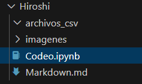
  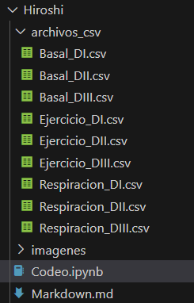
  <p>
  
  **Figura 2 y 3: Creación de archivos. Carpeta vacía (izquierda) y después de la creación de archivos CSV (derecha)"**
  </p>
</div> <br>
  
## **Edge Impulse**: Ajustes en CSV Wizard
<div align="justify">
Entonces, ingresamos a <a href="https://edgeimpulse.com/">Edge Impulse</a>. Ingresamos nuestra cuenta e ingresamos a la opción <b>Data Acquisition</b>. Para empezar, ingresamos a la opción <b>CSV Wizard</b> y subimos un archivo de guía:
</div>  <br>
  
<div align="center">
  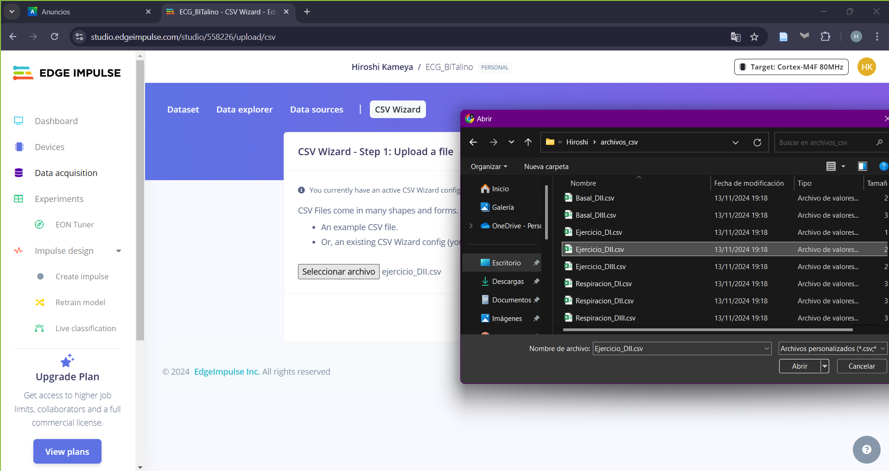

  <p>
  
  **Figura 4: Opción CSV Wizard. Subir un archivo como guía. En este caso, Ejercicio DII**
  </p>
</div> <br>
Luego, se procede a realizar los ajustes necesario:
<br>  
<div align="center">  

|Actividad a realizar|Imagen de referencia|
|:--:|:--:|
|En la opción <b>"delimeter"</b> escoger el separador del CSV. Asimismo, definir si el archivo tiene <b>cabecera</b>.<br> Para este caso, no se cuenta con separadores ni cabecera.|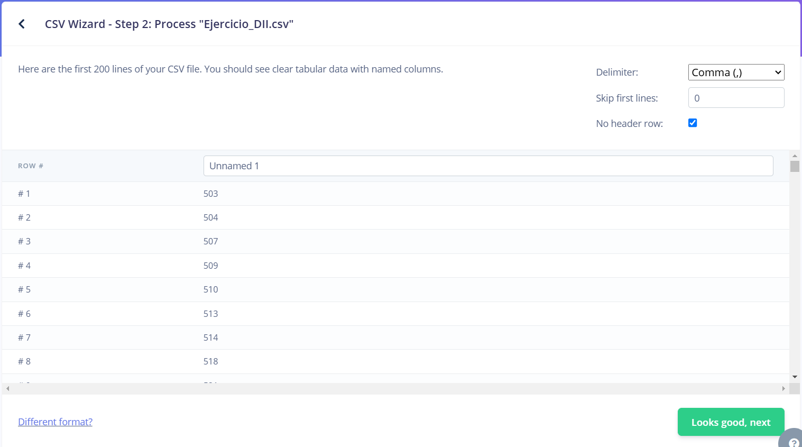|
|Al dar en siguiente, se debe establecer si es una <b>serie temporal o no</b>. De serlo, se debe definir si las columnas son solo valores, contiene el tipo de sensor u otro.<br> Para este caso, es una serie temporal y la columna es de solo datos.|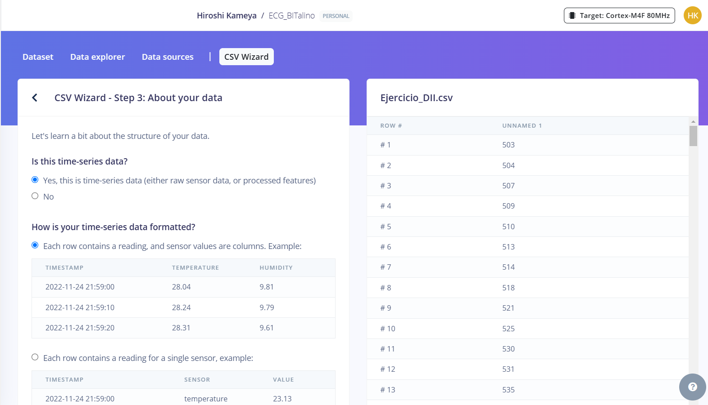| 
|Si se tiene una serie temporal, bajando se que definir si se tiene una <b>columna de tiempo</b>, también la <b>frecuencia</b>. Si se marca que no se cuenta con esa columna de tiempo, se creará una columna consistente a la frecuencia insertada.<br>Para este caso, no se cuenta con esa columna y la frecuencia de muestreo es de 1000 Hz.|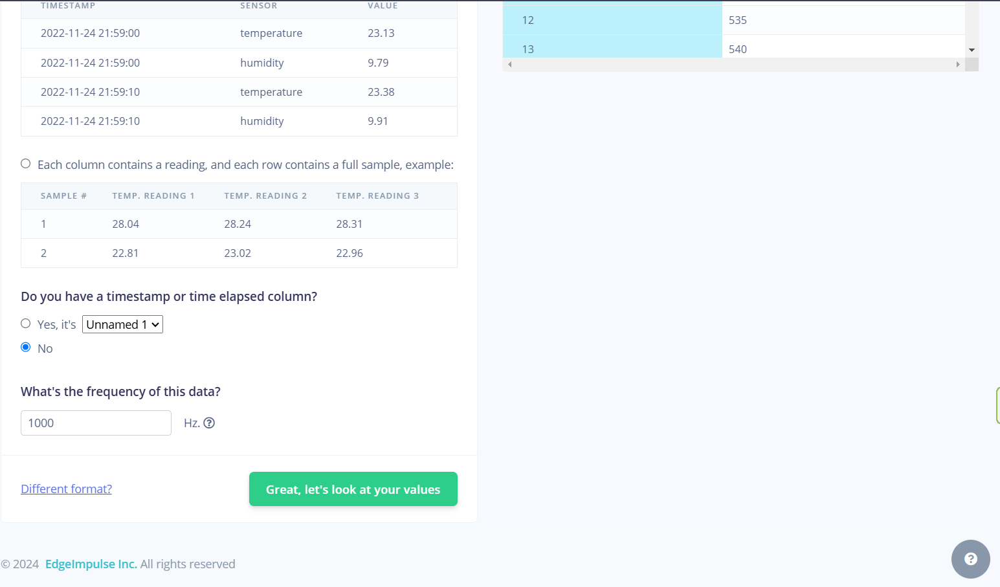| 
|En la siguiente opción, se tendrá que definir <b>las columnas en donde están los valores o señales de interés</b>. Puede ser una o varias columnas. Además, se puede visualizar la señal al lado derecho como tabla y en un gráfico. <br> Para este caso, debido a que arrojaba error, se eligió la opción "no" y se seleccionó manualmente la columna de la señal (columna 1).|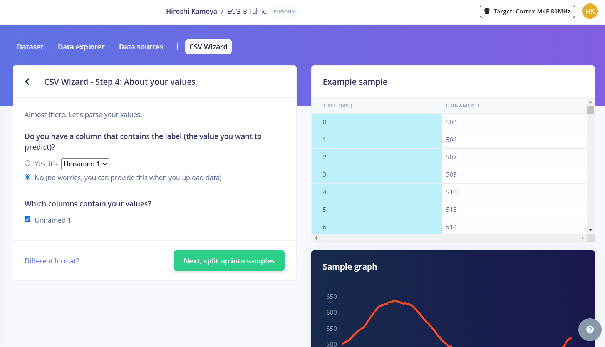|
|Finalmente, se tiene que definir si se desea <b>segmentar la señal</b>. Caso no se desea segmentar, se debe seleccionar la opción <i>"unlimited"</i>. Para este caso, se deseó segmentar a 10 segundos (10000 ms). Y con esto, se ha finalizado los ajustes necesarios del CSV Wizard. |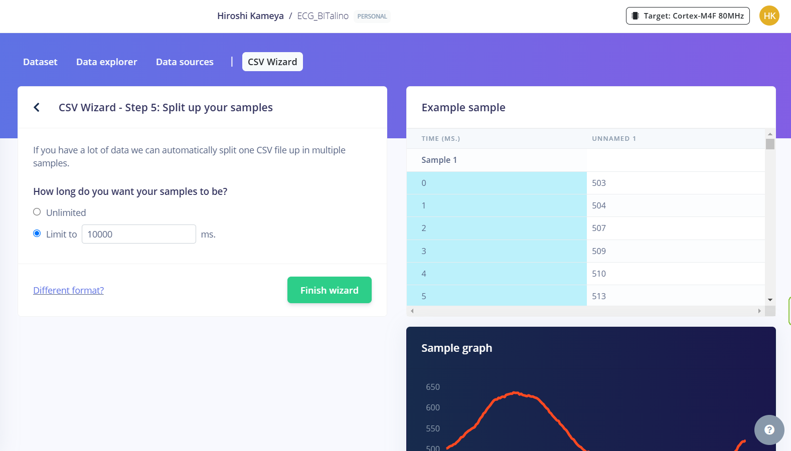|
</div>
<br>
  
## **Edge Impulse**: Importación de datos  
<div align="justify">
Luego de los ajustes en <b>CSV Wizard</b>, se procede con la importación de datos. Para esto, nos dirigmos a la opción <b>Data Acquisition</b> y <b>Add Data</b> (<i>Figura 5</i>). Se nos abrirá una opción en la que podremos elegir si subir datos locales o datos en la nube. Luego, se tendrá una ventana para subir los archivos, agruparlos para <b>entrenamiento o testeo</b> y colocar etiquetas (<i>Figura 6</i>).
</div>
<div align="center">
  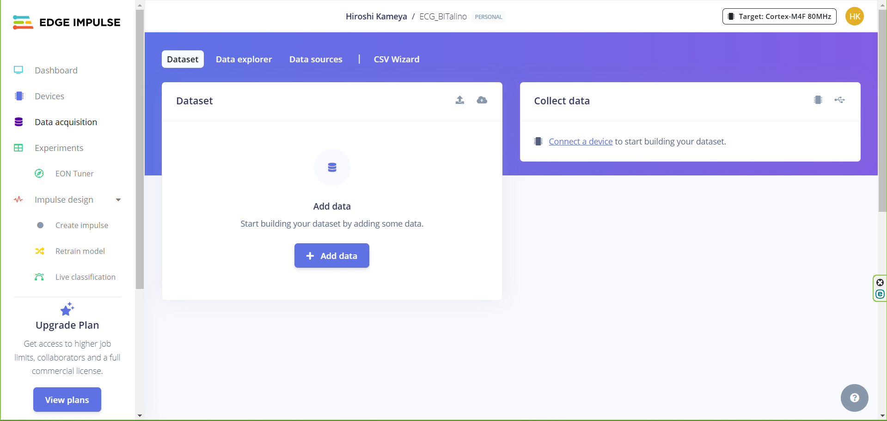

  <p><b>Figura 5: Pantalla de <i>Data Acquisition</i></b>
  </p>
</div><br>
<div align="center">
  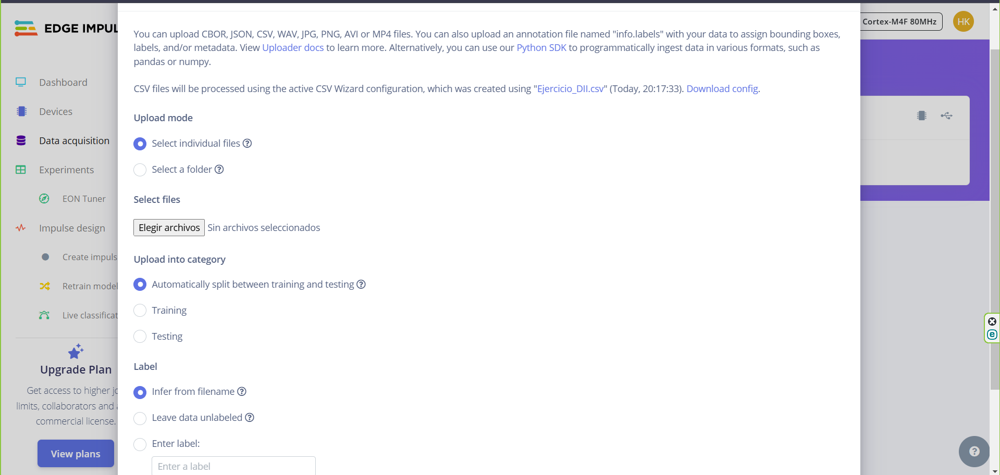

  <p><b>Figura 6: Ventana para la subida de archivos, agrupación y etiquetado</b>
  </p>
</div><br>
<div align="justify">
Para este caso, se procedió a importar la data por gesto y etiquetarlo de acuerdo al gesto realizado. Por ejemplo, importar los datos de <b>"Basal"</b> (las 3 derivadas) y etiquetarlas como <b>Basal</b> y así sucesivamente con las demás señales. Asimismo, se escogió la opción de agrupación (entrenamiento y prueba) de manera automática por comodidad.
</div><br>
<div align="center">
  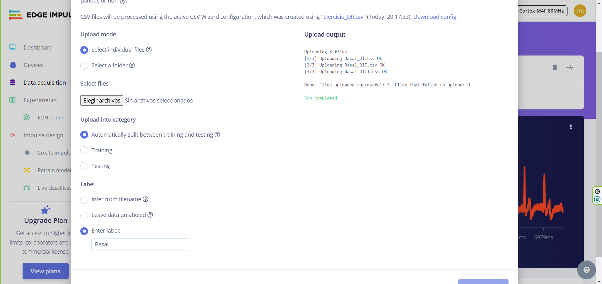

  <p><b>Figura 7: Subida de archivos exitosa. Selección de agrupación automática y definir etiquetas por gesto</b>
  </p>
</div><br>
  
## **Edge Impulse**: Ajuste adicionales de la data  
<div align="justify">
Para nuestro caso, la duración de la toma de datos por cada gesto no es uniforme (en algunos casos, la duración es muy elevada, comparada a los otros gestos), por ello, para obtener una uniformidad de datos por cada gesto, se seleccionará 30 segundos de data por cada gesto (en cada derivada). 
  
<br>
<div align="center">
  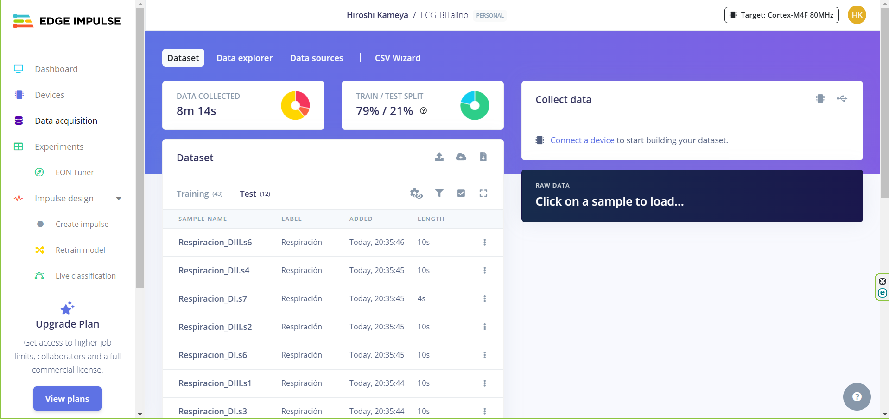

  <p><b>Figura 8: No uniformidad de data por gesto</b>
  </p>
</div><br>

Gracias a que se realizó una segmentación de datos (10 segundos), se procederá a obtener 3 segmentos de señal por cada derivada para cada gesto. Por lo tanto, por cada gesto se deberá tener 9 segmentos de señal (3 por cada derivada). Para ello, se procederá a eliminar los segmentos restantes.

<br>
<div align="center">
  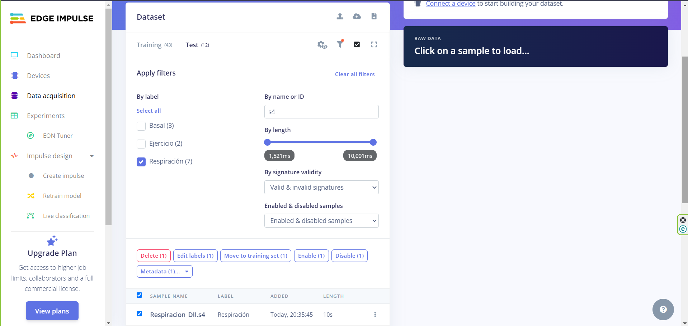

  <p><b>Figura 9: Eliminación de segmentos no deseados</b>
  </p>
</div><br>
Para realizar la eliminación de segmentos, se puede utilizar la opción de filtro, para obtener y eliminar las señales cuyas duraciones sean menores a 10 segundos (para mantener uniformidad de data por gesto) y segmentos restantes, por ejemplo, se procedió a mantener los 3 primeros segmentos de cada señal, por lo tanto, segmentos cuyos nombres no contengan s1,s2 ni s3, serán eliminadas.<br><br>
Finalmente, se deberá balancear los datos, con la finalidad de tener uniformidad tanto en el grupo de entrenamiento como en el de prueba (por ejemplo, 80% en entrenamiento y 20% en prueba, aproximadamente). Para ello, se tendrá que mover manualmente:  <br><br>

<div align="center">
  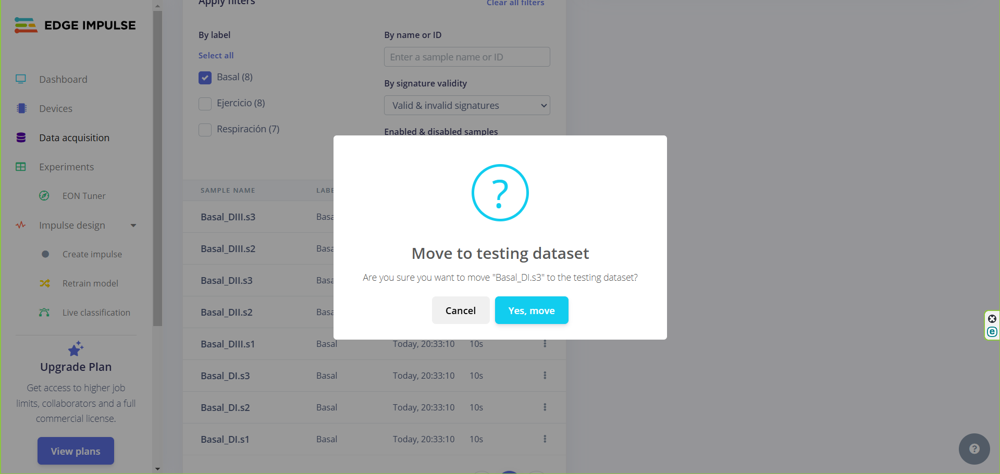

  <p><b>Figura 10: Mover datos para balancear los grupos</b>
  </p>
</div><br>
De esta manera, se deberá obtener estos resultados:  <br><br>
<div align="center">
  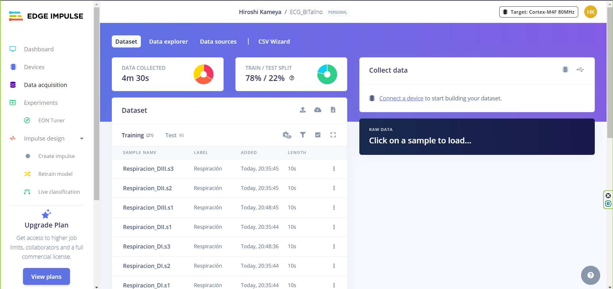
  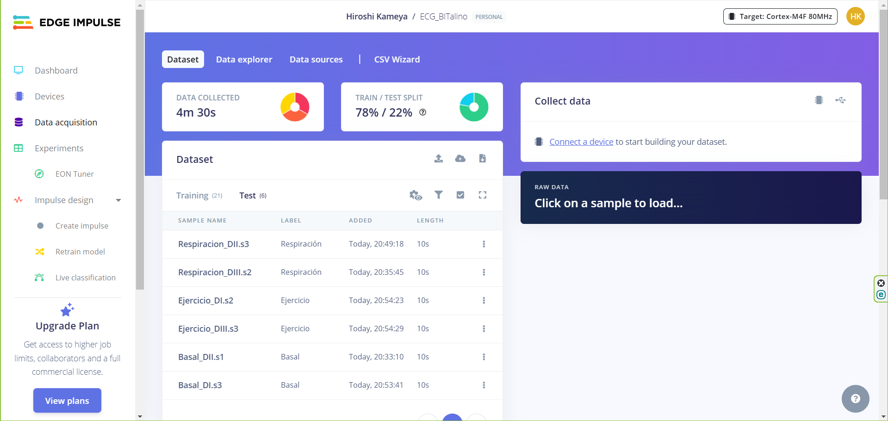
  <p><b>Figura 11 y 12: Data balanceada para el grupo de entrenamiento (izquierda) y para el grupo de testeo (derecha)</b>
  </p>
</div><br>
</div>
<br>

## Enlace al Edge Impulse creado:
<p align="justify">
Luego de haber realizado todo el procedimiento explicado a lo largo de este reporte, se hace entrega de los datos subidos al Edge impulse. Puede acceder mediante el enlace debajo o haciendo <a href="https://studio.edgeimpulse.com/public/558226/live">click aquí:</a><br>
https://studio.edgeimpulse.com/public/558226/live 
</p>

