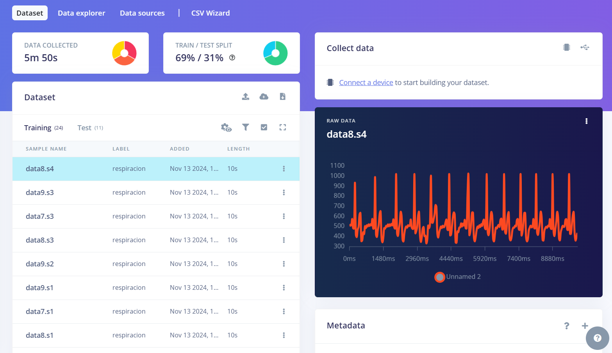
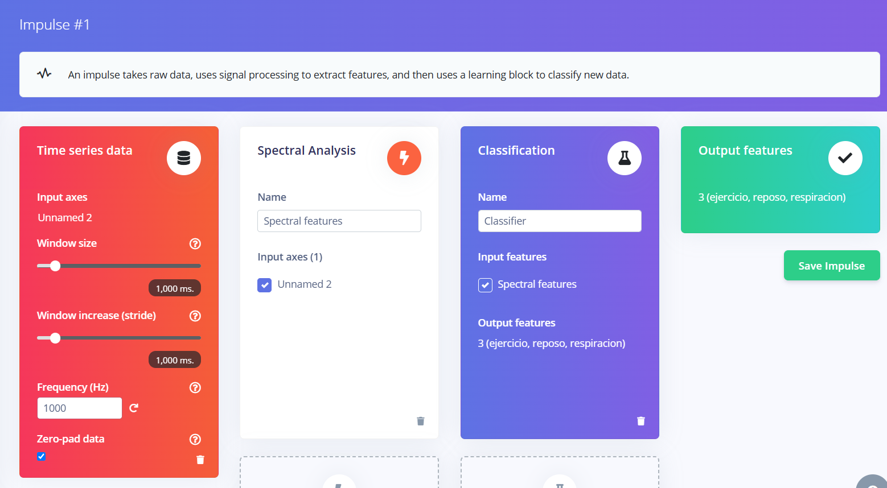
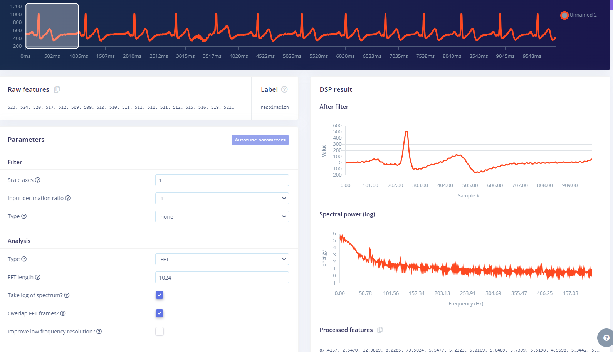
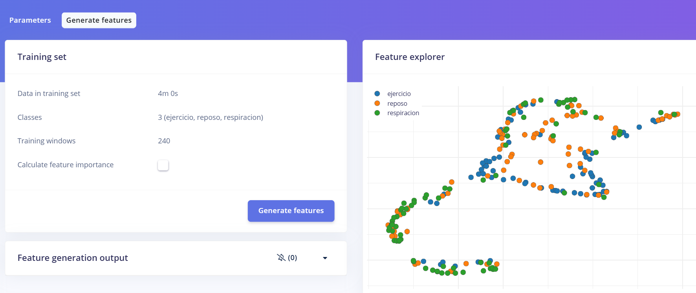
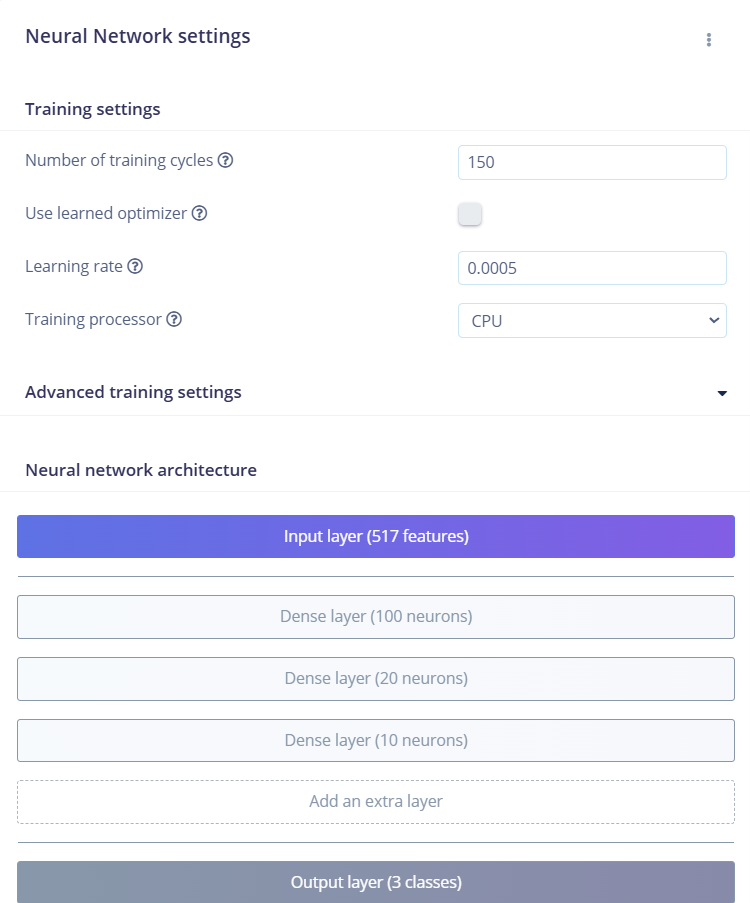
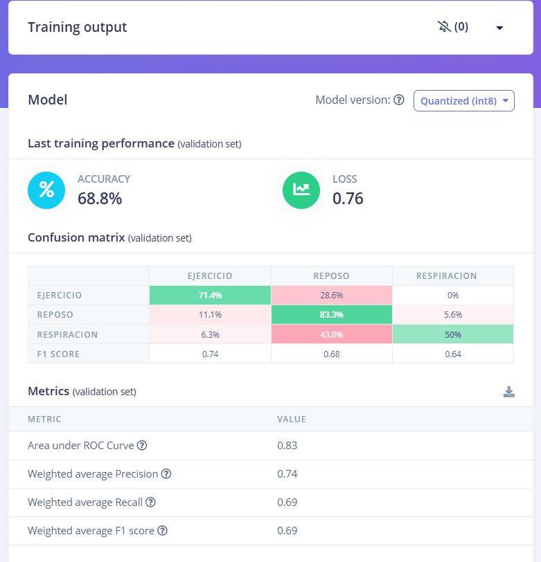
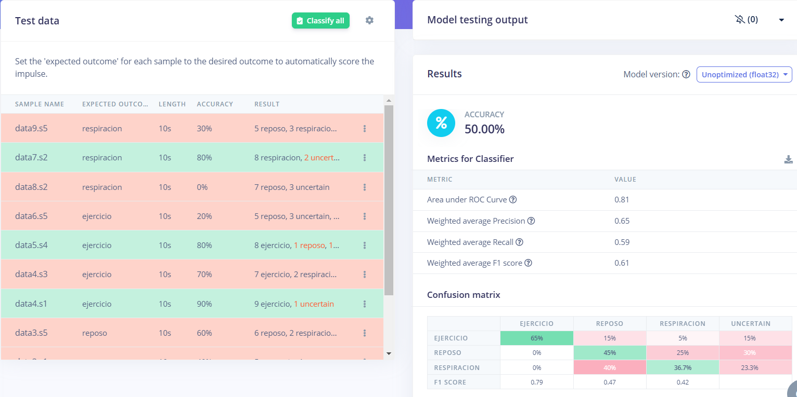

 
<b> LAB 13: IMPORTACION DE DATA A EDGE IMPULSE </b>
 

En el presente entregable, se describirá la metodología seguida para poder procesar la data que fue subida en el Laboratorio 12. Esta data será procesada por un algoritmo de aprendizaje que se implementa via Edge Impulse, donde podremos configurar ciertos parametros a traves de una intefaz amigable para el usuario. Recordemos que, para este caso, tenemos en nuestro dataset tres categorías de señales, las cuales corresponden a los siguientes estados:

- Reposo
- Aguantando la respiración por 10 segundos
- Inmediatamente después de 5 minutos continuos de ejercicio predominantemente aeróbico.

Los nombres para cada uno son *reposo*, *respiracion* y *ejercicio* respectivamente. 

  

  **Figura 1: Dataset creado en el Laboratorio 12**
  

 

### **Creación de un Impulso**
El primer paso para poder testear un algoritmo de aprendizaje mediante Edge Impulse es la creación de un Impulso. Este permite tomar la data subida en crudo, extraer las características mediante distintos métodos de procesamiento de señales y finalmente hacer uso de un bloque de aprendizaje para poder categorizar la información en base a las categorías definidas en el dataset.

A continuación, se muestra el Impulso creado. Nótese que se añadió el bloque de procesamiento *Spectral Analysis* y e bloque de aprendizaje *Clasification*. El bloque de procesamiento es el encargado de extraer las características de nuestra señal, trasladandola al dominio de la frecuencia, mientras que el bloque de aprendizaje, como se menciono anteriormente, será el que finalmente decida cual de los tres tipos de señal es.

  

  **Figura 2: Visualización del impulso creado junto a sus bloques**
  

 

Habiendo creado el impulso, el paso siguiente es configurar algunos parametros de los bloques.

### **Configuración de Spectral Features y Classifier**
En el aparto de *Spectral Features*, se configuraron ciertos valores para que el algoritmo tenga un punto de referencia acerca de cómo realizar el análisis. Entre los valores que se pueden configurar figuran dos grandes categorías: *Filter* y *Analysis*. Se optó por dejar *Filter* vacio para que la data trabajada sea tal cual la que se capto por el kit BITalino. Respecto a *Analysis*, se configuro que se aplique un análisis del tipo FFT, ya que al comparar con el análisis via wavelet, FFT obtenia mejor rendimiento. De igual manera, se establecio que el número de puntos de la FFT sea de 1024.

   

  **Figura 3: Valores establecidos para Spectral Features**
  

 

Esto nos dio la siguiente distribución de características en el *Feature explorer*.

   

  **Figura 4: Feature explorer en base a los valores establecidos anteriormente**
  

 

Pasando ahora a *Classifier*, en este apartado podemos establecer distintos parametros para la red neuronal que será la encargada de clasificar la información. Los parametros a destacar aquí son el número de ciclos de entrenamiento, la tasa de aprendizaje y la arquitectura neuronal. Respecto al número de ciclos de entrenamiento, se opto por elegir un valor ligeramente superior al default: se configuro el número de ciclos a 150. Respecto a la tasa de aprendizaje, se dejo en el valor por defecto de 0.0005. Finalmente, en cuanto a la arquitectura neuronal, se crearon tres capas densas para poder ir extrayendo las características. La primera capa es la de mayor cantidad de neuronas (100) ya que de esta forma podemos captar en gran medida las características generales al inicio. Las siguientes capas tienen un número considerablemente menor ya que a medida que avanzamos, se requiere mayor finura. Las características generales aprendidas en las capas iniciales ahora son sintetizadas para poder representar características específicas, por lo que lo adecuado sería un menor número de neuronas. 

Finalmente, aquí también podemos efectuar el entrenamiento del modelo.

  
  

  
<strong>Figura 5: Configuración de la red neuronal y los resultados del entrenamiento</strong>

 

Se puede ver que el modelo obtiene un accuracy de 68.8%, lo cual es relativamente bajo. Sin embargo, este problema entra dentro de lo esperado por la extensión limitada del dataset.

### **Testeo del modelo**
Habiendo culminado el entrenamiento del modelo, lo último sería realizar el testeo del modelo. Los resultados del testeo se pueden apreciar en *Model testing*, dentro del menú desplegable de *Impulse design*.

  

  **Figura 6: Resultados del testeo del modelo**
  

 

Vemos que para el testeo se obtuvo un accuracy de 50%, lo cual es aún más bajo que los resultados para el entrenamiento. Nuevamente, el factor limitante es la extensión del dataset, ya que una mayor cantidad de muestras pudo haber resultado en un mejor aprendizaje por parte de la red neuronal. Igualmente, otra configuración o combinación de parametros puedo haber ayudado a elevar el porcentaje. Pese a esto, es destacable el rendimiento de la red neuronal para tan poca data disponible, ya que las redes neuronales trabajan con miles de datos el momento de entrenarse.

Destaca que el modelo pudo identificar con mayor facilidad la data correspondiente a *ejercicio* (65%) cuando realmente pertenecia a esta categoría. Por otro lado, parece ser que la categoría que más se le dificulto detectar fue la de *respiracion*, lo cual se puede ver ya que hay un bajo porcentaje de acierto, en particular, el modelo le costo distinguir entre *respiracion* y *reposo*: error del 40%.

### **Enlace al proyecto de Edge Impulse**
Para poder visualizar el proyecto, acceder al siguiente enlace: https://studio.edgeimpulse.com/public/558182/live