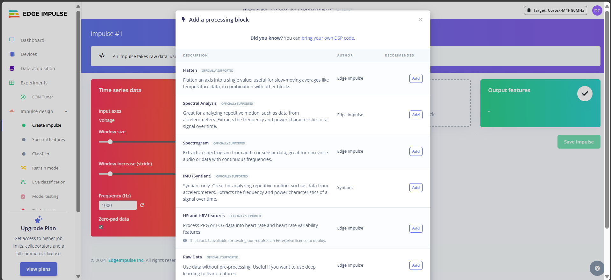
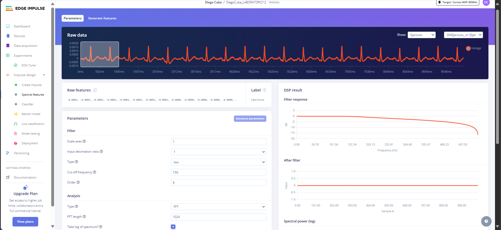
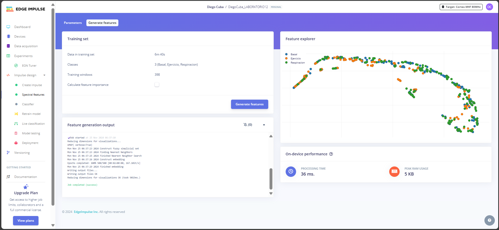
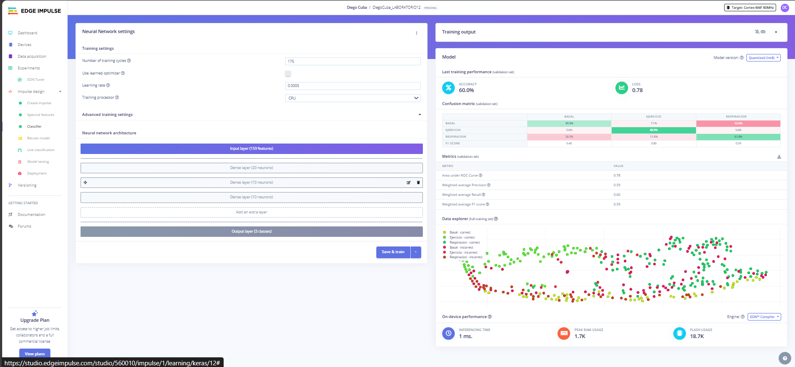

<b>LABORATORIO 13: Edge Impulse</b>

En este entregable se describirá la metodología utilizada para procesar los datos obtenidos en el Laboratorio 12. Estos datos serán analizados mediante un algoritmo de aprendizaje implementado a través de la plataforma Edge Impulse, que permite configurar diversos parámetros mediante una interfaz intuitiva y fácil de usar. Cabe destacar que, en este caso, el conjunto de datos contiene tres categorías de señales, las cuales corresponden a los siguientes estados:

- Estado Basal (Basal)
- Aguantando la respiración por 10 segundos (Respiración)
- Actividad física intensa (Ejercicio)

### Paso 1: Creación de un impulso

La creación de un impulso se refiere al proceso de diseñar y configurar un flujo de procesamiento de datos y un modelo de aprendizaje automático que se ajuste a un caso de uso específico. En terminos más sencillos, la creación de un impulso no es más que describir la combinación de pasos que permiten transformar datos en bruto (como señales brindadas por el bitalino) en predicciones útiles mediante un modelo entrenado.

  

  **Figura 1:** Creación de un impulso.
  

 

Con el dataset creado en el entregable pasado, procederemos a seleccionar los elementos de cada bloque

  

  **Figura 2:** Características Espectrales.
  

 

  

  **Figura 3:** Clasificación.
  

 

### Paso 2: Caracteristicas Espectrales

Se utilizó un filtro pasabaja con una frecuencia de corte de 150 Hz y de orden 6. Si bien los valores en la gráfica *After filter*, parece una función constante, sin embargo, esto se debe a que los valores de amplitud de la señal ECG procesada (voltaje), son muy pequeños, lo que da esa impresión. Asimismo, se utilizó la fft con 1024 puntos

  

  **Figura 4:** Parametros de las características espectrales.
  

 

  

  **Figura 5:** Generar características.
  

 

### Paso 3: Classifier

En este apartado, se establece los parametros para la red neuronal, el cual se encarga de clasificar la información, en este caso la señal de ECG. Los parametros a destacar aquí son el número de ciclos de entrenamiento, la tasa de aprendizaje y la arquitectura neuronal. Respecto al número de ciclos de entrenamiento se estableció el número de ciclos a 175. la tasa de aprendizaje, se mantiene en el valor por defecto de 0.0005. Finalmente, en cuanto a la arquitectura neuronal, se crearon tres capas densas para poder ir extrayendo las características. La primera capa contiene 20 neuronas, ya que de esta forma podemos captar en gran medida las características generales al inicio. Las siguientes capas tienen un número menor ya que a medida que avanzamos, se requiere mayor presición. Las características generales aprendidas en las capas iniciales ahora son sintetizadas para poder representar características específicas, por lo que lo adecuado sería un menor número de neuronas.

Finalmente, se efectua el entrenamiento del modelo.

  

  **Figura 6:** Modelo final.
  

 

## Conclusión

- Un 60% de precisión en el conjunto de validación indica que el modelo tiene un desempeño moderado, pero este no es suficiente como para considerarlo confiable en aplicaciones críticas.
- En la matriz de confusión, la categoría "Respiración" tiene el mejor desempeño, mientras que "Ejercicio" es la categoría más difícil de clasificar correctamente.
- Este modelo muestra potencial, pero requiere optimizaciones adicionales para mejorar su precisión y desempeño general. Podrías probar estas recomendaciones para lograr mejores resultados en la clasificación.

