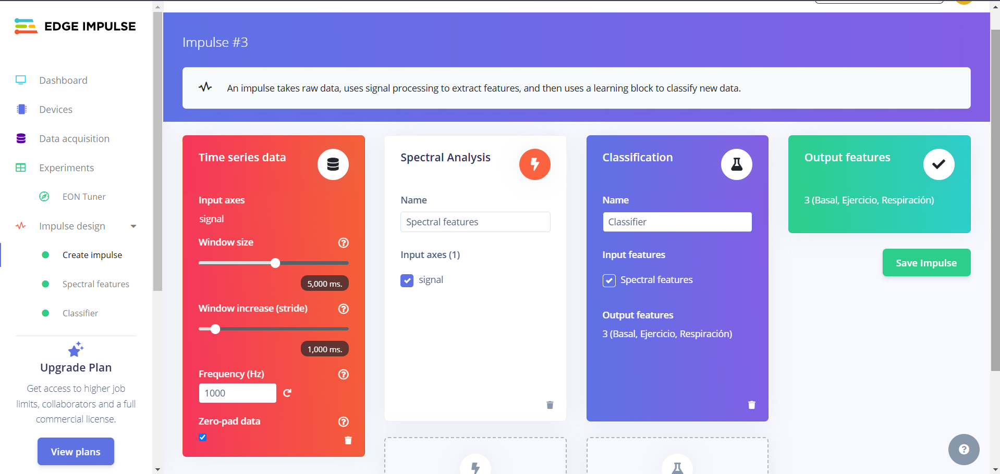
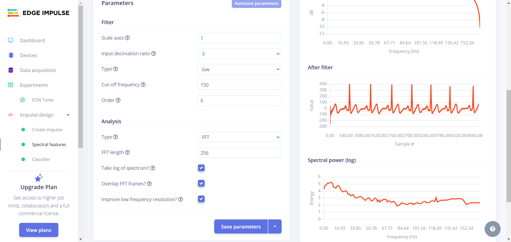
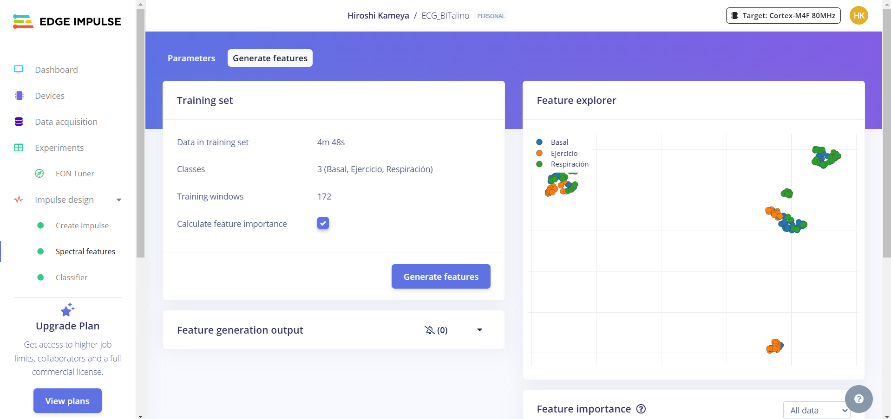
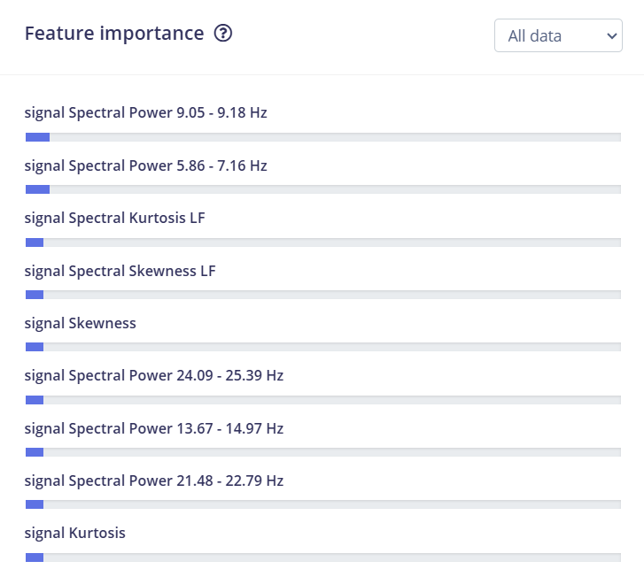
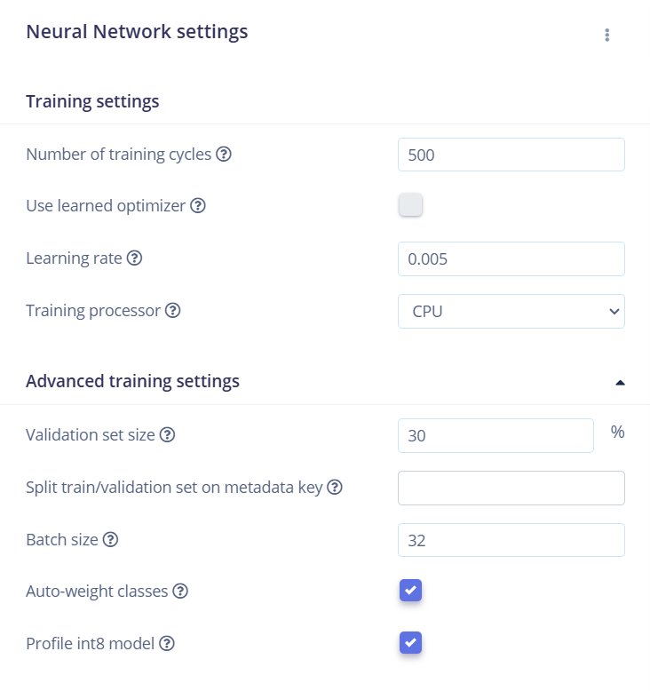
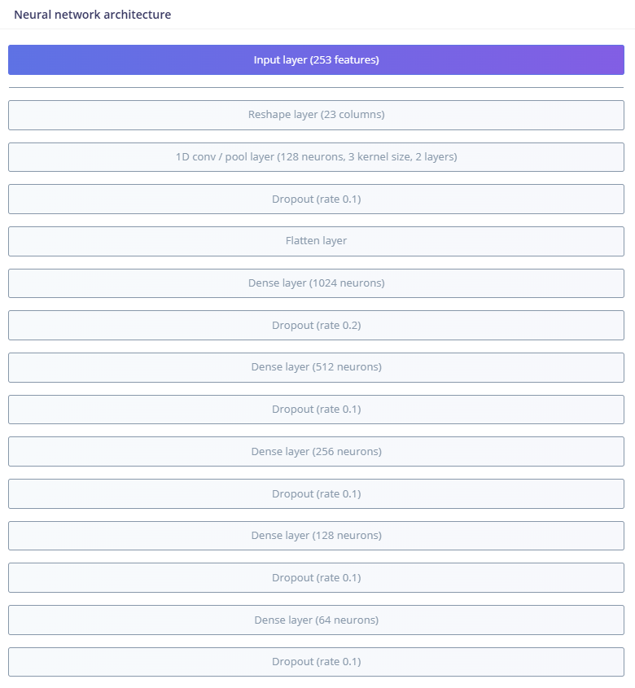
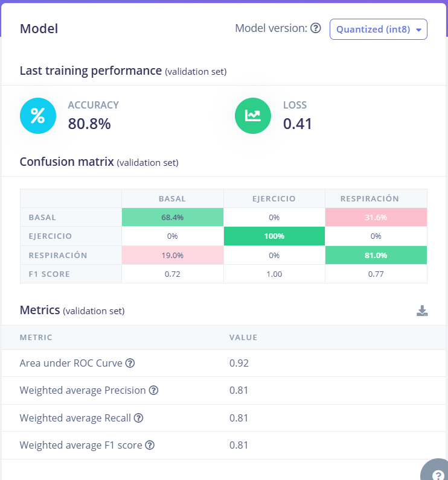
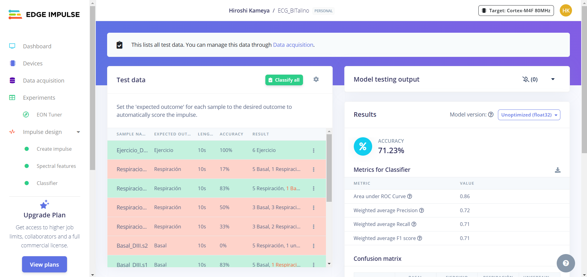
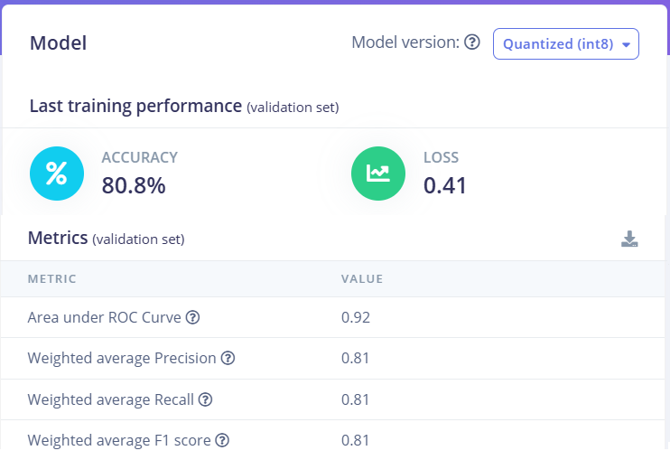
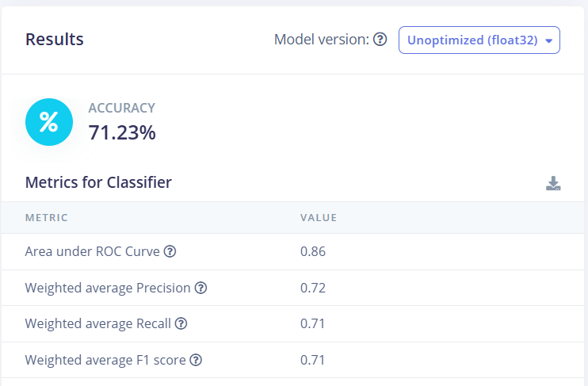

# Creación y testeo del modelo
  
<br>

## Lista de contenidos:
1. [**Ajustar la data**](#ajustar-la-data)  
2. [**Metodología y procesamiento**](#metodología-y-procesamiento)
3. [**Extracción de características**](#extracción-de-características)
4. [**Configuración para la creación del modelo**](#configuración-para-la-creación-del-modelo)
5. [**Testeo y comparación**](#testeo-y-comparación)
6. [**Enlace al Impulse Edge**](#enlace-al-edge-impulse)

## Ajustar la data
<div align="justify">
Para empezar, debido a la poca cantidad de data que se tenía inicialmente (del anterior laboratorio), se procedió a aumentar la cantidad de data.
Para esto, se procedió a disminuir la segmentación (configuración de CSV Wizard) con la finalidad de obtener uniformidad de data (misma duración) y reducir data que se eliminará
(se decidió eliminar data que no sea de 10 segundos, excepto una señal de ejercicio, debido a la poca cantidad que se tenía).  

<br>
</div>
  
<div align="center">
    <image src="imagenes/data.png" alt="Data" width="450">
    <p><b>Figura 1: Data proveniente de los ECG: Basal, Respiración y Ejercicio</b></p>
</div>  
<br>
<div aling="justify">
De esta manera, se aumentó la data colectada (debido a los resultados que se obtenían de iterar con la cantidad anterior de data es que se decidió incrementarla).
</div>  
<br>
 
## **Metodología y procesamiento**

<div align="justify">
Luego de tener la data, se ingresó a <i>"create impulse</i> en el que definió el tipo de análisis a utilizar y el tipo de modelo que se usará.
Debido a que el propósito era separar las señales por el gesto (basal, respiración y ejercicio) que se utilizó la clasificación. Asimismo, el tipo
de análisis usado fue <i>Espectral Analysis</i>. Este fue elegido luego de iterar y evaluar resultados (para nuestro objetivo se utilizó espectrograma, pero no se obtuvo buenos resultados, posiblemente la configuración utilizada no era óptima).
</div>  <br>
<div align="center">
  
  <p>
  
  **Figura 2: Tipo de análisis y tipo de modelo a utilizar**
  </p>
</div> <br>
<div align="justify">
Luego, se procedió a realizar el procesamiento de la data. Luego de realiar varias iteraciones y comparar los resultados que se obtenían es que se decidió,
finalmente, por utilizar esta configuración:
</div>  <br>
  
<div align="center">
  
  <p>
  
  **Figura 3: Procesamiento de la señal**
  </p>
</div> <br>
Inicialmente, había ruido en la señal (60Hz) y debido a la limitación del filtro que implementaba el Edge Impulse (solo pasa baja, solo pasa alta o ninguno) y la necesidad de extraer la mayor cantidad de características posibles (según la literatura, hasta los 150 Hz de la señal) es que fue requerido implementar un filtro notch previo al procesamiento. La función utilizada es la siguiente:
<br>  

```python  
from scipy.signal import butter, filtfilt
import numpy as np
import matplotlib.pyplot as plt

# Parámetros: 
    #orden 4
    #butterworth
    #fc1 = 59Hz
    #fc2 = 61Hz
def filtro_rechaza_banda(signal, fs, fc1, fc2, order):
    # Calcular frecuencias normalizadas
    nyquist = fs / 2  # Frecuencia de Nyquist
    low = fc1 / nyquist  # Frecuencia normalizada baja
    high = fc2 / nyquist  # Frecuencia normalizada alta

    # Diseño del filtro Butterworth Rechaza Banda
    b, a = butter(order, [low, high], btype='bandstop')

    # Aplicar el filtro
    #signal es una lista de str
    new_signal = []
    for dato in signal:
        new_signal.append(float(dato))
    filtered_signal = filtfilt(b, a, new_signal)

    return filtered_signal
```   


<div align="justify">

</div>
<br>
  
## **Extracción de características**
<div align="justify">
Luego, se pasó a la sección de extracción de características. Se obtuvo una separación de algunas características según el gesto, aunque no en su mayoría, como se ve en la siguiente imagen:

<br>
</div>
<div align="center">
  

  <p><b>Figura 4: Obtención de características</b>
  </p>
</div><br>
<div align="justify">
Asimismo, al revisar la importancia de las características es que nos dimos cuenta que la mayoría de estas (las más importantes) era relacionada a la potencia espectral en bajas frecuencias. Este fue un motivo por el cual, en la sección de procesamiento (análisis) se marcó la opción <i>"Improve low frequency resolution"</i>.   

<br>  
</div>
<div align="center">
  

  <p><b>Figura 5: Importancia de características</b>
  </p>
</div><br>

## **Configuración para la creación del modelo**
<div align="justify">
En la siguiente sección se realizaron los ajustes de algunos hiperparámetros del modelo.
Asimismo, al realizar iteraciones y evaluar los puntajes obtenidos, se decidió utilizar los siguientes valores:
  
<br>
<div align="center">
  

  <p><b>Figura 6: Configuración de hiperparámetros del modelo</b>
  </p>
</div><br>

Del mismo modo, debido a que la señal (la data) son electrocardiogramas (datos temporales), se procedió a implementar capas que incluían convolución 1D. Asimismo, se procedió a iterar valores de <i>"dropout"</i>
para reducir el overfitting, asimismo, para mejorar la captación de patrones es que se implementó 5 capas densas (cantidad de neuronas descendente con la finalidad de reducir "sobre-aprender" patrones).

<br>
<div align="center">
  

  <p><b>Figura 6: Configuración de las capas</b>
  </p>
</div><br>
De esta manera, al realizar el entramiento, se obtuvieron las siguientes métricas:<br><br>

<div align="center">
  

  <p><b>Figura 7: Métricas para grupo de entrenamiento</b>
  </p>
</div><br>
Analizando por gestos, se tiene una mejor sensibilidad en el caso de ejercicio, mientras que en basal se obtuvo la menor sensibilidad. Al realizar variación en los parámetros y capas, para este caso se obtuvo el menor valor para la función de pérdida (a menor valor, es mejor).
</div>
<br>

## **Testeo y comparación**
<p align="justify">
Finalmente, para el grupo de testeo, se obtuvieron las siguientes métricas:
</p>
<div align="center">
  

  <p><b>Figura 8: Métricas para grupo de testeo</b>
  </p>
</div><br>
<p align="justify">
Se aprecia que tiene una buena precisión y sensibilidad (recall), además de un buen puntaje para F1.  
Para analizar si hubo un sobreajuste es necesario comparar la métrica del grupo de entrenamiento y las métricas del grupo de testeo:
</p>
<div align="center">
  
  
  <p><b>Figura 9: Comparación de métricas: entrenamiento (izquierda) y testeo (derecho)</b>
  </p>
</div><br>
<p align="justify">
Lo que se aprecia es que los valores de las métricas no son muy distintos (la diferencia entre entrenamiento y testeo no es alto, por ejemplo, diferencia máxima es de 10% para el recall y F1 score). Por lo tanto, es poco probable un sobreajuste del modelo, el cual, era un objetivo al momento de crear el modelo.  
Asimismo, se ha tenido buenos valores para ambos grupos (>70%). <br> 
Uno de los problemas que surgieron durante las iteraciones (probando diferentes capas o métodos de análisis) era que se podía llegar a obtener una precisión en el grupo de entrenamiento mayor al 90%, pero las métricas en el grupo de entrenamiento no superaban el 30% (evidente sobreajuste). Algunas maneras para reducir esto (de manera empírica) fue aumentar el valor del <i>"dropout"</i>, disminuir el número de neuronas en las capas densas e ir reduciendo conforme se acercaba a la capa de salida, aumentar el porcentaje para el conjunto de validación cruzada, cambiar parámetros de la capa de convolución 1D y remodelar la matriz de características (<i>"reshape layer</i>).
</p>

## **Enlace al Edge Impulse**
<p align="justify">
Se ajunta el enlace al Edge Impulse:<br>

https://studio.edgeimpulse.com/public/558226/live
</p>