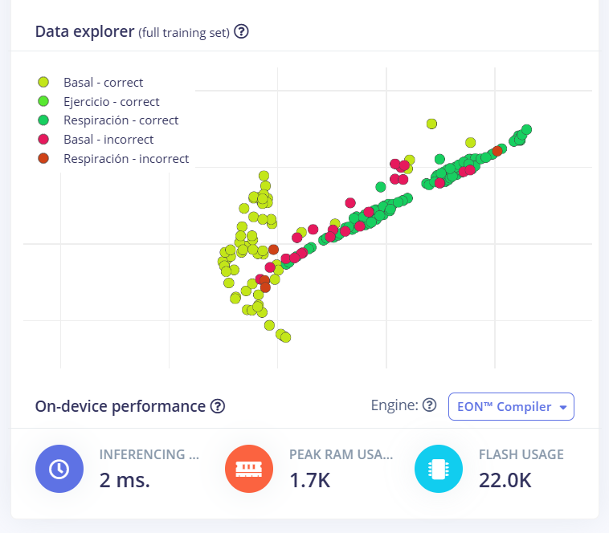

# LAB13: Extracción de características *Edge Impulse* 

 

## Lista de contenidos:
1. **Creación de impulso**  
2. **Características espectrales**
3. **Clasificador**
4. **Link al Edge Impulse creado**

## **Creación del impulso**

A partir del laboratorio anterior, donde se creó un proyecto para la importación de data en Edge Impulse, se va a realizar la extracción de características. Entonces, el primer paso a realizar es la creación del impulso, por lo que se selecciona la opción de Impulse design.

  
  

  **Figura 1: Creación del impulso**
  

  

En la ventana para la creación del impulso, se debe añadir los bloques de procesamiento y aprendizaje. En el caso del bloque de procesamiento, se selecciona la opción de Spectral Analysis. Por otro lado, en el caso del bloque de aprendizaje se selecciona la opción de Classification. Después de realizar estos ajustes, se guarda el impulso.

   
   

**Figura 2: Selección de los bloques de procesamiento y aprendizaje**  

 

## **Características espectrales**

El segundo paso a realizar son las características espectrales. Se selecciona esta opción y se nos muestra una ventana donde se observan la configuración de parámetros y el resultado del filtro.

   

  
  

  **Figura 3: Características espectrales**
  

  

Entonces, en la configuración de parámetros, se selecciona el filtro pasa bajas con una frecuencia de corte de 150 Hz y orden 6. Después, se realiza el guardado de los parámetros y se observa el resultado del filtro realizado.

   

  
  

  **Figura 4: Ajuste de parámetros**
  

  

Después, se selecciona la opción de Generate features y se observa el siguiente resultado:

   

   
   

**Figura 5: Generación de funciones**  

 

## **Clasificador**

El último paso a realizar es el clasificador. Se selecciona esta opción y se nos muestra una ventana donde se debe realizar la configuración de la red neuronal.

  

  
  

  **Figura 6: Ventana para importar los datos**
  

  

Después de realizar la configuración de la red neuronal, se guarda y entrena para obtener los resultados del modelo. Los resultados obtenidos fueron los siguientes:

  

   
   

**Figura 7: Resultados del modelo**

  

Finalmente, se realiza la discusión de los resultados obtenidos.  

  

- **Desempeño General del Modelo**:  
  - Se obtuvo una precisión global del 73.5%, lo que indica un desempeño aceptable pero que puede ser mejorable.
  - El valor de pérdida de 0.46 sugiere que el modelo no está sobreajustado.

- **Análisis de la Matriz de Confusión**:  
  - Se observa que la clase Ejercicio se clasifica correctamente en el 100% de los casos, por lo que se podría decir que es el punto fuerte del modelo.
  - Se observa una alta confusión entre las clase de Basal y Respiración. El 58.8% de las muestras de Basal se clasifican incorrectamente como Respiración y el 15% de las muestras de Respiración se clasifican incorrectamente como Basal.
  - Esta confusión puede deberse a características compartidas entre las dos categorías de Basal y Respiración, lo que limita la capacidad discriminante del modelo. Por otro lado, la clase Ejercicio presenta características que permite diferenciarle fácilmente de las otras dos categorías.

- **Métricas Adicionales**:  
  - Se observa un valor de 0.91 para el área bajo la curva ROC, lo que sugiere un buen balance entre sensibilidad y especificidad.   
  - Respecto a las métricas del F1-Score, estas evidencian que la clase Ejercicio presenta un desempeño perfecto (1.00). Mientras que las clases Basal (0.52) y Respiración (0.72) muestran necesidad de mejora en la clasificación.

- **Distribución de los Datos (Explorador de Datos)**:  
  - El gráfico muestra que las muestras se agrupan en ciertas regiones del espacio de características. Por un lado, la clase Ejercicio está separada de las otras dos categorías. Por otro lado, hay traslapes significativos entre "Basal" y "Respiración", lo que confirma la confusión observada en la matriz de confusión.

## **Link al Edge Impulse creado**

Link: https://studio.edgeimpulse.com/public/558232/live

  