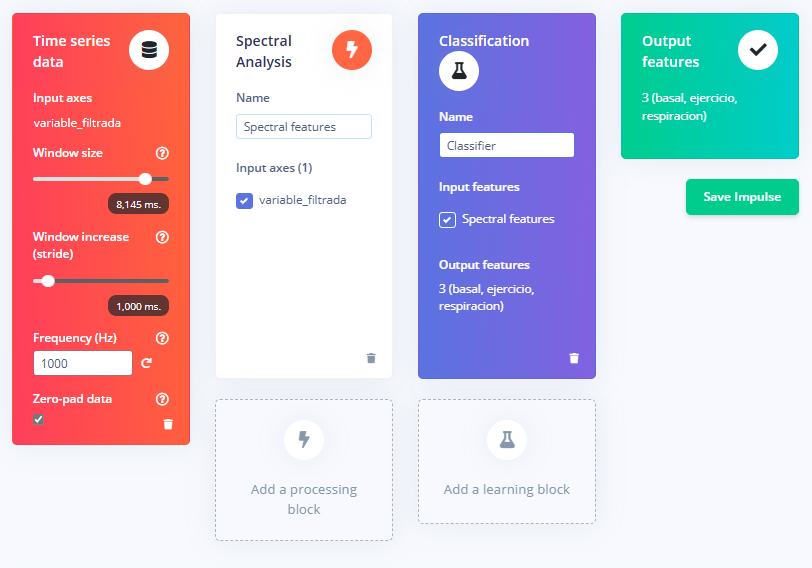
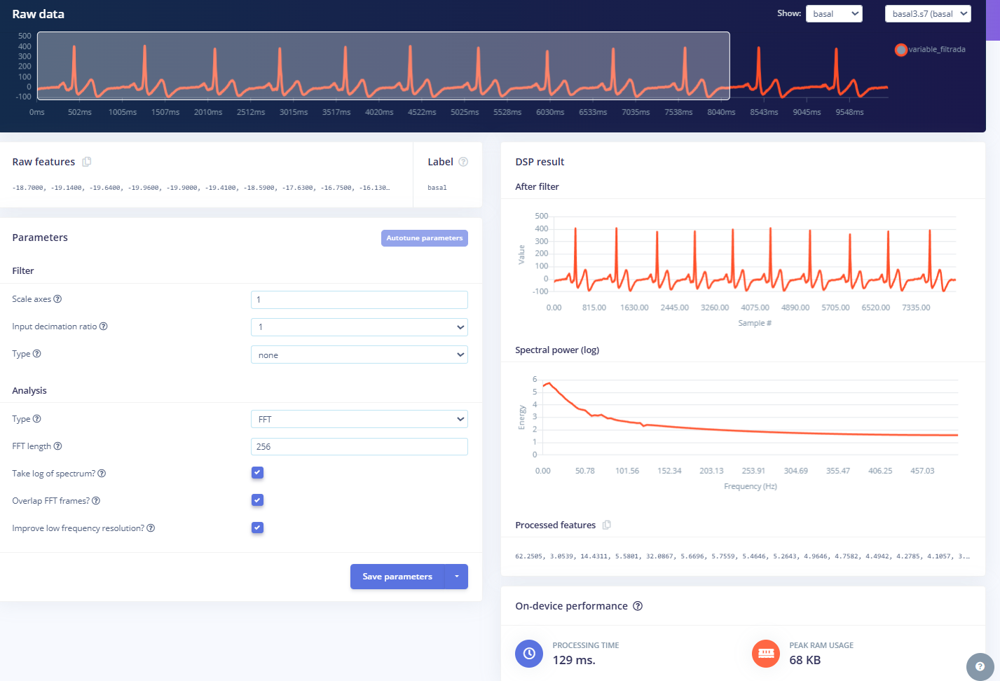
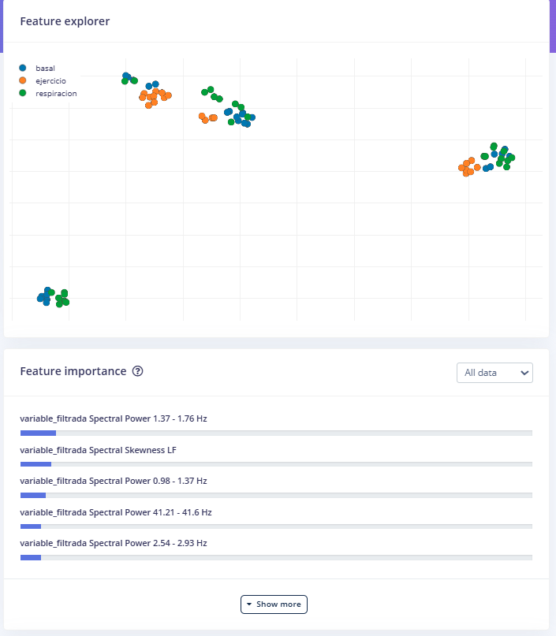
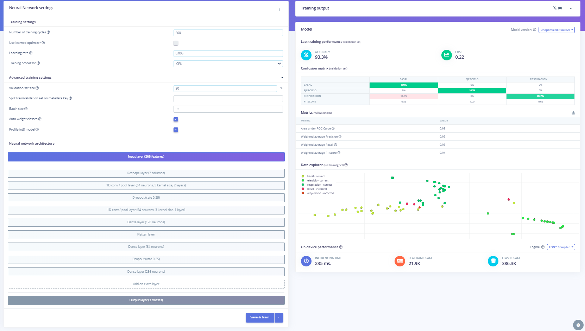

<b>LAB 13 EDGE IMPULSE</b>

# Tabla de Contenidos
- [Introducción](#introducción)
- [Impulse Design](#impulse-design)
- [Classifier](#classifier)
- [Spectral features](#spectral-features)
- [Model Testing](#model-testing)

---

## Introducción

 Este laboratorio da continuidad al Lab 12, cuyo propósito era subir señales de ECG al entorno de Edge Impulse. En esta ocasión, se trabajará en el diseño de un modelo capaz de diferenciar entre tres tipos de señales de ECG: basales, respiración de 10 segundos y post ejercicio.

 Las señales utilizadas provienen del dispositivo Bitalino, capturadas a una frecuencia de muestreo de 1000 Hz. Para su procesamiento, se realizaron ajustes importantes: se dividieron en segmentos de 10 segundos de duración y se aplicó un filtro Butterworth pasabanda de 0.5 Hz a 100 Hz. En las siguientes secciones, se explicará la razón detrás de estos ajustes y su impacto en el análisis y modelado de datos.

---

## Impulse Design

 Configuración del *Impulse* en Edge Impulse

 En esta sección, se detalla cómo configurar el *Impulse*, que constituye la estructura fundamental de un modelo en **Edge Impulse**. Se describen las etapas de procesamiento de datos, extracción de características y selección de bloques de aprendizaje, adaptadas a señales fisiológicas como ECG, respiración basal y post-ejercicio de una persona sana.

 Dado que las señales analizadas son de 10 segundos de duración, la característica más evidente y reconocible visualmente es la cantidad de latidos por minuto (LPM). Este tipo de datos temporales con duraciones más largas resulta ideal para que el modelo pueda diferenciar patrones de manera efectiva.

 ### **Time Series Data**
 En este paso, se configura la ventana de análisis y el incremento entre ventanas. Para las señales de 10 segundos, se considera adecuado un tamaño de ventana de **8000 ms** con un incremento de **1000 ms**. Esta configuración equilibra el nivel de detalle con la capacidad de capturar patrones significativos en los datos.

 ### **Bloques de Procesamiento**
 Un **bloque de procesamiento** en Edge Impulse es una etapa donde los datos en bruto se transforman en representaciones más útiles para el aprendizaje automático. Estos bloques extraen características importantes y reducen la complejidad de los datos, lo que facilita que el modelo identifique patrones y tendencias relevantes.

 #### **Spectral Analysis**
 Este bloque analiza patrones repetitivos, lo cual lo hace particularmente adecuado para señales como las de ECG. Además, extrae características en el dominio de la frecuencia, permitiendo una mejor representación de las señales periódicas y sus componentes armónicos. Esto es crucial para identificar variaciones significativas como las asociadas a diferentes estados de actividad fisiológica.

 ---

 ### **Bloques de Aprendizaje: Classification**
 Un **bloque de aprendizaje** es una etapa donde el modelo utiliza las características procesadas para generar predicciones. En este caso, al contar con etiquetas claras (basales, respiración post-ejercicio, etc.), se puede emplear un modelo de clasificación para distinguir entre los tres tipos de señales ECG. 

 La clasificación es adecuada porque busca asociar cada conjunto de características a una categoría específica, logrando así segmentar los datos de manera efectiva y precisa.

 ### **Output Features**
 El modelo produce salidas correspondientes a los tres tipos de señales descritos: 
 1. **Señales de ECG basal**  
 2. **Señales de respiración de 10 segundos**  
 3. **Señales post-ejercicio**

 Estas salidas permiten identificar el estado fisiológico representado por las señales y facilitan su análisis para aplicaciones prácticas como monitoreo de salud o análisis deportivo.

Imagen1: Diseño del impulso 

---

## Spectral features

Nos enfocaremos en la parte de parámetros. 

  En este caso, se observa que el escalado de ejes (Scale Axes) está configurado en <code>1</code>, lo que significa que no se aplica ninguna transformación a los valores originales de la señal, preservando su amplitud tal como fue capturada. Además, el ratio de decimación de entrada (Input Decimation Ratio) también está establecido en <code>1</code>, indicando que la señal conserva su resolución temporal completa y no se reduce la frecuencia de muestreo, lo cual es crucial para mantener la integridad de los datos en señales de alta resolución como el ECG. Por último, el tipo de filtro seleccionado es <code>none</code>, debido a que se subio las señales ya filtradas con antelación.

 En cuanto a la sección de análisis (Analysis), la técnica empleada es la Transformada Rápida de Fourier (FFT), lo que permite convertir la señal del dominio temporal al dominio de frecuencia. Esto es esencial para identificar las componentes frecuenciales que caracterizan las señales de ECG, como los ritmos cardíacos normales . El parámetro <b>FFT Length</b> está configurado en <code>256</code>, lo cual define la resolución del análisis. Este valor es un equilibrio ideal entre detalle y eficiencia computacional, capturando suficiente información de las frecuencias cardíacas relevantes sin sobrecargar los recursos de procesamiento.

 Para mejorar la interpretación de los resultados, la opción <b>Take log of spectrum</b> está activada, lo que transforma los valores de potencia del espectro a una escala logarítmica. Esto facilita la visualización y análisis de las frecuencias bajas, donde se encuentra la mayor parte de la información útil en una señal de ECG. Asimismo, la opción <b>Overlap FFT frames</b> también está habilitada, lo que permite superponer las ventanas FFT. Esto mejora la continuidad del análisis y asegura que no se pierdan detalles importantes entre segmentos consecutivos de la señal. Además, la opción <b>Improve low frequency resolution</b> está activada, lo que prioriza una mayor resolución en las frecuencias bajas, que son críticas para detectar características relevantes.

 En conjunto, esta configuración está optimizada para extraer información relevante de señales de ECG con alta precisión. Los parámetros seleccionados aseguran un análisis espectral eficiente, preservando las características esenciales de la señal mientras se mantiene la capacidad de implementar este procesamiento en dispositivos embebidos o sistemas de IoT. Estas características, combinadas con configuraciones específicas como la superposición de ventanas y la resolución mejorada en frecuencias bajas, hacen que esta configuración sea ideal para tareas como la clasificación de ritmos cardíacos, detección de arritmias y monitoreo de estados fisiológicos en tiempo real.

Imagen2: Spectral features 

 Segun la imagen 3 se observa que al extraer las características, se ha formado grupos de tal manera que se han juntado parcialmente por colores, lo cual es conveniente para poder distiguir entre etiquetas.
 Además las principales características son a bajas frecuencias como el Spectral Power 1.37 - 1.76 Hz

Imagen3: Generate features 

---

## Classifier
Explicación de cómo entrenar el clasificador, ajustar hiperparámetros y analizar métricas clave para obtener el mejor rendimiento del modelo.

 ### 1. Configuración de la Red Neuronal

### **Parámetros de Entrenamiento**
- **Ciclos de Entrenamiento:** `500`  
  Define la cantidad de iteraciones del entrenamiento para ajustar los pesos del modelo.
- **Learning Rate:** `0.005`  
  Controla la velocidad con la que el modelo aprende. Un valor moderado previene sobreajustes.
- **Batch Size:** `32`  
  Número de muestras procesadas simultáneamente en cada iteración. Es ideal para datos limitados y eficiencia en memoria.
- **Validación:**  
  - El 20% de los datos se reserva para validación, asegurando que el modelo se evalúe correctamente durante el entrenamiento.
- **Auto-weight Classes:** Activado  
  Ajusta automáticamente los pesos de las clases según su proporción en los datos, previniendo sesgos hacia clases más frecuentes.

### **Arquitectura de la Red Neuronal**
La arquitectura está diseñada para extraer patrones de las 256 características de entrada. Las capas y su funcionalidad son las siguientes:

1. **Input Layer (Capa de Entrada):**  
   Procesa las 256 características extraídas previamente.

2. **Reshape Layer:**  
   - **Función:** Organiza las características en columnas (7 columnas, en este caso). Esto es útil para convertir datos planos en matrices o tensores que pueden ser procesados por las capas convolucionales.
   - **Importancia:** Permite que las capas posteriores interpreten las características con una estructura más significativa.

3. **1D Convolutional Layers:**  
   - **Función:** Capturan patrones locales en las características usando filtros convolucionales.
   - **Configuración:** Dos capas con:
     - **64 filtros**
     - **Tamaño de kernel 3**
   - **Importancia:** Extraen patrones esenciales como correlaciones temporales en las señales procesadas.

4. **Dropout Layers (Tasa: 0.25):**  
   - **Función:** Previenen el sobreajuste al apagar aleatoriamente neuronas durante el entrenamiento.
   - **Importancia:** Aseguran que el modelo generalice mejor.

5. **Dense Layers:**  
   - Combina las características aprendidas en las capas anteriores. Incluye:
     - Una capa densa con 128 neuronas.
     - Otra capa densa con 64 neuronas.
   - **Importancia:** Aprende relaciones no lineales complejas entre las características.

6. **Output Layer:**  
   - Genera probabilidades para las 3 clases: basal, ejercicio, y respiración.

---

### 2. Resultados del Entrenamiento

### **Rendimiento del Modelo**
- **Precisión Total (Validation Set):** `93.3%`  
  Un resultado sólido que indica una clasificación efectiva de las señales en las tres clases.
- **Loss (Error):** `0.22`  
  El modelo tiene un error bajo, lo que sugiere un buen ajuste.

### **Confusion Matrix:**
- **Basal y Ejercicio:** 100% de precisión.  
- **Respiración:** 85.7% de precisión, mostrando que esta clase puede tener características más difíciles de diferenciar.

### **Métricas Adicionales:**
- **Área Bajo la Curva ROC (AUC):** `0.98`  
  El modelo distingue muy bien entre las clases.
- **F1 Score Promedio:** `0.94`  
  Un equilibrio sólido entre precisión y recall.

Imagen4: Clasificación 

---

## Model Testing

El modelo (imagen 5) de clasificación presenta un desempeño moderado con una precisión global del 68.42%, lo que sugiere limitaciones para generalizar correctamente sobre los datos de prueba. Este rendimiento está afectado principalmente por la alta similitud entre las señales de las clases "basal" y "respiración", lo que dificulta su diferenciación. Aunque las métricas como el área bajo la curva ROC (0.68) y el F1 Score (0.65) reflejan un desempeño aceptable, indican que el modelo tiene margen de mejora en precisión.

Imagen5: Testeo 

El análisis detallado de la matriz de confusión arroja información clave sobre las limitaciones del modelo:

### Matriz de Confusión
#### Clase "Basal"
- Solo **28.6%** de las señales "basal" fueron clasificadas correctamente.
- Un **71.4%** se clasificaron erróneamente como "respiración", mostrando una gran similitud entre estas clases.

#### Clase "Ejercicio"
- **100%** de las señales de "ejercicio" fueron clasificadas correctamente, lo que indica que esta clase tiene características distintivas bien capturadas por el modelo.

#### Clase "Respiración"
- El **87.5%** de las señales "respiración" fueron clasificadas correctamente.
- Sin embargo, un **12.5%** se confundió como "basal", nuevamente reflejando la similitud entre estas clases.

El desempeño del modelo en "ejercicio" es sólido, pero los resultados en "basal" y "respiración" sugieren que las características extraídas no son suficientes para distinguir eficazmente estas dos clases. Además, hay indicios de **sobreajuste** en el modelo, ya que parece estar demasiado ajustado a los patrones específicos del conjunto de entrenamiento en lo que son las señales de basal y respiración.

link: https://studio.edgeimpulse.com/public/558601/live 

