# Uso de BITalino para EMG

## Tabla de contenidos

* [Introducción](#introducción)
* [Objetivos](#objetivos)
* [Materiales y objetivos usados](#materiales-y-equipos-usados)
* [Procedimiento](#procedimiento)
* [Resultados](#resultados)
* [Conclusiones](#conclusiones)
* [Referencias bibliográficas](#referencias-bibliográficas)
* [Anexos](#anexos)
  
## Introducción
El BITalino es una placa electrónica diseñada y fabricada por la empresa PLUX Biosignals. El principal atractivo de este dispositivo es su utilidad en lo que respecta a aplicaciones en ingeniería biomédica, por su capacidad de captar distintas señales fisiológicas del cuerpo y digitalizarlas para un procesamiento posterior. Entre los algunos tipos de bioseñales que el BITalino puede adquirir, encontramos electroencefalograma (EEG), electrocardiograma (ECG), electromiografía (EMG) y actividad electrodérmica (EDA). Los distintos implementos físicos para capturar estas señales también están incluidos en el kit del BITalino: electrodos con sus respectivos cables. 

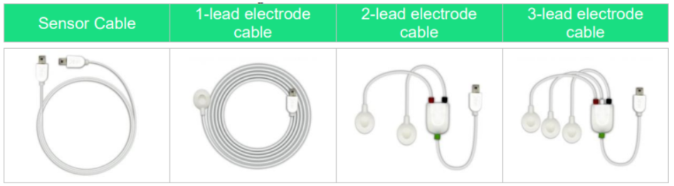 

<b>
Figura 1: Electrodos incluidos en el kit BITalino
</b>

 

<b>
Figura 2: Leyenda del significado de los colores de los electrodos
</b>

  

De igual manera, cuenta con otros elementos electrónicos como un acelerómetro, buzzer, LEDs, etc.

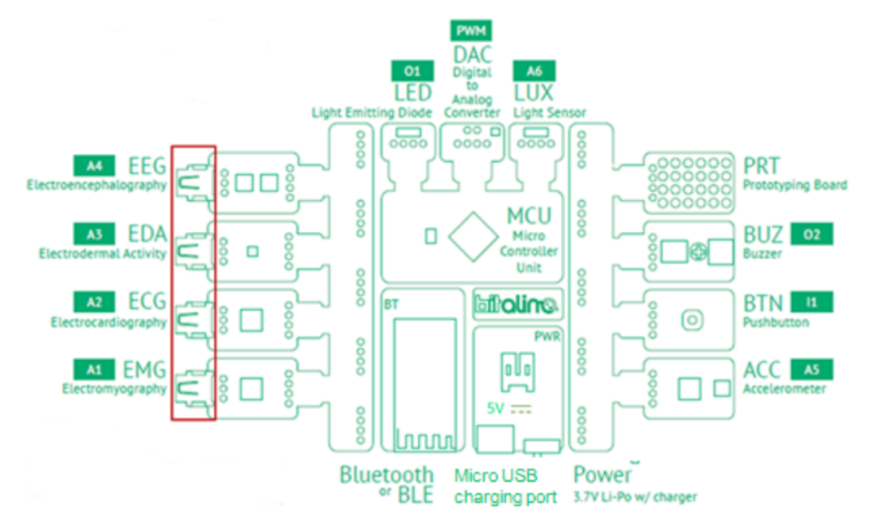

<b>
Figura 3: Esquema de BITalino. Se puede apreciar cómo están dispuestos los sensores y elementos como el acelerómetro y módulo Bluetooth
</b>

  

Las señales captadas por la placa pueden ser visualizadas en tiempo real mediante el software OpenSignals para PC. Este hace uso de la conectividad Bluetooth que posee la placa (puede ser Bluetooth 2.0 + EDR, que mejora la velocidad de transferencia o Bluetooth 4.1 BLE) para poder así enviar los datos de forma inalámbrica hacia el ordenador, graficando amplitud vs tiempo. Estos datos pueden ser exportados en distintos formatos para su visualización y análisis en otros programas externos. Respecto a especificaciones más técnicas, el BITalino tiene la capacidad de muestrear a distintas frecuencias de muestreo: 1, 10, 100 y 1000 Hz, las cuales pueden ser seleccionadas vía el OpenSignals. La elección de la frecuencia está condicionada por la precisión y exactitud deseada, al igual que la capacidad del sensor. Por otro lado, el BITalino posee una batería recargable de polímero de litio de  3.7V, 700 mAh. Teniendo en cuenta su consumo promedio de 65mA, el BITalino tiene una autonomía de entre 8-10 horas. Su voltaje de operación es de 3.3V, y acepta en sus pines de entrada un rango de voltaje de entre 3V a 5.5V, lo que significa que cuenta con reguladores de voltaje internos.

La electromiografìa (EMG) es una prueba que se realiza para evaluar al mùsculo esquelètico y a las neuronas motoras mediante el anàlisis de las señales elèctricas enviadas por los nervios para el control de los mùsculos, como al ejecutar un movimiento [1]. Para la mediciòn de las señales del EMG, hay dos tipos principales de electrodos: electrodos de aguja, los cuales, se introducen directamente al mùsculo y registran actividad elèctrica [2], y electrodos superficiales, que se basan en detectar cambios quìmicos entre la superficie muscular y la piel, referidos a la conducciòn electrolìtica [3]. 

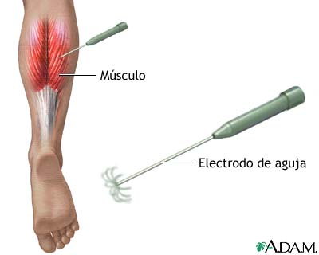

<b>
Figura 4: EMG mediante el uso de electrodos de aguja [4]
</b>

  

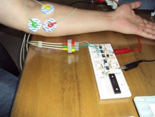

<b>
Figura 5: EMG mediante el uso de electrodos superficiales [5]
</b>

  

Ambas tècnicas, ademàs de diferenciarse por la invasividad, se diferencian en la informaciòn que proporcionan, por ejemplo, la electromiografìa de agujas ofrece informaciòn sobre estructura y daño muscular, mientras que la electromiografìa de superficie (uso de electrodo superficial) ofrece informaciòn sobre activaciòn de los mùsculos en una actividad o postura determinada. Esto ofrece oportunidades en el campo de la medicina, puesto que permite evaluar patologìas en la marcha, fatiga muscular (en medicina deportiva), coactivaciòn muscular (para el estudio de pacientes, por ejemplo, con Sìndrome de Down), ayuda en el proceso de rehabilitacòn (tècnica de biofeedback), anàlisis de movilidad articular, mejorar la ergonomìa (para anàlisis de riesgos en ambiente laboral) y entre otros [6]. Cabe destacar que, al realizar una prueba EMG en un mùsculo sano, se espera obtener señales elèctricas cuando el mùsculo està en uso y ninguna señal cuando el mùsculo està en reposo [1]; ademàs, que estas señales son esperadas en un rango de 0 a 500 Hz, ademàs de una amplitud de voltaje que varìe de 0 a 6 mV [7].

## Objetivos
* Aprender a usar el BITalino para la captura de señales de EMG superficial
* Analizar los EMG del tricep, bícep y gastrocnemio y ver cómo varía respecto a sus contracciones
* Analizar los movimientos en reposo, movimientos simples y aquellos que aumentan gradualmente en intensidad, en función de su frecuencia 

## Materiales y equipos usados
* BITalino
* Electrodos (superficiales)
* Open Signals (programa)
* Laptop
* Python (lenguaje de programación)

## Procedimiento
1. Conectamos los electrodos en el cable del sensor de EMG
2. Conectamos el cable en el puerto de EMG [A]
3. Colocamos la batería del BITalino y lo encendemos [B]
4. Enlazamos el BITalino mediante bluetooth a una laptop/pc
5. Se abre el Open Signals y se vincula con el BITalino [C]
6. Realizar la configuración del canal y sensor a usar, en este caso es EMG [D]
7. Conectamos los electrodos en los músculos que se analizarán [E]
8. Se inicia la adquisición de datos en el Open Signals [F]
9. Cada participante ejecutará, según el músculo que le corresponde: reposo, ejecución de fuerza sin carga y ejecución de fuerza con carga.
10. Se detiene la adquisición de datos cuando cada participante finalice la ejecución de cada acción. Se guardan los datos en formato txt.
11. Se vuelve a adquirir datos y el participante ejecutará la siguiente acción. Se detiene la adquisición al finalizar la acción. Se repetirá este proceso hasta que cada participante haya realizado las 3 acciones.
12. Se realiza el procesamiento de datos utilizando el lenguaje de programación Python [8][9][10] (mediante el aplicativo Visual Studio Code) y se entregarán las gráficas de la señal obtenida, filtrada y su espectro.

## Resultados
### Información sobre las tablas:
* **Toma general**: Referida a los datos que incluyen las 3 acciones
* **Transformada de Fourier General**: Transformada de Fourier de la señal general (que incluye las 3 acciones)
* **Reposo**: Músculo relajado
* **Sin carga**: Ejecución del movimiento muscular sin carga (fuerza externa)
* **Con carga**: Ejecución del movimiento muscular con una carga (fuerza externa en sentido contrario al movimiento)

### Prueba 1: 
#### Información sobre la prueba:
* Músculo a analizar: Bíceps
* Movimiento muscular: Flexión

#### Información adicional
En esta prueba, se evaluó las señales de reposo y contracción del bíceps, teniendo la conexión a tierra en el codo. Se realizó el movimiento de flexión del codo, lo que resulta en la activación del bíceps. Nos basamos en un estudio de Kleiber donde se menciona que este músculo se activa durante contracciones concéntricas como isométricas [11]. Los estudios de electromiografía realizados demuestran que a medida que aumenta el ángulo de flexión del codo, existe un incremento en la activación del músculo hasta llegar al máximo cuando el ángulo es de 90° [11]. Además, se demostró que el bíceps mantiene un nivel constante de activación independientemente de la posición neutra, supina o prona [11]. 

#### Tabla con gráficas de la señal adquirida
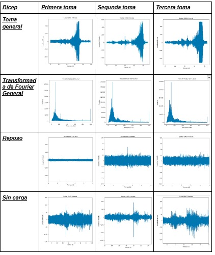
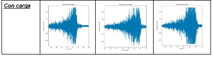

#### Video de la prueba
<video width="320" height="240" controls>
  <source src="Videos/video_moviemiento/Hiroshi/1.mp4" type="video/mp4">
</video>

---
### Prueba 2:
#### Información sobre la prueba:
* Músculo a analizar: Tríceps
* Movimiento muscular: Hiperextensión

#### Información adicional
El tríceps es un músculo que se encuentra ubicado en la parte posterior del brazo, está compuesto por tres porciones/cabezas: larga, medial y lateral. En el presente estudio se enfoca en el análisis de ejercicios para tríceps que provocan una mayor actividad muscular, para ello se realizaron los siguientes ejercicios:
- Dips
- Triangle push-ups
- Contragolpes de tríceps
- Extensiones de tríceps por encima de la cabeza
- Pushdowns con barra 
- Pushdowns con cuerda
- Extensiones de tríceps con barra acostada
- Press de banca con agarre cerrado
Mediante el análisis de la señal electromiográfica, se determinó que triangle push-ups genera la mayor actividad muscular, en comparación con los otros ejercicios. En ese sentido, se normalizaron los datos obtenidos en función de triangle push-ups, dando como resultado que dips y contragolpes de tríceps no generan diferencia alguna, es decir estos ejercicios se pueden realizar de manera indistintiva obteniendo una actividad muscular similar. Sin embargo, hay ciertos ejercicios que generan una mayor actividad en ciertas partes del tríceps, este es el caso de bar and row pushdowns, dónde la activación de la cabeza lateral es significativamente mayor que en la cabeza larga[12]. 

Teniendo en cuenta este estudio, se realizó la simulación del ejercicio de row pushdowns, el cual tiene un mayor rango de movimiento para la activación del tríceps. La diferencia es que en nuestro caso, utilizamos como carga externa a una fuerza generada por un compañero en contra al movimiento del ejercicio, en lugar de la cuerda a tensión.

**Figura 5: Rop Pushdowns [12]**

#### Tabla con gráficas de la señal adquirida
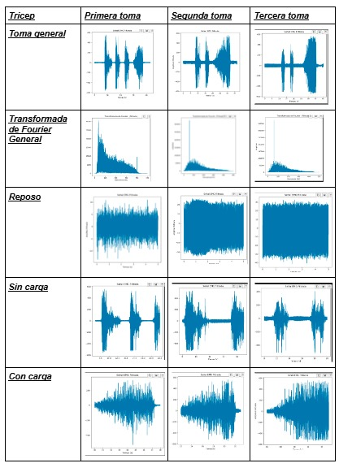
#### Video de la prueba
<video width="320" height="240" controls>
  <source src="Videos/video_moviemiento/Puma tricep/1t.mp4" type="video/mp4">
</video>

---
### Prueba 3:
#### Información sobre la prueba:
* Músculo a analizar: Gastrocnemio
* Movimiento muscular: Flexión plantar

#### Tabla con gráficas de la señal adquirida
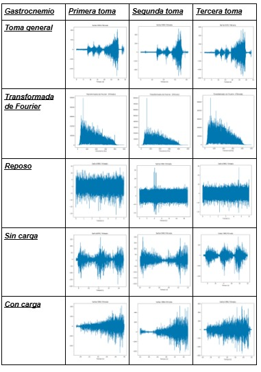

**Fourier (izquierda) y el movimiento del gastrocnemio (contracción sin carga)**

#### Video de la prueba
<video width="320" height="240" controls>
  <source src="Videos/video_moviemiento/Puma - gemelos/1g.mp4" type="video/mp4">
</video>

---

## Conclusiones:
* Respecto a la tabla de activación del bíceps, podemos concluir ciertos puntos. En primer lugar, para el bíceps es notable que los periodos de reposo corresponden a una poca activación, lo cual se puede apreciar en las gráficas de las tres tomas en reposo. La amplitud en estos periodos es baja, donde solo en una ocasión se logró superar las 50 unidades de amplitud. Esto concuerda con la respuesta muscular y diversas estructuras en esta etapa: un estado de reposo corresponde a un reclutamiento reducido de unidades motoras. Por otro lado, vemos que en los momentos de contracción sin carga existe un aumento en la amplitud, lo que corresponde a un mayor reclutamiento de unidades motoras para satisfacer la demanda. Sin embargo, el pico en la activación aparece al momento de aplicar la carga externa, donde la amplitud se dispara. Esta explicación se apoya también en la transformada. Si bien existe un pico prominente alrededor de 60Hz (probablemente a causa del ruido de la alimentación), también vemos prevalencias en frecuencias mayores (aunque en menor medida). Estas frecuencias corresponden a los momentos de contracción, ya sea con o sin carga. El necesitar más fuerza demandaría más unidades motoras al igual que un aumento en el ratio de disparo, aumentando de esta forma la frecuencia. Estos picos a frecuencias más altas no serían tan prominentes debido a que en el tiempo ocupan relativamente menos que los momentos en reposo. 

* Se puede observar que, para este sector del músculo(tricep), al realizar las tomas generales de contracciones sin carga, se presenta un cierto patrón de activación explosiva. Esto se debe a que, durante estas contracciones, el sistema nervioso recluta principalmente unidades motoras pequeñas que controlan fibras de contracción rápida , capaces de generar fuerza rápidamente. Por otro lado, cuando se realizó la contracción con carga, se observó un incremento progresivo en la fuerza, lo que se refleja en la activación gradual de un mayor número de unidades motoras. A medida que la carga aumenta, el sistema nervioso comienza a reclutar unidades motoras más grandes, superando el umbral de activación de las fibras musculares. Este proceso permite generar la fuerza necesaria para resistir la carga creciente, lo que explica el aumento progresivo en la señal de activación muscular.

* A partir de lo obtenido en la sección de gastrocnemio, se ve que en reposo no se evidencia o hay muy poca activación a unidades motoras,debido al mismo estado del músculo, pero a medida que lo contraemos hay un aumento de unidades motoras, además se ve que la contracción muscular con carga necesita de más unidades motoras  a medida que la carga es más exigente, por otro lado en la contracción sin carga se aprecia que hay cierto patrón que se mantiene.

* En todas la gráficas de la frecuencia se observa un pico a los cercano a los 60 hz esto, se puede deber al ruido electrónico de la electricidad sabiendo que trabajamos a 220v @60hz o también puede ser causado por el mismo dispositivo Bitalino.

## Referencias bibliográficas
[1] “Electromiografía y estudios de conducción nerviosa: Prueba de laboratorio de MedlinePlus”. Disponible en: https://medlineplus.gov/spanish/pruebas-de-laboratorio/electromiografia-y-estudios-de-conduccion-nerviosa/.

[2] “Electromiografía - Mayo Clinic”. Disponible en: https://www.mayoclinic.org/es/tests-procedures/emg/about/pac-20393913. 

[3] V. Gohel y N. Mehendale, “Review on electromyography signal acquisition and processing”, Biophys Rev, vol. 12, núm. 6, pp. 1361–1367, nov. 2020, doi: 10.1007/s12551-020-00770-w. Disponible en: https://www.ncbi.nlm.nih.gov/pmc/articles/PMC7755956/.

[4] “Electromiografía: MedlinePlus enciclopedia médica”. Disponible en: https://medlineplus.gov/spanish/ency/article/003929.htm.

[5]“came: Grupo de Investigación Biomédica - Electromiografía (EMG) - Dal”. Disponible en: https://www.dalcame.com/emg.html. 

[6] F. Javier y F. Juan-Garcia, “UTILIDAD DE LA ELECTROMIOGRAFÍA DE SUPERFICIE EN REHABILITACIÓN”, mar. 2017.

[7] E. Garcìa, G. Rojas, O. Nava y J. Ramiro, “Diseño y construcción de un prototipo de detecciòn de señales mioelèctricas de bajo costo”, Revista Electrònica ANFEI Digit., vol. 7, n.º 12, p. 10, 2020. [En línea]. Disponible: https://anfei.mx/revista/index.php/revista/article/view/661/1302

[8] J. A. Cortés Gómez, D. S. Acebes Moreno, L. M. Peñuela Calderón, y A. Velasco Vivas, «Detección de fuerza y posición para los movimientos de flexión-extensión de codo a partir de señales de EMG», reveia, vol. 20, n.º 39, pp. 3924 pp. 1–20, feb. 2023. 

[9] R. Guzmán-Venegas et al., “Efecto de la Amplitud de la Onda M sobre la Concordancia entre Evaluadores y el Número de Zonas de Inervación Detectadas en el Gastrocnemio Medial Mediante Electromiografía Multicanal”, International Journal of Morphology, vol. 41, núm. 6, pp. 1775–1780, 2023, doi: 10.4067/S0717-95022023000601775. Disponible en: http://www.scielo.cl/scielo.php?script=sci_abstract&pid=S0717-95022023000601775&lng=es&nrm=iso&tlng=en

[10] D. Rodríguez-Ridao, J. A. Antequera-Vique, I. Martín-Fuentes, y J. M. Muyor, “Effect of Five Bench Inclinations on the Electromyographic Activity of the Pectoralis Major, Anterior Deltoid, and Triceps Brachii during the Bench Press Exercise”, International Journal of Environmental Research and Public Health, vol. 17, núm. 19, p. 7339, ene. 2020, doi: 10.3390/ijerph17197339. Disponible en: https://www.mdpi.com/1660-4601/17/19/7339

[11] R. G. LeFavi, G. K. Limbaugh, J. D. Eitner, y B. L. Riemann, “Medial And Lateral Gastrocnemius Activation Differences During Heel Raise Exercise With Three Different Foot Positions: 1809: Board #159 May 27 3:30 PM - 5:00 PM”, Medicine & Science in Sports & Exercise, vol. 41, núm. 5, p. 137, may 2009, doi: 10.1249/01.MSS.0000354974.32823.a1. Disponible en: https://journals.lww.com/acsm-msse/Fulltext/2009/05001/Medial_And_Lateral_Gastrocnemius_Activation.2009.aspx. 

[12] K.-S. Shih et al., “Modified Ankle Joint Neuromechanics during One-Legged Heel Raise Test after an Achilles Rupture and Its Associations with Jumping”, Applied Sciences, vol. 11, núm. 5, p. 2227, ene. 2021, doi: 10.3390/app11052227. Disponible en: https://www.mdpi.com/2076-3417/11/5/2227. 

## Anexos
--- 
[A] Conexión de los cables de los electrodos del EMG

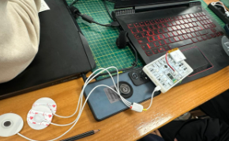
---
[B] Conexión de la batería al BITalino

--- 
[C] Vinculación del Open Signals con el BITalino

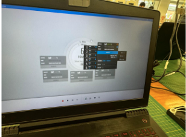
---
[D] Realizar la configuración del canal

---
[E] Conexiones a los músculos que se analizarán

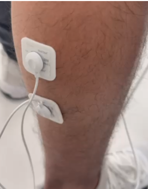
---
[F] Open Signals capturando la data

