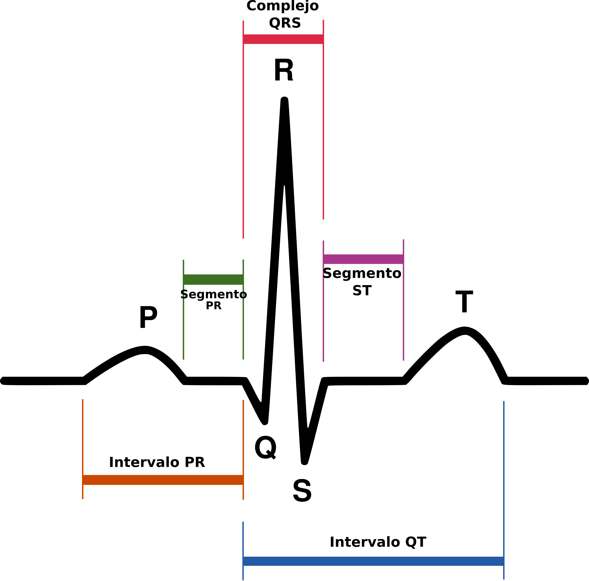
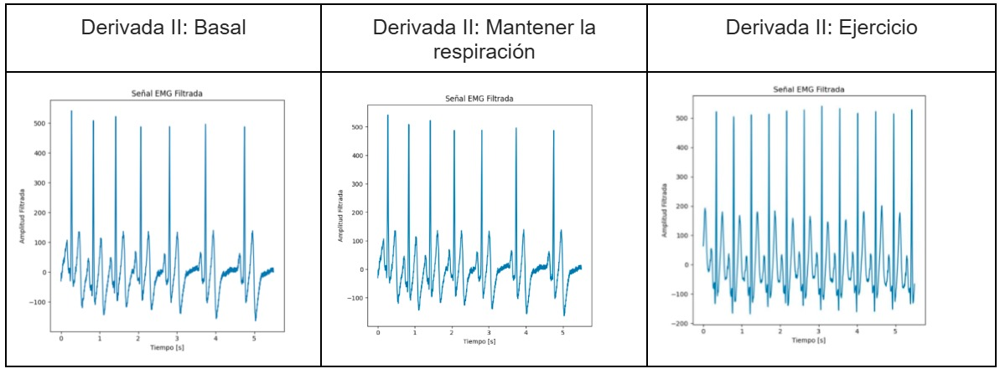

# LABORATORIO 5: Uso de BITalino para ECG

## **Tabla de contenidos:**

1. [**Introducción**](#1-introducción)  
2. [**Objetivos**](#2-objetivos)
3. [**Materiales y equipos**](#3-materiales-y-equipos)
4. [**Procedimiento**](#4-procedimiento)
5. [**Resultados**](#5-resultados)  
   5.1. [**Resultados Generales**](#resultados-generales)
6. [**Conclusiones**](#6-conclusiones)
7. [**Referencias**](#7-referencias)

<!--  El uso del Padding es para controlar el espacio entre contenido y borde -->
 

## **1) Introducción** 

   Un electrocardiograma (ECG) es una técnica no invasiva que permite registrar la actividad eléctrica del corazón [1], y es una herramienta de uso ampliamente extendido en lo que respecta a monitoreo y diagnóstico cardiaco. Una señal de ECG es captada por electrocardiografos, los cuales entregan/muestran la señal al usuario mediante papel milimetrado para ECG o en algunos casos de forma digital. Mediante esta técnica, es posible el diagnosticar distintos tipos de cardiopatías como lo son los distintos tipos de arritmias, infarto de miocardio, miocardiopatías, entre otras [2]. Estas enfermedades pueden identificarse analizando las distintas ondas que posee un ECG: la onda P, Q, R, S y T, y la manera en la que estas se agrupan. Por ejemplo, un complejo QRS más ancho de lo esperado puede significar un engrosamiento ventricular [3]. 

  

  **Figura 1: Imágen referencial de los componentes de una señal de ECG**
  

 

Para poder captar estas señales, se hace uso de las derivaciones de ECG. Estas son, en esencia, distintas “vistas” desde donde se capta la actividad eléctrica cardiaca. Estas perspectivas se logran gracias a la colocación de electrodos, los cuales se disponen de distinta manera dependiendo de la derivación de interés. Lo común en el campo médico es encontrar ECG que usen hasta 12 derivaciones, las cuales son:

 
     
* Tres derivadas bipolares (DI, DII, DIII)  
* Tres derivadas unipolares (aVR, aVF, aVL)  
* Seis derivadas precordiales (V1, V2, V3, V4, V5, V6)  

   

**Figura 2: Representación de las derivaciones cardiacas**  

 

## **2) Objetivos**
* Sensar las señales de ECG usando el Bitalino  
* Adquirir la señales del ECG usando Open Signals  
* Obtener la derivada 1, derivada 2 y derivada 3 del ECG  
* Obtener cada derivada variando entre estado basal, aguantando la respiración 20 segundos y después de realizar ejercicio  
* Analizar el ECG obtenido, respecto derivada y de acuerdo a la actividad realizada 
  
 

## **3) Materiales y equipos**
* Kit BITalino (placa y 3 cables para electrodos)  
* 3 electrodos  
* Laptop  
* Cronómetro  
* Software *Open Signals*  
 

## **4) Procedimiento**

Para todas las actividaes se usó el Bitalino como sensor y el Open Signals como el dispositivo que recolecta la información. Para esto primero se realizó la correcta conexión del Bitalino  con los cables de los electrodos y también la conexión con el software Open Signals. A la par también se colocaron los electrodos en la persona que se realizó la prueba. Para la colocación de los electrodos nos basamos respecto a esta imagen:

   

**Figura 3: Posición de electrodos [4]**  

 

     

**Figura 4: Tabla de imágenes sobre el procedimiento**  
**Elaboración propia** 

  

- ***Estado basal***

La primera actividad consiste en realizar la medición del electrocardiograma en el estado de reposo (cuando la persona no ha realizado ninguna actividad que requiera algún esfuerzo).  
Para la medición, a la persona se la sentó en una silla y se mantuvo en reposo durante 1 min.  
Este procedimiento se realizó para la primera derivada, segunda derivada y tercera derivada.  
Para cada derivada se intercambió las posiciones de los cables (positivo,negativo y neutro) del ECG:

  

**1ra derivada** = brazo izquierdo positivo, brazo derecho negativo, cresta iliaca positivo  
**2da derivada** = brazo izquierdo neutro, brazo derecho negativo, cresta iliaca positivo     
**3ra derivada** = brazo izquierdo negativo, brazo derecho neutro, cresta iliaca positivo  

 

     

**Figura 5: Persona sentada en estado basal**

 

- ***Mantener respiración***

La segunda fase consistió en realizar la medición del electrocardiograma durante el proceso de mantener la respiración durante 20 segundos y su posterior reposo. Esta actividad simula una apnea donde se observa una disminución temporal de la frecuencia cardíaca al inicio del proceso, seguido de un aumento gradual en la frecuencia cardíaca hacia el final de la apnea debido al aumento de la presión parcial de dióxido de carbono en la sangre. Entonces, durante la apnea se observa bradicardia debido a la disminución de oxígeno en la sangre y una vez que el episodio de apnea termina, se observa taquicardia como respuesta compensatoria. Este comportamiento genera un marcador fiable en el ECG, el cual sería un desequilibrio en el intervalo R-R [5].

 

- ***Actividad física***

La tercera fase consistió en la medición del electrocardiograma, luego de la realización de 5 minutos de actividad física. En el presente laboratorio, la actividad consistió:

| *Jumping jacks(*2 min y 50 s*)* |   |
| :---- | ----- |
| ***Burpees(2 minutos)*** |   |
| ***Push-ups(10 segundos)*** |  |

**Figura 6: Tabla de los ejercicios realizados**  

 

Todo lo anterior da un total de 5 minutos de actividad física por parte del participante.
 

## **5) Resultados**
- ***Estado basal***

Para la obtención de las gráficas se realizó un filtrado de 0.5 hz hasta 55 hz(señal original) y otro filtrador de 65 hz hasta 100 hz (señal original), para disminuir el ruido electrónico que es de 60 hz y también tomando en cuenta que el rango de la frecuencia de la señal de ECG está entre 0 - 100 hz.  
Posterior se sumó las dos señales filtradas para obtener los gráficos.

     

**Figura 7: Tabla de ECG(Derivada I,II,III ) y FFT estado basal**

 

Posterior al registro electrocardiográfico en estado basal ,se obtuvieron 3 trazos correspondientes a las Derivadas I, II y III respectivamente como se muestran en los gráficos anteriores, los cuales muestran una buena calidad de la señal y una interferencia de ruido  baja tras la aplicación de la Trasnformda de Fourier, es así que permite de forma adecuada identificar las ondas P, QRS y T en cada derivada. 

Es importante resaltar que BItalino ha demostrado evidenciar un ECG al cual el profesional en salud puede dar lectura, en este caso tenemos un sujeto estable en estado basal sin patologías subyacetes, por ende la descripción de este ECG se rige a la literatura [6]como :

     

**Figura 8: Tabla de ECG(Derivada II ), onda P, lpm y duración de los tramos(onda p,complejo QRS e intervalo QT)**

 

- ***Mantener respiración***

     

**Figura 9: Tabla de ECG(Derivada I,II,III ) y FFT estado basal**

 

De las gráficas obtenidas, notamos que el paciente está atravesando por un proceso de adaptación fisiológica. Las etapas son las siguientes: Recuperación inicial, se caracteriza por un intervalo R-R corto (ver figura 10), lo que indica un aumento en la frecuencia cardiaca, en este caso el valor del intervalo es menor a 1 segundo, luego, aparece la etapa de recuperación gradual, una vez experimentada la frecuencia cardiaca alta, esta tenderá a bajar y alcanzar valores normales, por lo que el intervalo R-R aumentará gradualmente (ver figura 11). Finalmente, encontramos una etapa estable, en esta parte el intervalo R-R tiende a mantener un valor constante (ver figura 12), indicando que la frecuencia cardiaca se ha normalizado y el paciente ha entrado a un estado basal. 
Para todos las derivaciones se tiene este mismo comportamiento, por lo que no es necesario el análisis independiente de cada uno. Asimismo, se puede indicar que el corazón del paciente late de manera normal o al menos en los segmentos analizados.

|  |   | |
| :----: | :-----: | :----:|
| **Figura 10: Recuperación inicial** | **Figura 11: Recuperación gradual** | **Figura 12: Estado estable**|

 

- ***Actividad física***

     

**Figura 13: Tabla de ECG(Derivada I,II,III ) y FFT ejercicio**

 

Se muestran los resultados de la señal de ECG para el participante luego de 5 minutos de ejercicio aeróbico y anaeróbico, con énfasis en los primeros. Visualmente, si bien se conserva de manera general el patrón en las derivadas, destaca un comportamiento errático en la primera derivada en comparación a la señal adquirida para esta misma pero en reposo. Sumado a esto, mediante la transformada de Fourier apreciamos que la señal contiene varios componentes con distintas frecuencias, lo que se puede ver de forma más prominente en la transformada de la tercera derivada. Todos estos cambios en la señal y por consecuente su transformada podrían atribuirse en primera instancia al ruido muscular. El tejido muscular, con énfasis en el estriado, puede llegar a tener altas demandas energéticas a causa de distintos tipos de estrés [11]. Al momento de realizar ejercicio, los músculos se activan en mayor medida debido a el aumento en la tasa de impulsos enviados. Esto desemboca en la liberación de iones de calcio en el tejido muscular, lo que induce más contracción y por tanto mayor liberación de ATP por parte de las mitocondrias para satisfacer la demanda [11]. El factor clave en este caso son los impulsos eléctricos enviados, ya que existen diversidad de manifestaciones mioeléctricas ocasionadas por la fatiga muscular del estrés mecánico [12] de eventos como hacer ejercicio. Esta señalización puede llegar a interferir en el ECG, en concreto por la actividad residual: incluso si la persona ya no está en movimiento, los músculos que han sido activados pueden continuar generando impulsos que interfieren con la señal.  

Existe evidencia de que la contracción de los músculos estriados contamina en gran medida la señal de ECG [13]. Esta contaminación por artefactos musculares puede acentuarse por el hecho de que el rango de frecuencias del músculo estriado (2 - 500 Hz) engloba al del ECG (0.5 - 100 Hz) [14], lo que se presta a que se infiltren las señales musculares a la lectura ya que no pueden ser filtradas en su totalidad.  Entonces, la aparición de más componentes de frecuencia en la transformada puede explicarse por este último punto: la mayor tasa de actividad mioeléctrica ocasiona que se infiltren señales musculares durante la medición del ECG. Por otro lado, vemos que en las distintas derivaciones, la señal cardiaca parece oscilar de forma más frecuente que en otros estados, es decir, visualmente luce más comprimida. Se ha encontrado que en actividad y post actividad, elementos de la señal como el complejo QRS y el intervalo QT se vuelven más cortos [15], lo cual va de la mano con los resultados obtenidos en el escenario de ejercicio.

### Resultados generales 

     

   **Figura 14: Comparación entre las 3 actividades en la DII**

 

Lo que estamos viendo son las 3 DII y todas son tomadas alrededor de 5 segundos. Se observa que, en estado basal, que son 7 y que mantener la respiración también son 7 y la DIII son 12. Con esto podemos decir que cuando se hace ejercicio, se tiene un LPM mayor.

 

## **6) Conclusiones** 

* Al analizar la **DII**, los componentes de una señal de ECG (onda P, segmento ST, complejo QRS y otros) se distinguen mejor en comparación de **DIII** y **DI**.  
* La frecuencia cardiaca aumenta cuando el usuario hace ejercicio; sin embargo, se observó que este se mantiene ante estado basal y al sostener la respiración.    
* Se concluye que, durante el análisis del ECG en la actividad de mantener la respiración, se observa un aumento en la frecuencia cardíaca durante la fase inicial de recuperación, lo que genera un intervalo R-R más corto. Posteriormente, ocurre una recuperación gradual en la que la frecuencia cardíaca disminuye hasta estabilizarse, alcanzando valores normales en el intervalo R-R.  
* La primera derivada es la más sensible al ruido ocasionado por la actividad muscular estriada, evidenciado por el patrón caótico en la señal y la aparición de más componentes de frecuencia en la transformada. Patrones como el complejo QRS resultan los más afectados. 

 

## **7) Referencias**

1. “Electrocardiogram (ECG or EKG),” Mayoclinic.org, 02-Apr-2024. [Online]. Disponible en: https://www.mayoclinic.org/tests-procedures/ekg/about/pac-20384983.  
2. I. Monedero, “A novel ECG diagnostic system for the detection of 13 different diseases”, Engineering Applications of Artificial Intelligence, vol. 107, p. 104536, ene. 2022, doi: 10.1016/j.engappai.2021.104536. Disponible en: https://www.sciencedirect.com/science/article/pii/S0952197621003845.  
3. “QRS Complex - an overview | ScienceDirect Topics”. Disponible en: https://www.sciencedirect.com/topics/immunology-and-microbiology/qrs-complex.  
4. PLUX Biosignals, BITalino (r)evolution Home Guide: Experimental Guides to Meet & Learn Your Biosignals, disponible en: https://support.pluxbiosignals.com/wp-content/uploads/2022/04/HomeGuide2_ECG.pdf  
5. A. S. J and P. S. H. Jose, "Review on Obstructive Sleep Apnea Detection using ECG Signals," 2022 4th International Conference on Smart Systems and Inventive Technology (ICSSIT), Tirunelveli, India, 2022, pp. 680-684, doi: 10.1109/ICSSIT53264.2022.9716342.  
6. “Jumping Jacks, el ejercicio cardiovascular que tonifica todo el cuerpo”, Diario ABC, el 8 de abril de 2020. Disponible en: https://www.abc.es/bienestar/fitness/abci-jumping-jacks-202004080958_noticia.html.  
7. “Burpees: qué es, para qué sirve y cómo hacer bien este ejercicio”, Diario ABC, el 24 de septiembre de 2019. Disponible en: https://www.abc.es/bienestar/fitness/abci-burpees-201909241622_noticia.html.  
8. “Push-ups, mucho más que entrenar pectorales - ESPN”. Disponible en: https://www.espn.com.ar/espn-run/nota/_/id/7077327/push-ups-mucho-mas-que-entrenar-pectorales.  
9. Conarec, Electrocardiograma, Laboratorios Roemmers, noviembre 2023. Disponible en: https://conarec.org/wp-content/uploads/2024/01/Electrocardiograma.pdf  
10. A. Sharaf, “Sleep Apnea Detection Using Wavelet Scattering Transformation and Random Forest Classifier”, feb. 2023, doi: 10.3390/e25030399  
11. A. M. Philp, N. J. Saner, M. Lazarou, I. G. Ganley, and A. Philp, “The influence of aerobic exercise on mitochondrial quality control in skeletal muscle,” The Journal of Physiology, vol. 599, no. 14, pp. 3463–3476, Jan. 2021, doi: 10.1113/jp279411.  
12. P. Georgiou and E. Koutsos, “Microelectronics for muscle fatigue monitoring through surface EMG,” Springer eBooks, 2017, pp. 133–162. doi: 10.1007/978-3-319-67723-1_6.  
13. A. R. Pérez‐Riera, R. Barbosa‐Barros, R. Daminello‐Raimundo, and L. C. De Abreu, “Main artifacts in electrocardiography,” Annals of Noninvasive Electrocardiology, vol. 23, no. 2, Sep. 2017, doi: 10.1111/anec.12494.  
14. J. Bronzino, Medical Devices and Systems. Boca Raton, FL, USA: CRC Press, 2006.  
15. L. Kocsis et al., “Exercise-Induced Electrocardiographic Changes in Healthy Young Males with Early Repolarization Pattern,” Diagnostics, vol. 14, no. 10, p. 980, May 2024, doi: 10.3390/diagnostics14100980.

