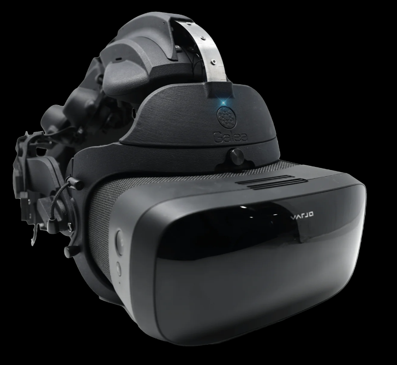
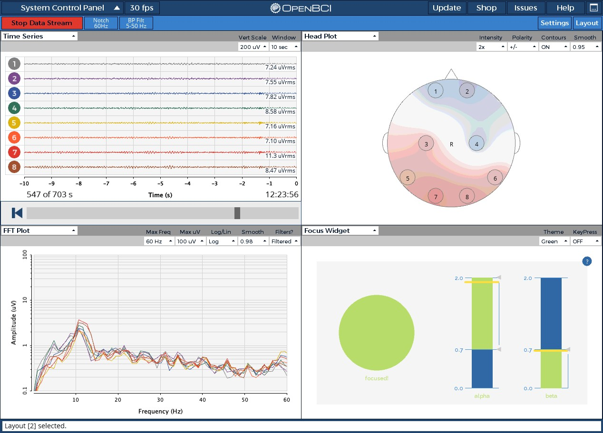
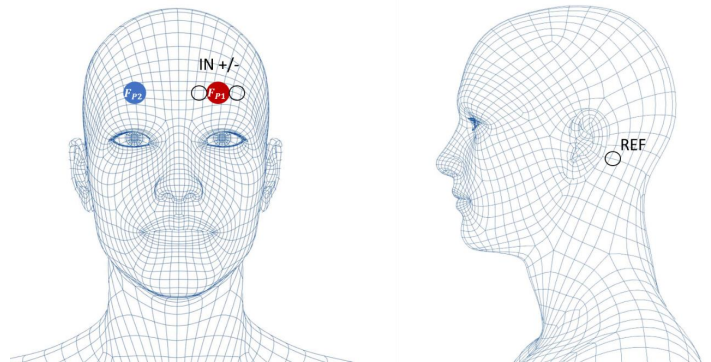

# LABORATORIO 6: Uso de OpenBCI en la adquisición de EEG

## **Tabla de contenidos:**

1. [**Introducción**](#1-introducción)  
2. [**Objetivos**](#2-objetivos)
3. [**Materiales y equipos**](#3-materiales-y-equipos)
4. [**Procedimiento**](#4-procedimiento)
5. [**Resultados**](#5-resultados)  
6. [**Conclusiones**](#6-conclusiones)
7. [**Referencias**](#7-referencias)

 

## **1) Introducción** 

### OpenBCI

  
Es una empresa enfocada en crear herramientas de código abierto relacionadas a biosensores y a la neurociencia, como interfaz cerebro-máquina (BCI en inglés). Entre los proyectos realizados por OpenBCI se tiene Galea, el cual es una plataforma que incluye hardware y software. Asimismo, incluye mediciones de EEG (electroencefalograma), EMG (electromiograma), EDA (actividad electrodermal), PPG (fotopletismografía) y seguimiento ocular, además que lo combina con inmersión de realidad aumentada y virtual. [WAOS]  

  

   

**Figura AAA: Imagen de Galea en la tienda de OpenBCI [MIAU]**  

 

Otro de los proyectos realizados por OpenBCI es el Ultracortex, el cual es un dispositivo que está diseñado para funcionar con el sistema OpenBCI y registrar la actividad EEG. En la actualidad, se cuenta con la versión de Ultracortex Mark IV (creado en enero de 2017) y continúa en desarrollo. [CHINCHIN]

  

   

**Figura BBB: Dispositivo Ultracortex Mark IV (para EEG) [GRAJEAS]**  

 

Gracias a que es un dispositivo de código abierto, los usuarios pueden acceder al archivo STL, imprimirlo en 3D y ensamblarlo por su cuenta. Para esto, se cuenta con guías e información sobre la impresión 3D (configuración y parámetros, además de la talla), montaje, colocación de electrodos (basado en sistema 10-20) y cables, configuración de los módulos (conexión entre tablero Ganglion [4 canales], Cyton [8 electrodos] y/o ampliación con el módulo Daisy [16 electrodos] con Mark IV [headset]), vinculación con dispositivos (como laptop) y la visualización de las ondas cerebrales (usando el GUI OpenBCI) [GRAJEAS] [WAZA].

  

   

**Figura CCC: Ejemplo de resultados utilizando la GUI BCI [PAROXÍSTICO]**  

 
  
## **2) Objetivos**
* Analizar las bioseñales respecto a diferentes dispositivos(bitalino y Ultracortex Mark IV) 
* Ver los cambios de las bioseñales respecto a las actividades z
* Ver las frecuencias de cada bioseñal, respecto a las actividades realizadas:
    * 30 segundos de reposo  
    * Abrir y cerrar los ojos cada 5 segundos  
    * Problemas aritméticos sencillos   
    * Problemas aritméticos complejos  
 
  

## **3) Materiales**
* Materiales
* Bitalino
* Open Signals
* Laptop
* OpenBCI
* Ultracortex Mark IV
* Cyton board
   
  
## **4) Procedimiento:**
  
### BITalino  

Para todas las actividaes relacionadas con el usó el Bitalino como  sensor y el Open Signals como el dispositivo que recolecta la información. Para esto primero se realizó la correcta conexión del Bitalino  con los cables de los electrodos y también la conexión con el software Open Signals. A la par también se colocaron los electrodos en la persona que se realizó la prueba. Para la colocación de los electrodos nos basamos respecto a esta imagen:

  

   

**Colocación de los electrodos [R1]**  

   
Posteriormente se realizaron 4 distintas actividades, con el fin de obtener EEG y analizar cómo varían.  
 

### Ultracortex Mark IV:
  

Este es un dispositivo de interfaz cerebro-computadora utilizado para la captura de las señales electroencefalográficas (EEG). Por lo tanto, el Ultracortex Mark IV permite registrar la actividad eléctrica cerebral no invasiva y convertirla en información útil. Para la captura de las señales EEG, se realizó la colocación de los electrodos mediante el sistema 10-20 internacional. Este sistema se basa en distancias porcentuales entre puntos anatómicos importantes como nasion, inion y orejas. Entonces los puntos de referencia utilizados para la colocación de los 8 electrodos son los siguientes:

* **FP**: áreas frontopolares
* **C**: áreas centrales
* **P**: +areas parietales
* **O**: áreas occipitales

  

## **5) Resultados:**  
## **6) Conclusiones:**  
## **7) Referencias:**
  
 

## Video:  
<video scr="https://github.com/Razzzon/PROYECTO_ISB/issues/1#issue-2554551280.mp4"></video>
 
