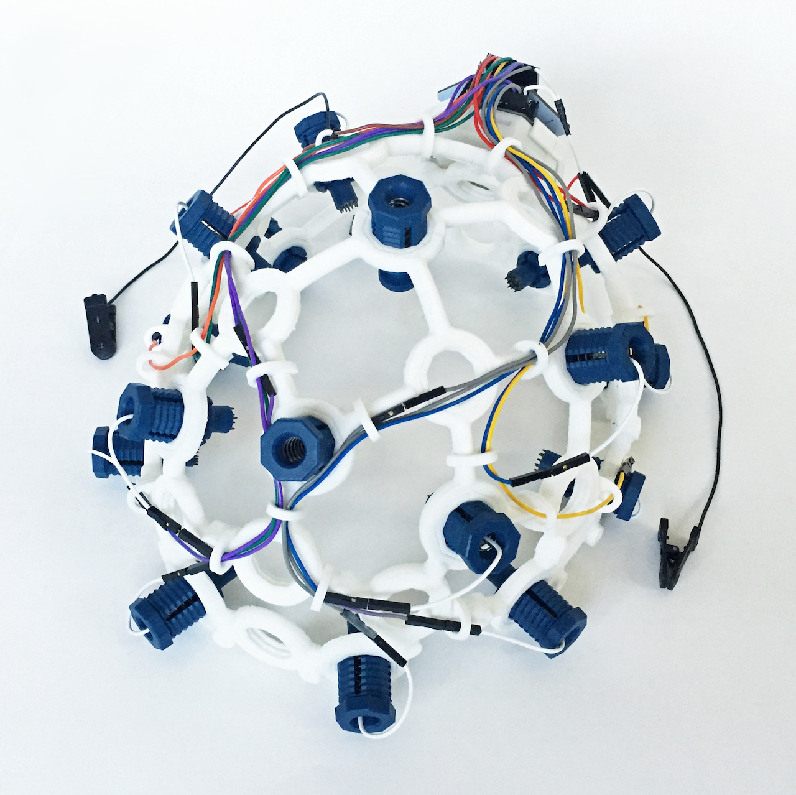

# LABORATORIO 6: Uso de OpenBCI en la adquisición de EEG

## **Tabla de contenidos:**

1. [**Introducción**](#1-introducción)  
2. [**Objetivos**](#2-objetivos)
3. [**Materiales y equipos**](#3-materiales-y-equipos)
4. [**Procedimiento**](#4-procedimiento)
5. [**Resultados**](#5-resultados)  
6. [**Conclusiones**](#6-conclusiones)
7. [**Referencias**](#7-referencias)

 

## **1) Introducción** 

### Electroencefalograma

Un electroencefalograma (EEG) es una herramienta que permite estudiar la actividad eléctrica a nivel cerebral [1]. Este método es ampliamente utilizado en entornos médicos ya que posee una gran variedad de aplicaciones: estudiar las funciones cerebrales, diagnosticar trastornos neurológicos y analizar cómo responde el cerebro a tareas de distinta complejidad.

  
  

   

**Figura 1: Representación de un EEG**  

 

Uno de los aspectos más atractivos de esta técnica es su naturaleza no invasiva, ya que se basa en la colocación de electrodos sobre la cabeza. Estos se encargan de medir el potencial eléctrico desde distintos puntos, lo que a su vez permite cuantificar la actividad de los lóbulos cerebrales. El equipamiento básico de todo este sistema consiste de los electrodos, un amplificador, un monitor y una central de procesamiento (usualmente un computador) [1]. 

  
  

Debido a que la cantidad de información está en gran parte dada por la cantidad de electrodos, existe un estándar para la cantidad de estos llamado sistema 10-20, que consta de 21 electrodos situados en la cabeza. Este estándar garantiza una ubicación consistente y reproducible de los electrodos, permitiendo así la comparación de EEGs entre diferentes estudios.

### OpenBCI

  
Es una empresa enfocada en crear herramientas de código abierto relacionadas a biosensores y a la neurociencia, como interfaz cerebro-máquina (BCI en inglés). Entre los proyectos realizados por OpenBCI se tiene Galea, el cual es una plataforma que incluye hardware y software. Asimismo, incluye mediciones de EEG (electroencefalograma), EMG (electromiograma), EDA (actividad electrodermal), PPG (fotopletismografía) y seguimiento ocular, además que lo combina con inmersión de realidad aumentada y virtual. [2]

  

   

**Figura 2: Imagen de Galea en la tienda de OpenBCI [6]**  

 

Otro de los proyectos realizados por OpenBCI es el Ultracortex, el cual es un dispositivo que está diseñado para funcionar con el sistema OpenBCI y registrar la actividad EEG. En la actualidad, se cuenta con la versión de Ultracortex Mark IV (creado en enero de 2017) y continúa en desarrollo. [3]

  

   

**Figura 3: Dispositivo Ultracortex Mark IV (para EEG) [5]**  

 

Gracias a que es un dispositivo de código abierto, los usuarios pueden acceder al archivo STL, imprimirlo en 3D y ensamblarlo por su cuenta. Para esto, se cuenta con guías e información sobre la impresión 3D (configuración y parámetros, además de la talla), montaje, colocación de electrodos (basado en sistema 10-20) y cables, configuración de los módulos (conexión entre tablero Ganglion [4 canales], Cyton [8 electrodos] y/o ampliación con el módulo Daisy [16 electrodos] con Mark IV [headset]), vinculación con dispositivos (como laptop) y la visualización de las ondas cerebrales (con el GUI OpenBCI.  [4] [5]

  

   

**Figura 4: Ejemplo de resultados utilizando la GUI BCI [7]**  

 
  
## **2) Objetivos**
* Analizar las bioseñales respecto a diferentes dispositivos(bitalino y Ultracortex Mark IV) 
* Ver los cambios de las bioseñales respecto a las actividades z
* Ver las frecuencias de cada bioseñal, respecto a las actividades realizadas:
    * 30 segundos de reposo  
    * Abrir y cerrar los ojos cada 5 segundos  
    * Problemas aritméticos sencillos   
    * Problemas aritméticos complejos  
 
  

## **3) Materiales**
* Materiales
* Bitalino
* Open Signals
* Laptop
* OpenBCI
* Ultracortex Mark IV
* Cyton board
   
  
## **4) Procedimiento:**
  
### BITalino  

Para todas las actividaes relacionadas con el usó el Bitalino como  sensor y el Open Signals como el dispositivo que recolecta la información. Para esto primero se realizó la correcta conexión del Bitalino  con los cables de los electrodos y también la conexión con el software Open Signals. A la par también se colocaron los electrodos en la persona que se realizó la prueba. Para la colocación de los electrodos nos basamos respecto a esta imagen: 

  

   

**Figura 5: Colación de los electrodos [8]**  

   
Posteriormente se realizaron 4 distintas actividades, con el fin de obtener EEG y analizar cómo varían. 
 

### Ultracortex Mark IV:
  

Este es un dispositivo de interfaz cerebro-computadora utilizado para la captura de las señales electroencefalográficas (EEG). Por lo tanto, el Ultracortex Mark IV permite registrar la actividad eléctrica cerebral no invasiva y convertirla en información útil. Para la captura de las señales EEG, se realizó la colocación de los electrodos mediante el sistema 10-20 internacional. Este sistema se basa en distancias porcentuales entre puntos anatómicos importantes como nasion, inion y orejas. Entonces los puntos de referencia utilizados para la colocación de los 8 electrodos son los siguientes:

* **FP**: áreas frontopolares
* **C**: áreas centrales
* **P**: +areas parietales
* **O**: áreas occipitales

  
  

   

**Figura 6: Imagen del Ultracortex Mark IV y tabla de colocación de electrodo-cable para el cyton board (8 canales)**  

   
  

Durante la adquisición de la señal, se observa una interfaz donde se muestra la actividad eléctrica de los 8 canales, la Transformada Rápida de Fourier (FFT) y la potencia de las bandas de las bandas de frecuencia de las ondas cerebrales.

  

   

**Figura 7: Interfaz gráfica de usuario[7]**  

   

### Actividades:
* **Cerrar ojos y respiración normal**  
  

El sujeto mantuvo un estado de calma mientras se le realizó una prueba de respiración controlada durante un periodo de 30 segundos.

  
  

* **cerrar-abrir con 30s2**  
  

Después de un reposo de 30 segundos, el sujeto procedió a realizar una secuencia de apertura y cierre de ojos. Mantuvo los ojos abiertos durante 5 segundos, seguidos de 5 segundos con los ojos cerrados, repitiendo esta acción según lo indicado.

  
  

* **Operaciones matemáticas de nivel fácil y difícil**

Si bien se tienen dos escenarios de operaciones aritméticas de distinta complejidad, la metodología de ambos es igual. Se buscaron 3 preguntas de la página Springerlink y se las preguntó al sujeto de prueba para cada caso, donde primero se le planteó al sujeto de pruebas las preguntas de nivel fácil y luego de nivel difícil. Se le repitió 3 veces cada pregunta y se esperó hasta que respondiera. Este procedimiento se siguió tanto para el caso de la toma de información vía BITalino como con el Ultracortex Mark IV. 

  

   

**Figura F8: Preguntas aritméticas fáciles[9]**  

 
  

   

**Figura F9: Preguntas aritméticas complejas[9]**  

 
  

Respecto al BITalino, una vez obtenidas las señales, se le realizó el procesamiento y posterior lectura de la información mediante el uso de Python. Se le aplicó un filtro pasa banda que contenía el rango de frecuencias de las ondas de interés (desde el 0.5 Hz que es el límite inferior para las ondas delta, hasta 50 Hz que es el límite superior para las ondas gamma)[16]. En el caso del Ultracortex Mark IV, la visualización de los datos se realizó desde el mismo programa.

## **5) Resultados:**  

### Bitalino:
* **Cerrar ojos y respiración normal**

   

**Figura 10: Resultados para la señal producto de cerrar ojos y respiración normal**  

   

  
Destaca una elevada potencia de las frecuencias de delta. En este caso particular, determinamos que se debe a una falla en la colocación del electrodo de referencia, ya que al momento de terminar las mediciones para esta etapa el electrodo no se encontraba en contacto completo con la piel. Esto generaría ruido por movimiento del electrodo, y el que sea de un ruido en bajas frecuencias es algo que se ha reportado previamente [17]. Finalmente, el también resalta una baja potencia de las ondas gamma. Esto se debe a que la tarea no implica una demanda cognitiva alta y/o compleja, por lo que no se requiere activación gamma que está usualmente relacionada a este tipo de tareas.

* **Abrir y cerrar ojos**

   

**Figura 11: Resultados para la señal producto de cerrar ojos y abrir ojos**  

 
  

La onda delta permanece con una amplitud baja debido a que los ejercicios realizados no están enfocados para su activación, lo cual implicaría someter al paciente a un sueño profundo. Luego, tenemos una activación de las ondas restantes, se nota una diferencia entre las ondas alpha y beta, lo que permite indicar la diferencia entre el abrir y cerrar los ojos. Al igual que theta y gamma, cuya variación es menos visible.

* **Operaciones matemáticas fáciles**  

Para el análisis vía BITalino, se obtuvieron los siguientes resultados al momento de aplicar las operaciones matemáticas de un nivel de complejidad sencillo. Estos gráficos de barras fueron obtenidos luego de filtrar la señal vía Python, para posteriormente obtener su PSD y clasificar en base a frecuencias de interés. 

  

   

**Figura 12: Señal EEG filtrada en el tiempo y su transformada.**  

 

   

**Figura 13: Resultados para la señal producto de operaciones sencillas**  

 

No obstante, para un mejor análisis de frecuencias, se optó por un procesamiento adicional. Se cargaron los datos de la señal en estado de reposo a manera de vector. Este vector fue restado del vector con los datos del EEG correspondientes a las operaciones fáciles. El propósito de realizar esto fue para poder limpiar el vector con los datos de EEG de interés de la información perteneciente al estado basal, resaltando aún más las características propias de la señal resultante de las operaciones fáciles. El vector producto de esta resta fue luego procesado de igual manera que se hizo anteriormente:  se filtró la vía Python y para posteriormente obtener su PSD y clasificar en base a frecuencias de interés. 

  

   

**Figura 14: Datos procesados para limpiar los datos de reposo**  

   
  

En este nuevo gráfico de barras, destaca de mejor manera la mayor potencia de las ondas beta e incluso se percibe un aumento de la potencia de gamma. En particular, esto es de esperarse en el contexto de la prueba aplicada. Si bien se plantean preguntas de índole aritmética de un nivel sencillo, de todas formas esto implica cierto nivel de pensamiento, ya que la capacidad de raciocinio implica siempre un nivel de complejidad cerebral y de actividad neuronal relacionada a resolución de problemas. En particular, las ondas beta reflejan este estado, ya que estas suelen manifestarse al completar una tarea y durante la concentración activa, y su activación se ha asociado a una elevada capacidad de cálculo aritmético [11]. De igual manera, se ha encontrado incluso que las ondas beta se manifiestan sólo por el simple hecho de que la persona se encuentre en un estado de concentración [12], lo cual también va de la mano con el escenario de la prueba: estar atento a la pregunta y realizar una operación matemática básica.

  
  

Destaca de igual manera una prevalencia de las ondas gamma. Estas se asocian a un nivel más elevado de concentración y conciencia [11]. También está relacionada con un estado de atención sostenida y otros tipos de procesos cognitivos avanzados como la memoria, percepción visual, entre otros [13]. En base a esto, tendría sentido que estas ondas estén presentes. Al realizar una tarea aritmética, por más simple que sea, el cerebro necesita coordinar diferentes áreas para procesar los números, entender la pregunta, recuperar el conocimiento matemático previo y responder.  

  
 
  
* **Operaciones matemáticas fáciles**  

Se obtuvo la señal filtrada con su transformada de fourier, para realizar el análisis de las ondas. Se tomó en cuenta una señal previa que es la de reposar por 30 segundos por segunda vez, esta se usó como referencia para obtener la señal que solo se considera cuando se está realizando la operación matemática. 

  
  

   

**Figura 15: Señal EEG filtrada en el tiempo y su transformada operaciones complejas.** 

   
  

Para esto se realizó una resta entre la señal de actividad compleja y la señal cuando está respirando por 30 segundos. Una vez obtenido la señal y su FFT es difícil de analizar la señal en el tiempo y la señal en frecuencia (FFT), para esto se realizó la PSD (power spectral density) de la señal con el fin de obtener un diagrama de barras, de tal forma que sea más fácil analizar, debido a que en el diagrama de barras se puede realizar mediante rangos, es decir, por ondas cerebrales:

  
  

   

**Figura 16: Gráfico de barras con la señal con anomalias.** 

  
  

Respecto a la imagen obtenida hay que tener en cuenta, que se puede ver una alta actividad en las ondas delta (0.5 hz - 4 Hz), esta onda delta representa la fase de sueño profundo lo cual no concuerda con la actividad que está realizando el sujeto, que es realizar actividades matemáticas complejas. Viendo la señal en función del tiempo se detectaron anomalías (señales en función del tiempo que parecen ondas cuadradas), recordando que las ondas cuadras (función rect(t)), en función del tiempo, se representa como función sinc(f), cuando se representa en frecuencias; teniendo en cuenta que la función Sinc(f) presenta una gran cantidad de frecuencias bajas, esto se vería reflejado como si fuera onda delta.

  
  

   

**fig 17.  Señal con anemias similar a ondas cuadradas** 

  
  

Para corregir esto se realizó otro filtrado a partir de 5 hz - 50 hz , con el fin de disminuir el sesgo de la señal causa por las anomalías obteniendo el siguiente gráfico de barras.

  
Se consideró el siguiente rango de frecuencias:
* **Delta**: 0.5 - 4 Hz *(amarillo)*  
* **Theta**: 4 - 8 Hz *(verde)*  
* **Alfa**: 8 - 13 Hz *(azul)*  
* **Beta**: 13 - 32 Hz *(anaranjado)*  
* **Gamma**: 32 - 50 Hz *(morado)*
  
  

   

**Figura 18: Gráfico de barras filtrada sin anomalías** 

   
  

El gráfico de barras muestra la potencia de la señal en las distintas bandas de frecuencia durante la realización de operaciones aritméticas complejas. Se observa que la mayor potencia está en la banda beta (13 Hz - 32 Hz) lo cual es consistente con la literatura científica, el cual asocia las ondas Beta con actividades cognitivas intensas, así como el procesamiento de cálculos matemáticos. Esto confirma que, en esta instancia, la señal EEG del individuo refleja una alta actividad cognitiva en la banda Beta, que predomina sobre las otras bandas.

  
  

También se realizó una comparación entre señales sin referencia y con referencia y se vio que si presenta una variación.

  
  

   

**fig 19. Gráficos de barras de la PSD** 

   
  

A partir de las imágenes se observa que la principal diferencia es que en la onda theta (verde) hay una mayor intensidad sin tener como referencia a la señal basal. Pero si tomamos como referencia la señal basal se ve que las onda alpha (morada) presenta mayor intensidad.

  
  
### Ultracortex Mark IV:
* **Cerrar los ojos**  

   

**fig 20. Open BCI 30 segundos** 

   
  

Como se observa en la figura, durante los 30 segundos de respiración controlada, la actividad en la banda Alpha mostró una mayor potencia relativa en comparación con otras bandas de frecuencia. Este fenómeno es característico del estado de relajación que experimenta el sujeto cuando no se enfrenta a estímulos externos significativos y se encuentra en un estado de descanso con los ojos cerrados o en reposo mental.

  
  

   

**fig 21. Gráficos de barras por canal en 30 segundos respiración** 

   

A partir de los análisis de los canales, se observa que hay una mayor activación de las ondas alfa en los canales 3 y 4. Aunque lo esperado sería que durante la actividad de cerrar los ojos y respirar normalmente se active el lóbulo occipital (canal 7 y 8) debido a que está asociado con el estado de descanso visual. Una mayor activación de la zona central (canal 3 y 4) se justifica por un posible movimiento de los músculos de la cabeza o cuello durante la respiración debido a que esta acción es en mayor medida un movimiento autónomo, pero presenta una parte voluntaria. Por lo tanto, los movimientos musculares leves posiblemente fueron la causa de que haya sucedido una mayor actividad en la parte central del cerebro.

  

* **Cerrar y abrir ojos**  
  

Durante la prueba, el sujeto alterna entre abrir y cerrar los ojos en intervalos regulares de 5 segundos. Este tipo de actividad constante provoca que las ondas Alpha (relajación con ojos cerrados) y Beta (alerta con ojos abiertos) se activen de manera intermitente y casi simultánea. El cerebro no tiene suficiente tiempo para reducir completamente una banda antes de que la otra vuelva a activarse.

  

   

**fig 22. Open BCI abrir y cerrar ojos** 

   

   

**fig 23. Gráficos de barras por canal de abrir y cerrar ojos	** 

  

A partir de las gráficas obtenidas en función del tiempo, notamos que hay un patrón que se cumple para la mayoría de canales, las ondas delta permanecen con una intensidad baja, en ocasiones, no se aprecia, esto debido a que este tipo está asociado con un sueño profundo, cosa que no ocurre en ninguno de los ejercicios analizados, luego, cuando la persona permanece con los ojos cerrados, tanto las ondas theta (en menos proporción), alfa, presentan un aumento moderado respecto a las ondas beta, gamma(en menor proporción), esto debido a que las ondas theta se asocian con un estado de meditación, así como las ondas alfa que se activan en momentos de relajación, por otro lado, las onda beta disminuyen cuando las personas mantienen los ojos cerrados, ya que no se encuentre en un estado de alerta completo, más aún cuando esta persona presentaba audífonos que lo aislaba auditivamente. Asimismo, indicar que estos cambios se pueden apreciar con mayor claridad cuando se analizan los canales 7 y 8 para ojos abiertos, ya que este canal analiza la región occipital el cual se encarga del procesamiento visual, principalmente.

  
  
* **Operaciones matemáticas fácil**  
  

   

**Figura 24: Datos visualizados en OpenBCI** 

  
  

En cuanto a los resultados para operaciones matemáticas fáciles usando el Ultracortex, se obtienen resultados similares a los vistos para el BITalino en el mismo caso de pruebas. Se percibe una activación tanto de beta como gamma, lo que implica que se están llevando a cabo procesos cognitivos más complejos, lo que a su vez va de la mano del contexto de la prueba. No obstante, gracias al Ultracortex también podemos ver las zonas de activación gracias al apartado Head Plot. En este caso, vemos que existe mayor activación alrededor de la zona parietal, frontal e incluso occipital.

  

Si bien el participante realizó la prueba con ojos cerrados, lo que implicaría una poca activación occipital, es posible que para resolver las preguntas haya optado por imágenes mentales para representar operaciones. Se ha encontrado evidencia de que la imaginería visual de una persona puede llegar a activar la región occipital [14], lo cual puede explicar la activación percibida. 

  
  

Por otro lado, la activación parietal puede deberse al procesamiento del estímulo auditivo de la pregunta, ya que estudios acerca de lesiones en el área parietal derecha mostraron que esta zona es crítica para el reconocimiento de la voz [15]. Finalmente, la activación frontal era esperada, ya que esta zona está involucrada en el procesamiento y resolución de problemas. Además, la poca activación de esta zona va de la mano con la complejidad de la tarea, ya que si bien es necesaria por la naturaleza racional, tampoco es muy demandante.

  
   

* **Operaciones matemáticas difícil**
  

A partir de los resultados obtenidos, se observa que la amplitud en el canal 2 tiene un valor constante de 0, lo que sugiere una posible mala colocación del electrodo o que este se desprendió, impidiendo la recepción de señal en ese canal.  

  
  

   

**fig 25. Open BCI canal 2** 

   
  

En cuanto al análisis de las bandas de frecuencia de las ondas cerebrales, se observa que las ondas beta y gamma son las más prominentes, mientras que la onda delta muestra la menor actividad. Este patrón es coherente con la actividad realizada, ya que las ondas beta están asociadas con procesos mentales activos y concentración, mientras que las ondas gamma suelen aparecer en actividades cognitivas de alto nivel.  

  
  

Además, el gráfico de barras revela que las intensidades de las ondas theta y alpha también son elevadas, especialmente durante la resolución de problemas simples. Esto indica una mayor activación cerebral durante la tarea matemática, ya que dichas ondas están asociadas con la coordinación de procesos de atención y la relajación mental necesaria para resolver problemas.

  
  

   

**fig 26. Open BCI** 

   
  

Por último, se analizó el canal 1, observando que este muestra la mayor activación en el lóbulo frontal, lo cual es consistente con el tipo de actividad cognitiva llevada a cabo, dado que el lóbulo frontal es clave en el procesamiento de tareas complejas y toma de decisiones.

  
  

   

**fig 27. Gráficos de barras por canal en resolución de problemas complejos** 

    
  

## **6) Conclusiones:**  

 

* Se observó que durante la actividad de cerrar los ojos y respirar normalmente, hubo una mayor actividad de las ondas alfa. Además, se observó una mayor actividad en la zona central del cerebro debido a que el movimiento de respiración presenta una parte voluntaria, lo que ocasiona la activación de esa zona del cerebro debido a los leves movimientos musculares.

  

 

* Se observó que durante la resolución de problemas matemáticos, la intensidad de las ondas cerebrales varía en función de si se usa el estado basal como referencia. Con referencia, la onda beta (azul) muestra mayor intensidad, mientras que sin referencia, aumenta la intensidad de la onda theta.

  

  

* Se observó que durante la resolución de problemas matemáticos, la intensidad de las ondas cerebrales varía en función de si se usa el estado basal como referencia. Con referencia, la onda beta (azul) muestra mayor intensidad, mientras que sin referencia, aumenta la intensidad de la onda theta.

  
  

 

* Se concluye que a partir de la actividad realizada, se obtiene una diferente potencia de las bandas de frecuencia de las ondas cerebrales.

  

 

* Se concluye que para la actividad donde se realizó preguntas complejas, se obtienen ondas beta y gamma más prominentes debido a que estas están asociadas a la actividad mental, concentración y procesos cognitivos complejos.  

  

## **7) Referencias:**

[1] A. Rayi y N. I. Murr, “Electroencephalogram”, en StatPearls, Treasure Island (FL): StatPearls Publishing, 2024. Disponible en: http://www.ncbi.nlm.nih.gov/books/NBK563295/.  
  
[2] “OpenBCI | About”. Disponible en: https://openbci.com/about.  
  
[3] OpenBCI/Ultracortex. OpenBCI, 2024. Disponible en: https://github.com/OpenBCI/Ultracortex.   
  
[4] “Ultracortex Mark IV EEG Headset Assembly - YouTube”. Disponible en: https://www.youtube.com/watch?v=S87FV-Q59F8.  
  
[5] “Ultracortex Mark IV | OpenBCI Documentation”, el 20 de septiembre de 2024. Disponible en: https://docs.openbci.com/AddOns/Headwear/MarkIV/  
  
[6] “Galea – OpenBCI Online Store”. Disponible en: https://shop.openbci.com/products/galea?variant=43850609295600.  
  
[7] “OpenBCI_GUI/images/GUI-V4-Screenshot.jpg at master · OpenBCI/OpenBCI_GUI”, GitHub. Disponible en: https://github.com/OpenBCI/OpenBCI_GUI/blob/master/images/GUI-V4-Screenshot.jpg.  

[8] “BITalino (r)evolution Lab Guide”. Disponible en: https://support.pluxbiosignals.com/wp-content/uploads/2022/04/HomeGuide3_EEG.pdf  
  
[9] “Table 1 | EEG correlation during the solving of simple and complex logical–mathematical problems | Cognitive, Affective, & Behavioral Neuroscience”. Disponible en: https://link.springer.com/article/10.3758/s13415-019-00703-5/tables/1  
  
[10]  K. Kragel, "Event-Related Potential (ERP) Filtering," Neural Data Science: A Primer with MATLAB and Python, 2023. [Online]. Disponible en: https://neuraldatascience.io/7-eeg/erp_filtering.html.  
  
[11] P. Kora, K. Meenakshi, K. Swaraja, A. Rajani, y M. S. Raju, “EEG based interpretation of human brain activity during yoga and meditation using machine learning: A systematic review”, Complementary Therapies in Clinical Practice, vol. 43, p. 101329, may 2021, doi: 10.1016/j.ctcp.2021.101329. Disponible en: https://www.sciencedirect.com/science/article/pii/S1744388121000281.  
  
[12] M. Hosťovecký y B. Babušiak, “Brain activity: beta wave analysis of 2D and 3D serious games using EEG”, Journal of Applied Mathematics, Statistics and Informatics, vol. 13, núm. 2, pp. 39–53, dic. 2017, doi: 10.1515/jamsi-2017-0008. Disponible en: https://www.sciendo.com/article/10.1515/jamsi-2017-0008.  
  
[13] L. Bhaskar, V. Tripathi, C. Kharya, V. Kotabagi, M. Bhatia, y V. Kochupillai, “High-Frequency Cerebral Activation and Interhemispheric Synchronization Following Sudarshan Kriya Yoga as Global Brain Rhythms: The State Effects”, International Journal of Yoga, vol. 13, núm. 2, p. 130, ago. 2020, doi: 10.4103/ijoy.IJOY_25_19. Disponible en: https://journals.lww.com/ijoy/fulltext/2020/13020/High_Frequency_Cerebral_Activation_and.7.aspx.  
  
[14] B. de Gelder, M. Tamietto, A. J. Pegna, and J. Van den Stock, "Visual imagery influences brain responses to visual stimulation in bilateral cortical blindness," Cortex, vol. 59, pp. 1-12, 2015. [Online]. Disponible en: https://www.sciencedirect.com/science/article/abs/pii/S001094521400375X.  
  
[15] C. Roswandowitz, C. Kappes, H. Obrig, and K. von Kriegstein, "Obligatory and facultative brain regions for voice-identity recognition," Brain, vol. 141, no. 1, pp. 234–247, 2018. [Online]. Disponible en: https://academic.oup.com/brain/article/141/1/234/4708308  
  
[16] “EEG correlation during the solving of simple and complex logical–mathematical problems | Cognitive, Affective, & Behavioral Neuroscience”. Disponible en: https://link.springer.com/article/10.3758/s13415-019-00703-5.  
  

