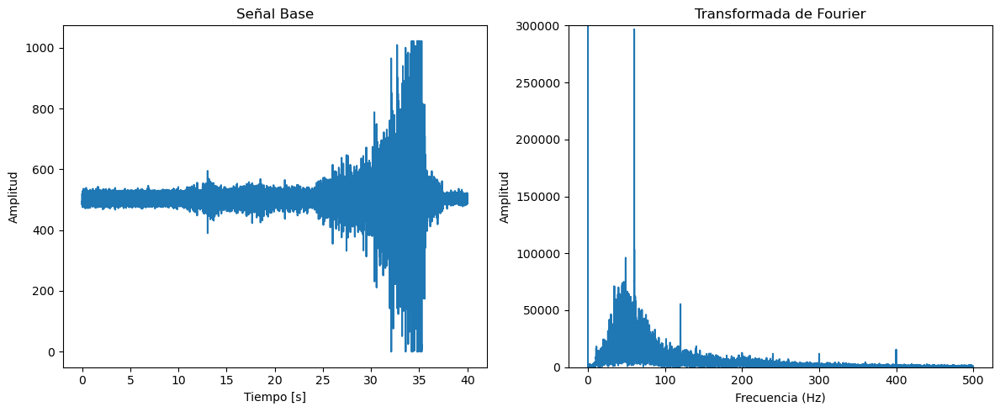
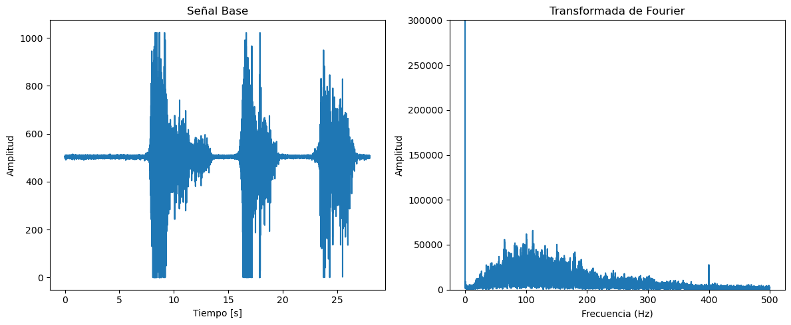
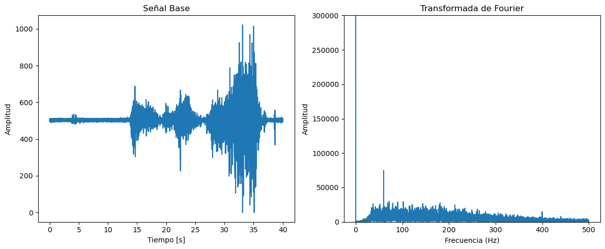
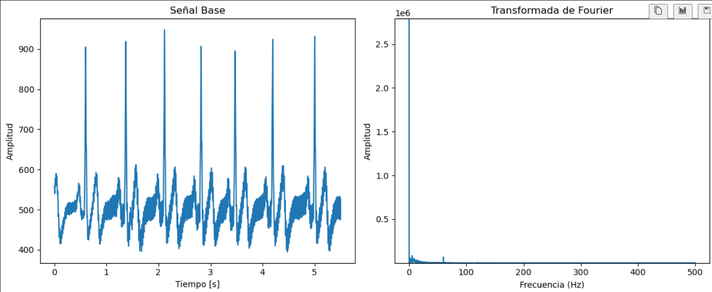
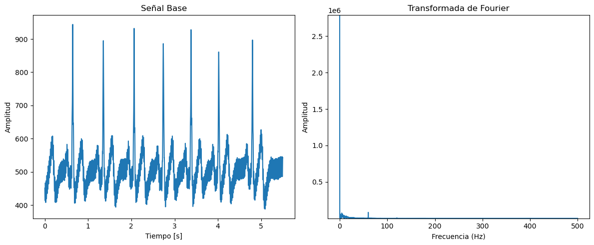
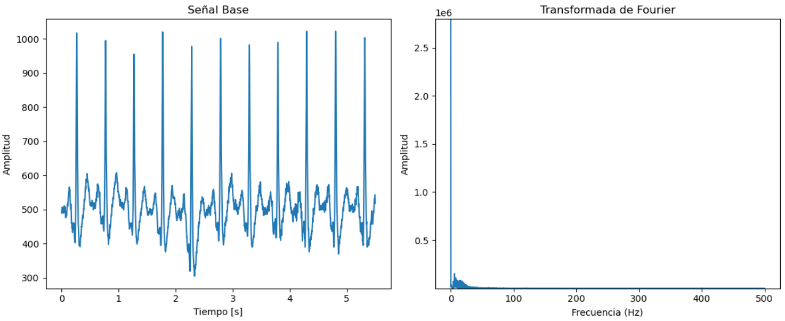

# FILTRADO DE SEÑALES ECG Y EMG
**Autor: Alejandro Javier Rosas González-Zúñiga**

**EL ARCHIVO .MD FUE TRABAJADO DE MANERA INDIVIDUAL**

***Nota*: Todos los códigos usados e implementados pueden ser encontrados en la carpeta *codigos*, que esta localizada dentro de la carpeta personal.**

    En el presente informe, se muestra el filtrado de una selección de las señales obtenidas en los laboratorios 4 y 5 (EMG y ECG). En concreto, se hará el filtrado de una señal por actividad para tanto EMG y ECG. Recordando, tenemos las siguientes actividades:

**Actividades del Laboratorio 4: EMG**

* Contracción de bíceps  
* Contracción del tríceps  
* Contracción de gastrocnemio

**Actividades del Laboratorio 5: ECG**

* Medición en estado basal  
* Medición aguantando la respiración durante 10 segundos  
* Medición post ejercicio (ejercicio realizado durante 5 minutos)

    Por otro lado, en cuanto a los tipos de filtro a utilizar, se está considerando dos filtros FIR y uno IIR. Esto debido a que se ha visto que los filtros del tipo FIR resultan mucho más efectivos y obtienen un mejor rendimiento para el filtrado de este tipo de señales en comparación a los IIR \[1\]. Sumado a esto, debido a la naturaleza del filtro IIR, estos no pueden garantizar una fase lineal en la respuesta \[2\]. Esto quiere decir que los distintos componentes frecuenciales de la señal de entrada pueden sufrir delays, lo cual resulta en un problema si es que la señal tiene parámetros dependientes de su fase, como lo es una señal de ECG por ejemplo: estos delays pueden modificar la relación temporal entre los distintos componentes como el complejo QRS, onda P, etc., lo que puede llevar a un error en un diagnóstico. Pese a esto, se optó por incluir un filtro IIR en la selección para evaluar qué tanto afecta la fase. Los filtros FIR fueron implementados con la ayuda de Pyfdax.

**JUSTIFICACIÓN** 
 

    Para el filtrado se optó, como se mencionó anteriormente, de tres tipos de filtros. Dependiendo de la señal, algunos parámetros se fueron cambiando para poder adaptarse a las características de la data a procesar. No obstante, en general, los tipos de filtros fueron los siguientes.

* **Filtro FIR Blackman:** La elección del filtro Blackman se basó en el hecho de que la ventana de Blackman ofrece un alto nivel de atenuación de las bandas indeseadas. La potencial atenuación que alcanza Blackman es superior a la de otras ventanas como Hamming, Bartlett, Rectangular, etc., llegando a rondar los 40 dB. Esto la hace ideal para aplicaciones que requieren un filtrado preciso, al igual que una fuerte supresión de frecuencias. De igual manera, al ser un filtro FIR goza de la ventaja de la linealidad de fase en las frecuencias aceptadas por el filtro.  
    
* **Filtro FIR Rectangular:** Al igual que la ventana de Blackman, tiene las ventajas de linealidad de fase. Adicionalmente, la ventana Rectangular es práctica por el hecho de que es computacionalmente eficiente de implementar por su simplicidad. No obstante, esta ventana es la que menos atenuación puede llegar a ofrecer entre las distintas ventanas de filtros FIR. Su elección se basó en concreto para poder comparar qué tal se comportaba este tipo de filtro aparentemente inferior frente a uno superior como los es el FIR via Blackman  
    
* **Filtro IIR Notch:** A diferencia de los filtros anteriores, el filtro Notch busca eliminar una frecuencia específica entre los componentes frecuenciales de una señal. Esto lo hace una opción viable si es que se conoce la frecuencia del ruido o de algún artefacto a atenuar. En otras palabras, es altamente selectivo, y como conocemos la frecuencia del ruido por red eléctrica, el filtro Notch es excelente para este testeo de filtros. Finalmente, la capacidad de poder alterar el factor de calidad Q nos permite elegir que tanto queremos afectar las frecuencias aledañas a la frecuencia objetivo.

# Filtrado: Laboratorio 4
Para las señales del laboratorio 4, tenemos EMG recolectados del bicep, tricep y gastrocnemio. Para evaluar los cambios que sufre la señal a medida que se dé el filtrado, se optó por rescatar la data del archivo en formato *.txt* para, aparte de aplicar los respectivos filtros, graficar la señal original junto a su transformada de Fourier. De igual manera, se graficó su transformada corta de Fourier (STFT). Esto último para la aplicación de espectrograma.  Empezaremos mostrando el procesamiento de la señal obtenida del bicep.

### **BÍCEPS**

    A continuación se muestra el ploteo de la señal en crudo de EMG del bicep, su transformada de Fourier y su STFT en forma de espectrograma. En estas gráficas, podemos ver que destaca la presencia de un pico prominente correspondiente a 60 Hz. Esto puede deberse al ruido introducido por la toma de corriente nacional, por lo que los filtros aplicados en este caso estarán destinados a reducirla en lo máximo posible. Por otro lado, vemos que destacan componentes frecuenciales por debajo de los 10 Hz. Esto es de esperarse ya que las señales EMG del músculo estriado se encuentran dentro del rango de 2 - 500 Hz [3].

  

  **Figura 1: Señal sin procesar para contracción de biceps**
  

 

  

  **Figura 2: Espectrograma (STFT) de la señal del biceps sin procesar**
  

 

***Filtro 1***

    Ahora, procederemos a aplicar los filtros. En primer lugar, se aplicará un filtro FIR rechaza banda de Blackman. Este filtro es de orden 275, y su banda de rechazo comprende un rango donde se encuentran los 60 Hz de la alimentación: entre 55 y 65 Hz. A continuación, se muestra la señal filtrada, su transformada y la STFT.

  

  **Figura 3: Señal filtrada por filtro 1**
  

 

  

  **Figura 4: Espectrograma (STFT) de la señal del filtro 1**
  

 

    Para entender mejor el sistema, también se presenta el diagrama de polos y ceros, sumado al diagrama de Bode. Se puede apreciar la disposición de los ceros alrededor del círculo unitario, además de que los filtros FIR son inherentemente estables. En el diagrama de Bode se muestra la atenuación en la banda objetiva, al igual que la linealidad de la fase.

  

  **Figura 5: Diagrama de polos y ceros del filtro 1**
  

 

  

  **Figura 6: Diagrama de BODE del filtro 1**
  

 

***Filtro 2***  

    El filtro 2 es un FIR con ventana Rectangular. Es de orden 151, y se eligió la banda de rechazo de 55 a 62 Hz, para ver que tal respondía el filtro a los parámetros. 

  

  **Figura 7: Señal filtrada por filtro 2**
  

 

  

  **Figura 8: Espectrograma (STFT) de la señal del filtro 2**
  

 

    De igual manera, se presenta el diagrama de Bode y el de polos y ceros. En particular, destaca las ondulaciones que presenta en la respuesta en magnitud. Esto es de esperarse ya que la ventana es de las de menor rendimiento.

  

  **Figura 9: Diagrama de polos y ceros del filtro 2**
  

 

  

  **Figura 10: Diagrama de BODE del filtro 2**
  

 

***Filtro 3***  

    Ahora, se presenta el filtro Notch. Para su diseño, se consideró la frecuencia objetivo como 60 Hz, y el factor de calidad Q = 50 para lograr alta selectividad.   

 

  

  **Figura 11: Señal filtrada por filtro 3**
  

 

  

  **Figura 12: Espectrograma (STFT) de la señal del filtro 3**
  

 

    En el diagrama de polos y ceros para el filtro Notch, vemos que existe una cantidad extremadamente reducida de polos y ceros, en comparación a los filtros anteriores. Esta es una de las ventajas del filtro Notch, siendo computacionalmente eficiente. En cuanto al diagrama de Bode, resalta la mencionada especificidad del filtro sobre los 60 Hz, logrando una buena atenuación. Finalmente, vemos un comportamiento particular de la fase alrededor de la frecuencia objetivo, no obstante, esto no afecta en gran medida ya que esta distorsión aparece cerca a la frecuencia a eliminar, dejando intacta al resto.

  

  **Figura 13: Diagrama de polos y ceros del filtro 3**
  

 

  

  **Figura 14: Diagrama de BODE del filtro 3**
  

  

  

  **Figura 15: Distorsión de la fase entre 55 y 65 Hz del filtro 3**
  

  

### **TRICEPS**  

    Para la señal EMG del tríceps, se siguió un procedimiento similar al detallado anteriormente. Empezaremos mostrando los ploteos correspondientes a la señal en crudo de EMG para tríceps. Destaca su naturaleza pulsátil. Además, vemos una concentración de componentes frecuenciales alrededor de 100 Hz. Debido a esto, para el caso del tríceps, buscaremos eliminar estas frecuencias cercanas a 100 Hz (incluyendo a 100 Hz) para evaluar que tan bien logran este cometido los filtros.

  

  **Figura 16: Señal sin procesar para contracción de triceps**
  

 

  

  **Figura 17: Espectrograma (STFT) de la señal del triceps sin procesar**
  

 

***Filtro 1***  

    El primer filtro aplicado es un filtro FIR Blackman rechaza bandas de orden 199. Como queremos eliminar las frecuencias que rodean a 100 Hz, se eligió una banda de rechazo entre 85 y 115 Hz. En la transformada de la señal filtrada, vemos la atenuación deseada.

  

  **Figura 18: Señal filtrada por filtro 1**
  

 

  

  **Figura 19: Espectrograma (STFT) de la señal del filtro 1**
  

 

    Se presenta el diagrama de polos y ceros, y el de Bode. Vemos que en este caso el filtro Blackman logró una atenuación importante, mayor a la que logró en el caso del bíceps.

  

  

  **Figura 20: Diagrama de polos y ceros del filtro 1**
  

 

  

  **Figura 21: Diagrama de BODE del filtro 1**
  

 

***Filtro 2***  

    El segundo filtro es un FIR de ventana rectangular y también rechaza banda. Es de orden 121 y la banda de rechazo está delimitada por las mismas frecuencias que el filtro anterior. Se logra, de igual manera, una atenuación importante.

  

  **Figura 22: Señal filtrada por filtro 2**
  

 

  

  **Figura 23: Espectrograma (STFT) de la señal del filtro 2**
  

 

    Se presenta el diagrama de polos y ceros, y el de Bode. Para el caso de la ventana rectangular vemos unas oscilaciones en la banda de rechazo en lo que respecta la atenuación, lo cual puede deberse al fenómeno de Gibbs. En la fase también existe una distorsión dentro de la banda de rechazo, no obstante, al suceder en esta región, no es de gran importancia.

  

  **Figura 24: Diagrama de polos y ceros del filtro 2**
  

 

  

  **Figura 25: Diagrama de BODE del filtro 2**
  

  

  

  **Figura 26: Distorsión de la fase entre 55 y 65 Hz del filtro**
  

  

***Filtro 3***  

    El filtro Notch aplicado tiene como frecuencia objetivo 100 Hz y con un factor de calidad de 40\. En este caso, el filtro Notch no elimina un fragmento considerable como lo han hecho los otros filtros. 

  

  **Figura 27: Señal filtrada por filtro 3**
  

 

  

  **Figura 28: Espectrograma (STFT) de la señal del filtro 3**
  

 

    Se presenta el diagrama de polos y ceros, y el de Bode. Los polos se encuentran justo en el círculo unitario, haciendo al filtro marginalmente estable. Por otro lado, el diagrama de Bode vuelve a mostrar la alta selectividad de este tipo de filtros. 

  

  **Figura 29: Diagrama de polos y ceros del filtro 3**
  

 

  

  **Figura 30: Diagrama de BODE del filtro 3**
  

 

### **GASTROCNEMIO**  

    A continuación, se muestran los ploteos correspondientes para la señal en crudo. También tiene una naturaleza similar a los pulsos vistos en el tríceps. Además, aparece un pico en 60 Hz, dándonos a entender que es ruido de la red eléctrica.

  

  **Figura 31: Señal sin procesar para contracción del gastrocnemio**
  

 

  

  **Figura 32: Espectrograma (STFT) de la señal del biceps sin procesar**
  

 

***Filtro 1***  

    Aplicamos un filtro FIR de ventana de Blackman rechaza bandas. Este es de orden 275 y como buscamos nuevamente eliminar el ruido de la alimentación, el rango a rechazar es entre 55 y 62 Hz. Se puede ver en la transformada que se logra atenuar en este rango.  

  

  **Figura 33: Señal filtrada por filtro 1**
  

 

  

  **Figura 34: Espectrograma (STFT) de la señal del filtro 1**
  

 

    Se presenta el diagrama de polos y ceros, y el de Bode. Como es de esperarse, se logra una atenuación aceptable en el rango de interés y una fase lineal.

  

  **Figura 35: Diagrama de polos y ceros del filtro 1**
  

 

  

  **Figura 36: Diagrama de BODE del filtro 1**
  

 

***Filtro 2***  

    En cuanto al filtro FIR de ventana rectangular, este también es rechaza banda y tiene como banda de rechazo la misma que el filtro anterior. Es de orden 151 y también logró una atenuación dentro de esta zona.

  

  **Figura 37: Señal filtrada por filtro 2**
  

 

  

  **Figura 38: Espectrograma (STFT) de la señal del filtro 2**
  

 

    Se presenta el diagrama de polos y ceros, y el de Bode. Presenta oscilaciones propias de la ventana rectangular en la respuesta en magnitud. De igual manera, presenta sorprendentemente mayor atenuación que la ventana de Blackman. La fase es lineal.

  

  **Figura 39: Diagrama de polos y ceros del filtro 2**
  

 

  

  **Figura 40: Diagrama de BODE del filtro 2**
  

 

***Filtro 3***  

    En cuanto al filtro Notch aplicado, tuvo como frecuencia objetivo los 60 Hz de la red eléctrica, y se eligió un factor de calidad mucho más alto que para los casos anteriores. Esto con el fin de evaluar la especificidad a la que puede llegar el filtro. La alta especificidad se refleja en una transformada que no presenta cambios bruscos producto de la eliminación de toda una banda.

  

  **Figura 41: Señal filtrada por filtro 3**
  

 

  

  **Figura 42: Espectrograma (STFT) de la señal del filtro 3**
  

 

    Se presenta el diagrama de polos y ceros, y el de Bode. Destaca nuevamente la especificad en el diagrama de Bode, al igual que la naturaleza marginalmente estable del sistema que caracteriza al filtro. Vuelve a hacerse presente la distorsión en fase cercana a la frecuencia objetivo.

  

  **Figura 43: Diagrama de polos y ceros del filtro 3**
  

 

  

  **Figura 44: Diagrama de BODE del filtro 3**
  

 

# ***Filtrado: Laboratorio 5***  

    Para las señales del laboratorio 5, tenemos ECG recolectados en distintas etapas: basal, aguantando la respiración por 10 segundos y posterior a 5 minutos de ejercicio predominantemente aeróbico. Empezaremos por el procesamiento de la señal basal.

**ESTADO BASAL**  

    Se muestran los ploteos correspondientes a la señal ECG basal. Nuevamente, en la transformada de Fourier se puede apreciar un componente frecuencial correspondiente al ruido de la alimentación.

  

  **Figura 45: Señal sin procesar para ECG basal**
  

 

  

  **Figura 46: Espectrograma (STFT) de la señal del ECG basal sin procesar**
  

 

***Filtro 1***  

    Como en los casos anteriores, tenemos un filtro FIR Blackman, en este caso de orden 281\. Además, se consideró una banda de rechazo que comprende entre 55 a 65 Hz. En la transformada se ve que se eliminó satisfactoriamente el pico en 60 Hz.

  

  **Figura 47: Señal filtrada por filtro 1**
  

 

  

  **Figura 48: Espectrograma (STFT) de la señal del filtro 1**
  

 

    Se presenta el diagrama de polos y ceros, y el de Bode, mostrando la naturaleza de estabilidad inherente del filtro al igual que una atenuación superior a 15 dB para la banda de rechazo. Todo esto nos indica que el filtro se comporta de manera esperada.

  

  **Figura 49: Diagrama de polos y ceros del filtro 1**
  

 

  

  **Figura 50: Diagrama de BODE del filtro 1**
  

 

***Filtro 2*** 

 
    En este caso, el filtro FIR de ventana rectangular de orden 223, y con la misma banda de rechazo que el filtro de ventana Blackman. El filtro también logra la supresión del pico en 60 Hz.

  

  **Figura 51: Señal filtrada por filtro 2**
  

 

  

  **Figura 52: Espectrograma (STFT) de la señal del filtro 2**
  

 

    Se presenta el diagrama de polos y ceros, y el de Bode, mostrando la naturaleza de estabilidad inherente del filtro al igual que una atenuación superior al filtro anterior, sobrepasando los 60 dB. No obstante, presenta oscilaciones en esta zona. De igual manera, existe una distorsión en la fase en la banda de rechazo. Se comprueba que esta distorsión pertenece a la banda de rechazo ploteando líneas adicionales.

  

  **Figura 53: Diagrama de polos y ceros del filtro 2**
  

   

  

  **Figura 54: Distorsión de la fase entre 55 y 65 Hz del filtro**
  

 

***Filtro 3*** 

 
    El filtro Notch tiene una frecuencia objetivo de 60 Hz y un factor de calidad de 30.También logra la supresión del pico en la frecuencia previamente mencionada.

  

  **Figura 55: Señal filtrada por filtro 3**
  

 

  

  **Figura 56: Espectrograma (STFT) de la señal del filtro 3**
  

 

Se presenta el diagrama de polos y ceros, y el de Bode.

  

  **Figura 57: Diagrama de polos y ceros del filtro 3**
  

 

  

  **Figura 58: Diagrama de BODE del filtro 3**
  

 

### **ESTADO DE MANTENER LA RESPIRACIÓN**  

    Se muestran los ploteos de la señal en crudo, su transformada y el espectrograma en base a la STFT. La señal presenta nuevamente ruido de la toma de electricidad.

  

  **Figura 59: Señal sin procesar para ECG aguantando la respiración**
  

 

  

  **Figura 60: Espectrograma (STFT) de la señal del ECG aguantando la respiración sin procesar**
  

 

***Filtro 1***  

    Se diseñó un filtro FIR rechaza banda de ventana de Blackman, con una banda de rechazo comprendida entre 55 y 65 Hz. De igual manera, es de orden 281\. Lograr atenuar el pico en la zona de interés.

  

  **Figura 61: Señal filtrada por filtro 1**
  

 

  

  **Figura 62: Espectrograma (STFT) de la señal del filtro 1**
  

 

Se presenta el diagrama de polos y ceros, y el de Bode.

  

  **Figura 63: Diagrama de polos y ceros del filtro 1**
  

 

  

  **Figura 64: Diagrama de BODE del filtro 1**
  

 

***Filtro 2***  
El filtro FIR de ventana rectangular es de orden 241, y con la misma banda de rechazo anterior.

  

  **Figura 65: Señal filtrada por filtro 2**
  

 

  

  **Figura 66: Espectrograma (STFT) de la señal del filtro 2**
  

 

    Se presenta el diagrama de polos y ceros, y el de Bode. En la respuesta en magnitud aparece una distorsión en la atenuación de la banda de paso. Asimismo, también hace presencia una distorsión en fase un tanto distinta a las vistas con anterioridad, ya que esta hace que los picos se junten.

  

  **Figura 67: Diagrama de polos y ceros del filtro 2**
  

 

  

  **Figura 68: Diagrama de BODE del filtro 2**
  

 

***Filtro 3***  
El filtro Notch tiene su frecuencia objetivo en 60 Hz, y un factor de calidad de 40.

  

  **Figura 69: Señal filtrada por filtro 3**
  

 

  

  **Figura 70: Espectrograma (STFT) de la señal del filtro 3**
  

 

Se presenta el diagrama de polos y ceros, y el de Bode.

  

  **Figura 71: Diagrama de polos y ceros del filtro 3**
  

 

  

  **Figura 72: Diagrama de BODE del filtro 3**
  

 

### **ESTADO DE ACTIVIDAD/EJERCICIO**  

    Este estado es de los más particulares. Al haber estado en actividad física, no solo el corazón ha estado trabajando a mayor ritmo, sino que también esto implica mayor activación de los músculos. En ese sentido, es posible que la señal de ECG para esta fase se encuentre parcialmente contaminada de artefactos de EMG residuales de la actividad muscular. Como el rango de frecuencias de EMG comprende al de ECG, resulta mucho más complejo la atenuación. Es por esto que se optó por la elaboración de filtros pasa altas con frecuencia de corte 100 Hz de muy poca atenuación. Si bien con esto no se logrará eliminar los artefactos, se espera que suavicen ligeramente la señal. Los 100 Hz son la frecuencia que funciona como límite superior al ECG, por lo que buscaremos suavizar la señal propia del ECG intentando suavizar la del artefacto de EMG.

  

  **Figura 73: Señal sin procesar para ECG de ejercicio**
  

 

  

  **Figura 74: Espectrograma (STFT) de la señal del ECG de ejercicio sin procesar**
  

 

***Filtro 1***  

    Para el primer filtro pasa altas FIR de ventana de Blackman, se usó un orden 9 para lograr poca atenuación y por tanto no perder la información de la señal. Como se mencionó anteriormente, la frecuencia de corte es de 100 Hz.

  

  **Figura 75: Señal filtrada por filtro 1**
  

 

  

  **Figura 76: Espectrograma (STFT) de la señal del filtro 1**
  

 

    Se presenta el diagrama de polos y ceros, y el de Bode. Resalta lo dispersos que se encuentran los ceros para este sistema, al igual que la cantidad de ceros es bastante menor en comparación a nuestros otros filtros. Por otro lado, la poca atenuación se percibe en la respuesta en magnitud, siendo mucho menos prominente que en casos anteriores.

  

  **Figura 77: Diagrama de polos y ceros del filtro 1**
  

 

  

  **Figura 78: Diagrama de BODE del filtro 1**
  

 

***Filtro 2***  
En cuanto al filtro FIR de ventana rectangular, este es de orden 3 y con la misma frecuencia de corte que el filtro anterior. 

  

  **Figura 79: Señal filtrada por filtro 2**
  

 

  

  **Figura 80: Espectrograma (STFT) de la señal del filtro 2**
  

 

    Se presenta el diagrama de polos y ceros, y el de Bode. Aquí hay incluso menos ceros debido al bajo orden del filtro. La respuesta en magnitud muestra una atenuación baja, tal y como se había planeado desde un principio

  

  **Figura 81: Diagrama de polos y ceros del filtro 2**
  

 

  

  **Figura 82: Diagrama de BODE del filtro 2**
  

 

***Filtro 3***  

    Finalmente, tenemos el filtro Notch, el cual se establece con una frecuencia objetivo en 50 Hz. El porqué en 50 Hz se debe a que se buscó emular un efecto similar al pasa altas, dando un factor de calidad bajo. Este factor de calidad reducido implica un mayor ancho de banda, por lo que las frecuencias aledañas se vendrían a ver afectadas por el filtro en mayor medida.

  

  **Figura 83: Señal filtrada por filtro 3**
  

 

  

  **Figura 84: Espectrograma (STFT) de la señal del filtro 3**
  

 

    Se presenta el diagrama de polos y ceros, y el de Bode. Salta a la vista que es el primer filtro Notch de los evaluados en ser estable, ya que los polos se encuentran estrictamente dentro del círculo unitario.

    

  

  **Figura 85: Diagrama de polos y ceros del filtro 3**
  

 

  

  **Figura 86: Diagrama de BODE del filtro 3**
  

 

## **Referencias bibliográficas**

1. C. Saxena, A. Sharma, R. Srivastav, and H. K. Gupta, "Denoising of ECG Signals Using FIR & IIR Filter: A Performance Analysis," *International Journal of Engineering & Technology*, vol. 7, no. 4.12, pp. 1-5, 2018\. \[Online\]. Available: [www.sciencepubco.com/index.php/IJET](http://www.sciencepubco.com/index.php/IJET).  
2. National Instruments, "FIR and IIR Filters," *NI Documentation*, 2024\. \[Online\]. Available: [https://www.ni.com/docs/en-US/bundle/diadem/page/genmaths/genmaths/calc\_filterfir\_iir.htm](https://www.ni.com/docs/en-US/bundle/diadem/page/genmaths/genmaths/calc_filterfir_iir.htm)  
3. J. Bronzino, Medical Devices and Systems. Boca Raton, FL, USA: CRC Press, 2006\.

