<div style="text-align: center;">
  <h1>LAB 7: FILTROS</h1>
</div>

Un filtro es un sistema utilizado para atenurar o eliminar ciertos componentes de frecuencia de una señal no deseados. De modo que se pueda extraer las características útiles de la señal analizada, lo que resulta esencial en el procesamiento de señales.
## Análisis de Señales de ECG y EMG
Se analizará una señal de ECG y otra de EMG. A cada señal se le aplicarán 3 filtros con el fin de eliminar el ruido y las frecuencias no deseadas.

## Señal de EMG
Se seleccionó la señal de contracción del tríceps con fuerza de oposición debido a que presentaba una gran actividad muscular

```python
#DISEÑO DE FILTROS

#Filtro FIR pasa-altos
cutoff = 20  # Frecuencia de corte en Hz
numtaps = 101  # Número de coeficientes del filtro FIR

b = signal.firwin(numtaps, cutoff, fs=fs, pass_zero=False)

#Filtro FIR pasabanda
lowcut = 20  # Frecuencia de corte baja en Hz
highcut = 450  # Frecuencia de corte alta en Hz
numtaps = 101  # Número de coeficientes del filtro FIR

b = signal.firwin(numtaps, [lowcut, highcut], fs=fs, pass_zero=False)

#Filtro Notch
f0 = 50  # Frecuencia de la línea eléctrica en Hz
Q = 30  # Factor de calidad

b, a = signal.iirnotch(f0, Q, fs)
```
<div align="center">
   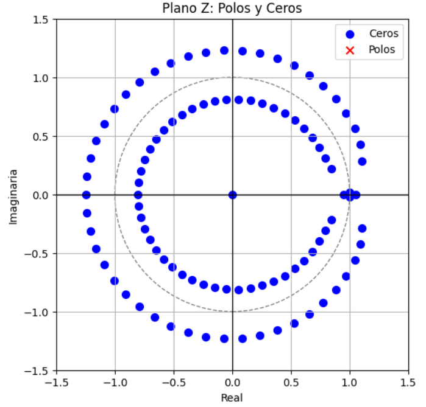
   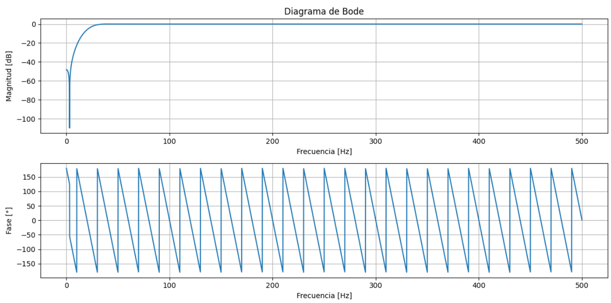

**Figura 1: Diagrama de polos y ceros y Diagrama de Bode del filtro FIR pasa-altos**  
</div>
<br>

<div align="center">
   
   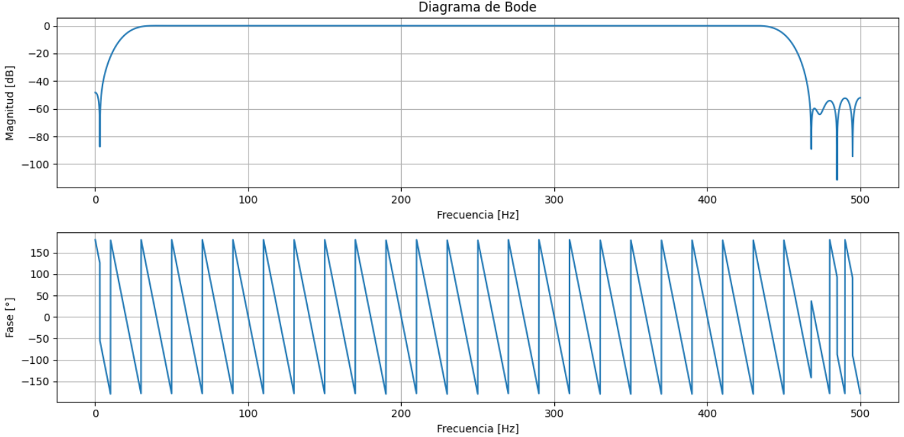

**Figura 2: Diagrama de polos y ceros y Diagrama de Bode del filtro FIR pasa-banda**  
</div>
<br>

<div align="center">
   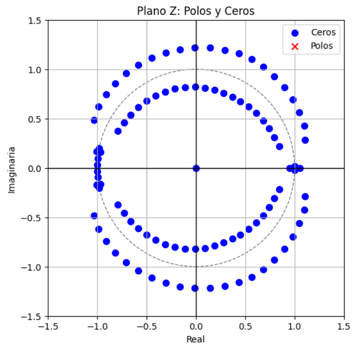
   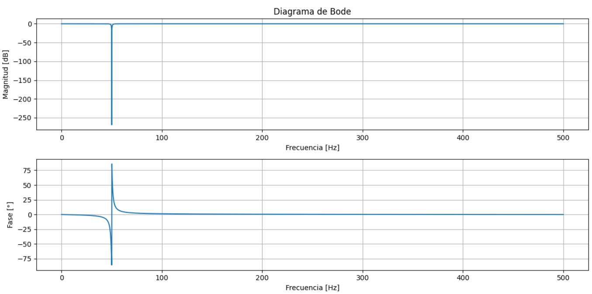

**Figura 3: Diagrama de polos y ceros y Diagrama de Bode del filtro IIR Notch**  
</div>
<br>

<div align="center">
   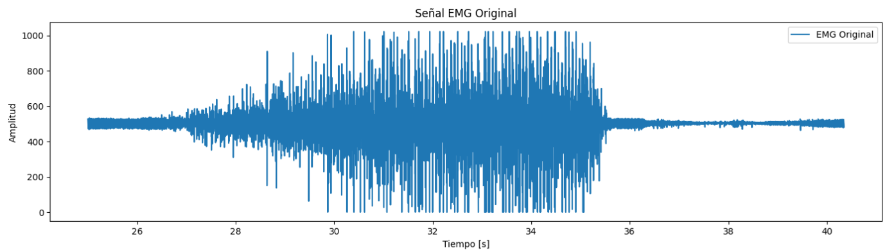
   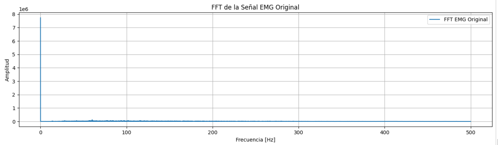

**Figura 4: Análisis de la señal original en dominio del tiempo y la frecuencia**  
</div>
<br>

<div align="center">
   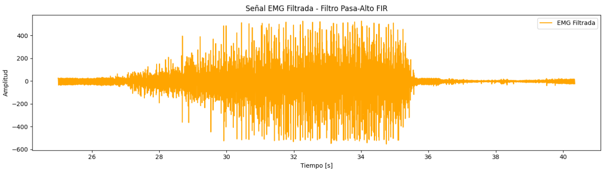
   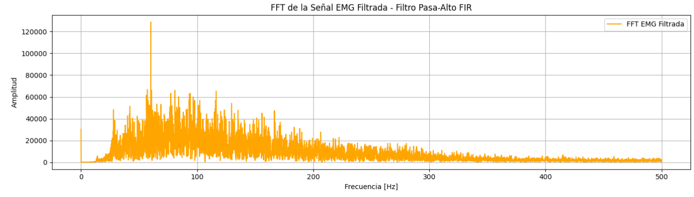

**Figura 5: Análisis de la señal filtrada con el filtro FIR pasa-alto en dominio del tiempo y la frecuencia**  
</div>
<br>

<div align="center">
   
   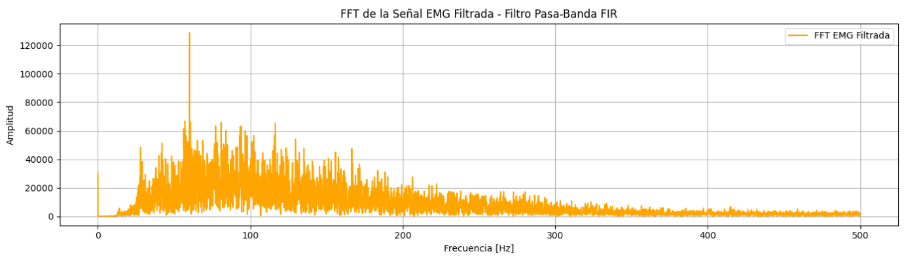

**Figura 6: Análisis de la señal filtrada con el filtro FIR pasa-banda en dominio del tiempo y la frecuencia**  
</div>
<br>

<div align="center">
   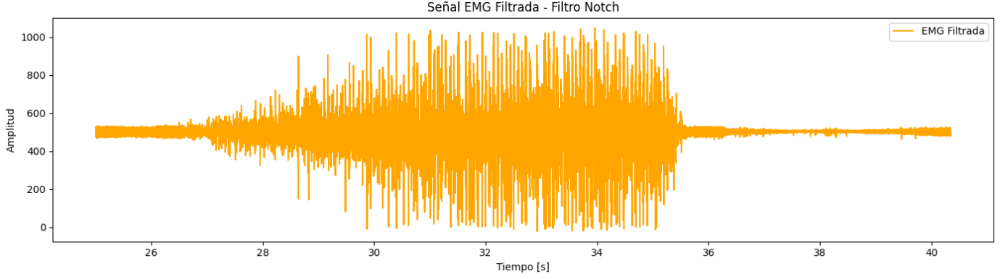
   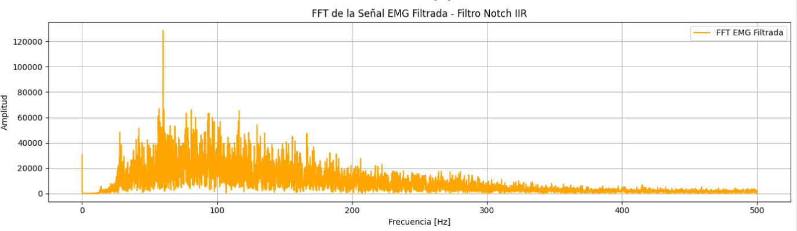

**Figura 7: Análisis de la señal filtrada con el filtro IIR Notch en dominio del tiempo y la frecuencia**  
</div>
<br>

## Justificación
Filtro Pasa-Altas: El filtro pasa-altas se utiliza principalmente para eliminar las componentes de baja frecuencia de la señal de EMG, como el ruido de base que puede estar relacionado con movimientos lentos o cambios en la posición del cuerpo.

Filtro Notch: El filtro Notch (rechaza-banda) se utiliza para eliminar el ruido de interferencia de línea de energía eléctrica, que se presenta generalmente a 50 Hz o 60 Hz dependiendo de la región.

Filtro Pasa-Banda: El filtro pasa-banda permite aislar el rango de frecuencia que contiene las principales componentes de la señal EMG. En este caso, se centra en un rango de 20 a 450 Hz, que es donde se encuentran la mayoría de las señales útiles de EMG para la actividad muscular.

## Señal de ECG
Se seleccionó la señal de reposo, donde se utilizará un filtrado que permita eliminar el ruido y destacar las características más importantes de la señal.

```python
#DISEÑO DE FILTROS

#Filtro FIR pasa-bajos
cutoff_low = 45  # Frecuencia de corte en Hz para el filtro pasa-bajas
numtaps_low = 101  # Número de coeficientes del filtro FIR

b_low = signal.firwin(numtaps_low, cutoff_low, fs=fs, pass_zero=True)

#Filtro Notch
notch_freq = 50  # Frecuencia del ruido de interferencia
quality_factor = 30  # Factor de calidad, determina el ancho de la banda a eliminar

b_notch, a_notch = signal.iirnotch(notch_freq, quality_factor, fs)

#Filtro FIR pasa-altos
cutoff_high = 0.5  # Frecuencia de corte en Hz para el filtro pasa-altas
numtaps_high = 101  # Número de coeficientes del filtro FIR

b_high = signal.firwin(numtaps_high, cutoff_high, fs=fs, pass_zero=False)
```

<div align="center">
   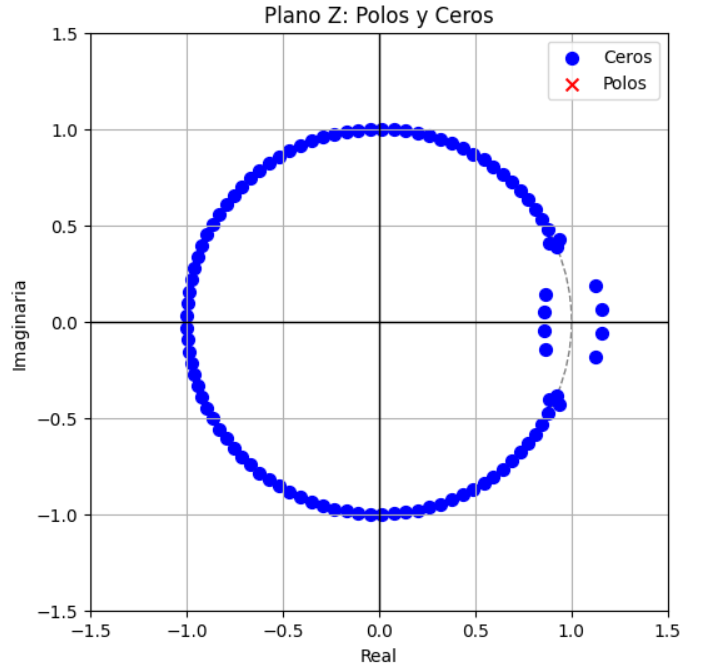
   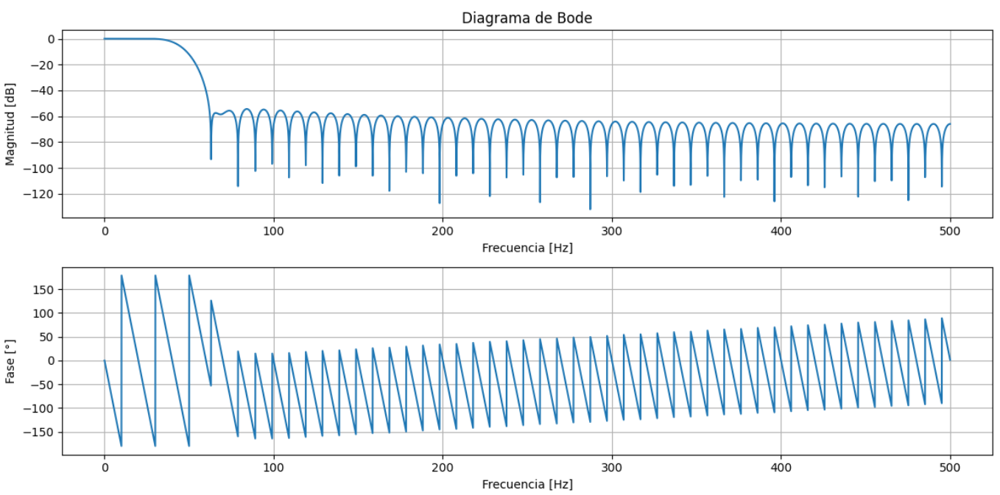

**Figura 8: Diagrama de polos y ceros y Diagrama de Bode del filtro FIR pasa-bajas**  
</div>
<br>

<div align="center">
   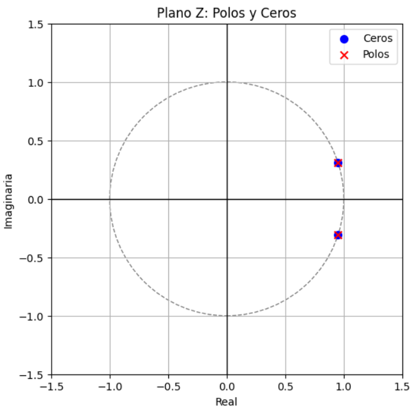
   

**Figura 9: Diagrama de polos y ceros y Diagrama de Bode del filtro IIR Notch**  
</div>
<br>

<div align="center">
   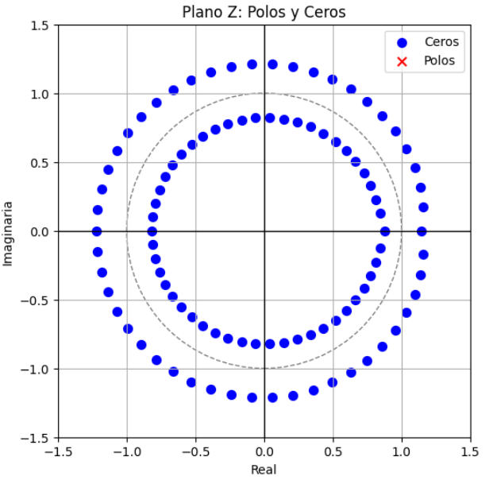
   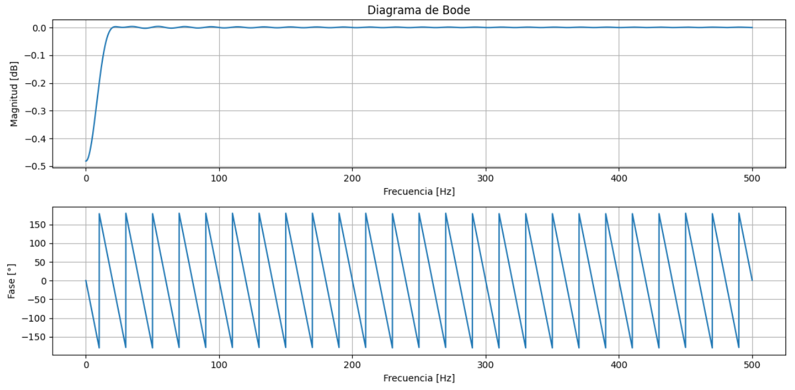

**Figura 10: Diagrama de polos y ceros y Diagrama de Bode del filtro FIR pasa-altas**  
</div>
<br>

<div align="center">
   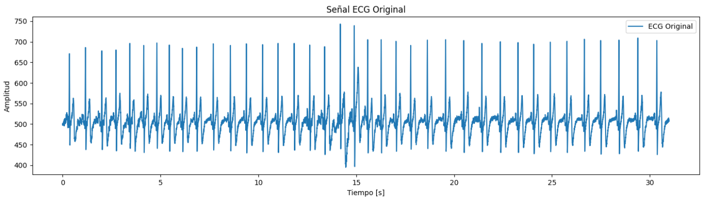
   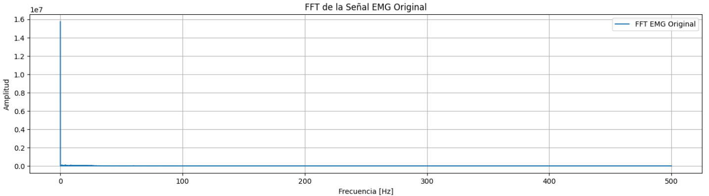

**Figura 11: Análisis de la señal original en dominio del tiempo y la frecuencia**  
</div>
<br>

<div align="center">
   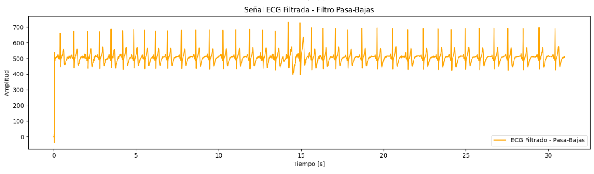
   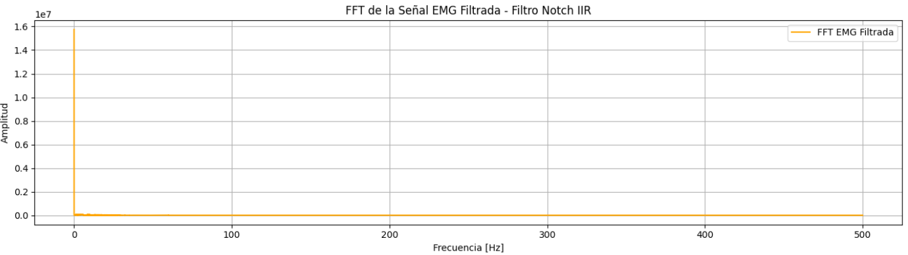

**Figura 12: Análisis de la señal filtrada con el filtro FIR pasa-bajas en dominio del tiempo y la frecuencia**  
</div>
<br>

<div align="center">
   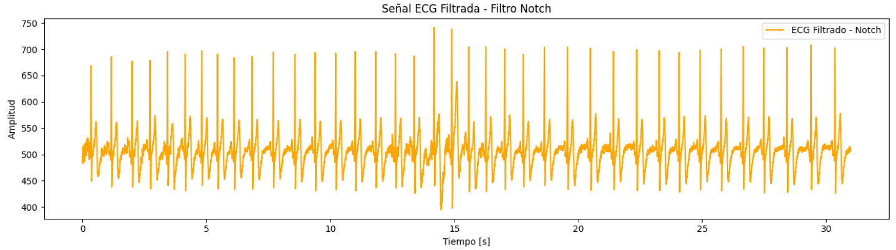
   

**Figura 13: Análisis de la señal filtrada con el filtro IIR Notch en dominio del tiempo y la frecuencia**  
</div>
<br>


<div align="center">
   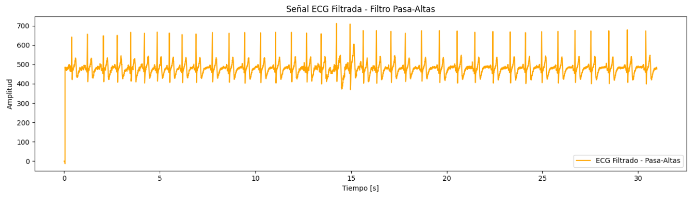
   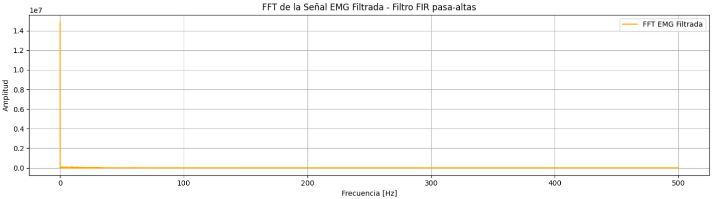

**Figura 14: Análisis de la señal filtrada con el filtro FIR pasa-bajas en dominio del tiempo y la frecuencia**  
</div>
<br>

## Justificación
Filtro Pasa-Bajas: Ayuda a reducir el ruido de alta frecuencia que puede contaminar la señal ECG.

Filtro Notch: Elimina la interferencia de línea de energía, que es un ruido muy común en las grabaciones de señales biomédicas.

Filtro Pasa-Altas: Permite eliminar el ruido de baja frecuencia, como los artefactos de movimiento.