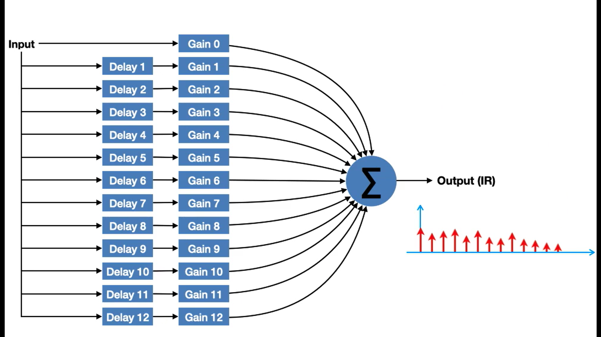
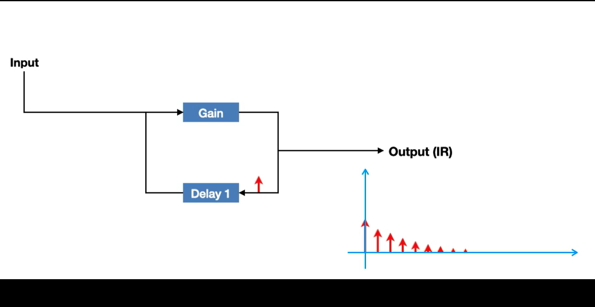
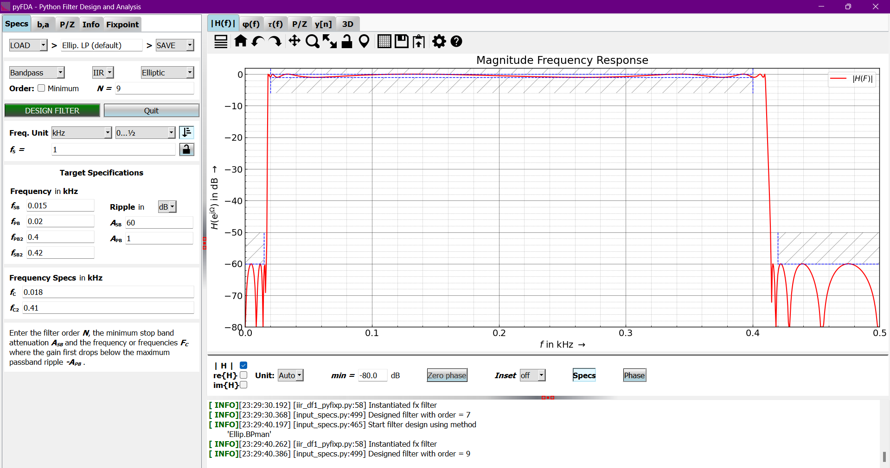

# Laboratorio 7: Procesamiento de **Señales ECG y EMG**
 

## **Contenidos:**

1. [**¿Qué son los filtros?**](#qué-son-los-filtros)
2. [**Filtros FIR e IIR**](#filtros-fir-e-iir)
3. [**Tipos de filtros**](#tipos-de-filtros)
4. [**Filtrado de señales EMG**](#filtrado-de-señales-emg)
5. [**Filtrado de señales ECG**](#filtrado-de-señales-ecg)
6. [**Bibliografía**](#bibliografía)

 

---
---

## **¿Qué son los filtros**  

Los filtros son sistemas que son utilizados para atenuar frecuencias no deseadas en una señal. Asimismo, existen filtros analógicos y filtros digitales. [1] 

   

Los filtros analógicos se logra mediante manioulación de propiedades eléctricas, como el uso de capacitores, inductores o resistencias. Para el caso de filtros digitales, se requiere la conversión previa de las señales analógicas a señales digitales, mediante el muestreo de la señal, y luego se realiza el procesamiento . [1]  

  

Analizando los filtros digitales, se tiene dos tipos: filtros FIR (Finite Impulse Rsponse) y filtros IIR (Infinite Impulse Response).

  

---
---
## **Filtros FIR e IIR**  
### Filtro FIR

Son filtros que no cuentan con retroalimentación (*feedback*) y tienen respuestas de impulso finitas.[2]

Algunas ventajas de los filtros FIR son [3]:
* Pueden tener fases lineales, por lo que no habría distorción de la onda en el tiempo.
* Son siempre estables.
* Los efectos transitorios de inicio tienen duración finita en el filtro.  

A pesar de estas ventajas, los filtros FIR tienen un mayor costo computacional (requiere un mayor orden de filtro, si lo comparamos con los filtros IIR), por lo que este tendría mayor retardo que los filtros IIR. [3]

  

   

**Figura 1: Representación de filtro FIR en término de retrasos y ganancias (no hay retroalimentación)**  

 

### Filtro IIR

Son filtros que se basan en utilizar tanto los valores de la entrada del filtro, como los valores de la salida (*feedback*). Esto le permite obtener una mayor variedad de funciones de transferencia sin requerir mayores cantidades de elementos. [2]  

  

La principal ventaja de los filtros IIR es que requieren un menor orden del filtro que los FIR. Sin embargo, los filtros IIR tienen una fase no lineal (esto puede ocasionar distorsión de la señal). Además que no necesariamente puede ser estable, esto se debe a que puede crecer indefinidamente debido al *feedback* que tiene el filtro.

   

**Figura 2: Representación de filtros IIR en términos de retrasos y ganancias (hay retroalimentación)**  

 

---
---

## **Tipos de filtros**

En el caso de filtros IIR, se tienen los filtros (llamador filtros IIR clásicos) [4]:
* Butterworth
* Chebyshev tipos I y II
* Elíptico
* Bessel  

Para el caso de los filtros FIR, estos son [3]:
* Ventaneo
* Multibanda con bandas de transición
* Mínimos cuadrados restringidos
* Respuesta arbitraria
* Coseno alzado

  
 

Sobre cuándo utilizar un determinado filtro, eso dependerá de finalidad o sobre el tipo de señal que se utilice. Por ejemplo, los **filtros Butterworth** tienen la característica de tener una respuesta de frecuencia plana, es decir, no inserta ondulaciones en la amplitud de las frecuencias de interés; sin embargo, tiene una mayor banda de paso (comparado con los demás filtros), esto se traduce en que habrá paso de algunas frecuencias no deseadas a la señal. [5]

Ahora, para el caso de los **filtros Chebbyshev**, estos tienen una menor banda de paso (lo que habrá atenuación de frecuencias no deseadas más rápido); sin embargo, estos filtros ocasionan ondulaciones, pero estas son ajustables. Este filtro cuenta con dos tipos (1 y 2) y la principal diferencia de ambos es en dónde ocurre la ondulación. Para el **tipo 1**, la ondulación ocurre en la banda de paso, mientras que para el **tipo 2**, en la banda de parada. [5]

En el caso de **filtros Besse**, estos están enfocados en optimizar el retardo de tiempo máximo para lograr un retardo grupal constante. Esto se traduce en obtener una fase lineal, es decir, se minimiza la distorsión a la señal; sin embargo, este filtro tiene una menor atenuación, comparado con los filtros anteriormente mencionados. [5]

Por otro lado, para el caso de **filtros elípticos**, estos filtros están enfocados en realizar una transición de paso más rápido; sin embargo, presenta ondulación tanto en la banda de paso (como Chebyshev tipo I), como en la banda de rechazo (similar al Chebyshev tipo II).

Por lo tanto, si se desea una menor variación de la señal deseada, es preferible utilizar filtros Butterworth o Chebyshev del tipo II. Para el caso de una mayor rapidez en la transición, se recomendaría utilizar filtros elípticos o Chebyshev tipo I. O si se desea obtener menos distorsión en la señal, se recomendaría utilizar filtros Bessel.

---
---

## **Filtrado de señales EMG**

### Analizando los gráficos de PyFDA:

   

**Figura 3: Filtro elíptico para el filtrado de señales EMG**  

 

  

---
---
## **Filtrado de señales ECG**

  

---
---
## **Bibliografía**  

[1]E. I. O. Education, “Filtros digitales - cursos online | Euroinnova”, Euroinnova International Online Education. Disponible en: https://www.euroinnova.com/blog/latam/filtros-digitales. [Consultado: el 7 de octubre de 2024]

  
  

[2] JuanS, “IIR vs FIR: Entendiendo realmente sus diferencias”, JuanSaudio, el 23 de abril de 2020. Disponible en: https://www.juansaudio.com/post/iir-vs-fir-entendiendo-realmente-sus-diferencias. [Consultado: el 7 de octubre de 2024]

  

[3]“Diseño de filtros FIR - MATLAB & Simulink - MathWorks América Latina”. Disponible en: https://la.mathworks.com/help/signal/ug/fir-filter-design.html. [Consultado: el 7 de octubre de 2024]

  

[4]“Diseño de filtros IIR - MATLAB & Simulink - MathWorks América Latina”. Disponible en: https://la.mathworks.com/help/signal/ug/iir-filter-design.html. [Consultado: el 7 de octubre de 2024]

[5]“Filter design basics: Butterworth, Chebyshev, Bessel Filters”, el 16 de octubre de 2022. Disponible en: https://analogcircuitdesign.com/butterworth-and-chebyshev-filters/. [Consultado: el 7 de octubre de 2024]

