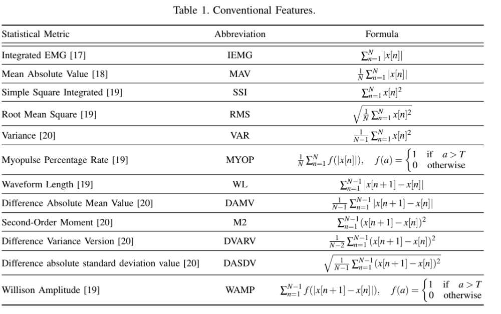
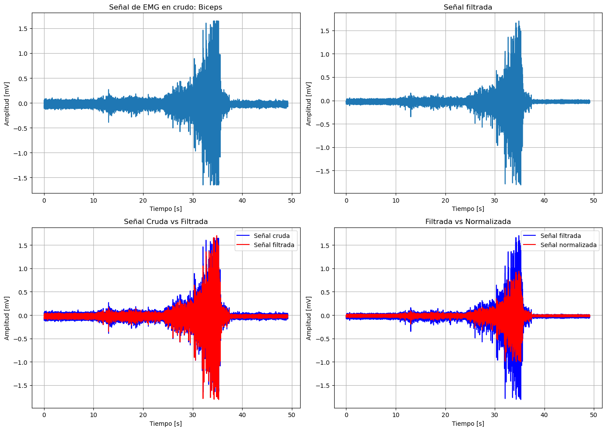
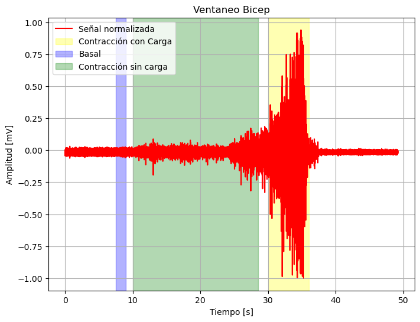
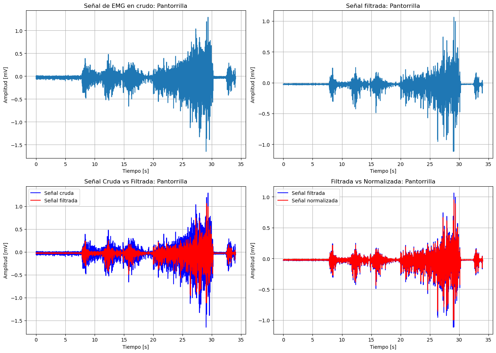
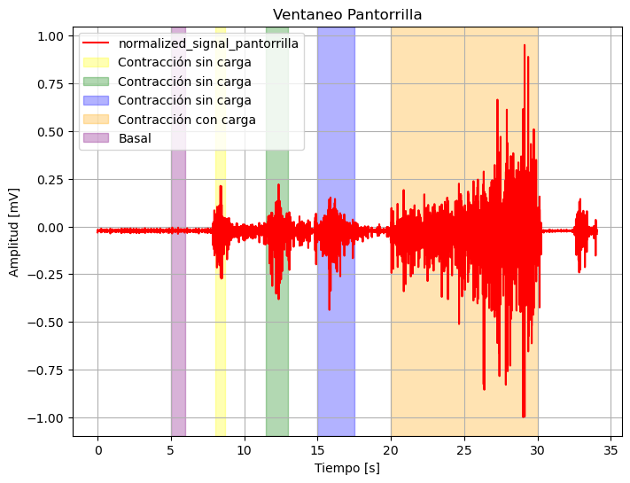
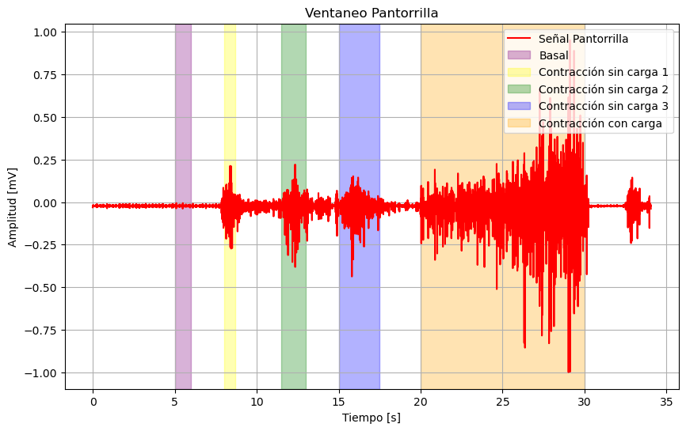
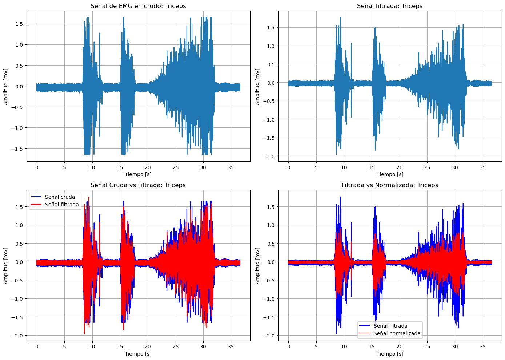
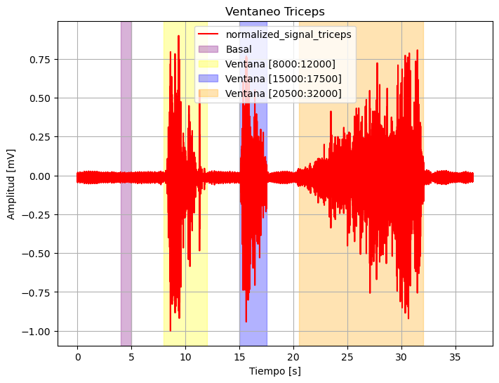

# LAB 9: PROCESAMIENTO DE SEÑALES EMG

#### **Tabla de Contenido**

1. [Introducción](#introduccion)
2. [Objetivos](#objetivos)
3. [Materiales](#materiales)
4. [Procedimiento](#procedimiento)
5. [Resultados](#resultados)
6. [Discusión](#discusion)
7. [Conclusiones](#conclusiones)
8. [Bibliografía](#bibliografia)

## Introducción
La electromiografía de superficie (sEMG) es una técnica no invasiva utilizada para registrar la actividad eléctrica generada por los músculos esqueléticos durante la contracción muscular. Esta señal contiene información valiosa sobre la activación muscular y es ampliamente utilizada en aplicaciones clínicas, de ingeniería e investigación. La sEMG se obtiene mediante la colocación de electrodos en la superficie de la piel sobre el músculo de interés, permitiendo registrar el potencial de acción de la unidad motora (MUAP) sin la necesidad de penetrar la piel. [1]

A pesar de su utilidad, la señal EMG es muy sensible a diversas fuentes de ruido y artefactos, que pueden comprometer la calidad de la información obtenida. Estas fuentes de ruido se pueden clasificar en cinco categorías principales [1]:
1. Ruido inherente: Originado en los componentes electrónicos del equipo de medición y está presente en todo dispositivo electrónico.
2. Ruido ambiental: Proviene de la radiación electromagnética en el entorno.
3. Artefacto de movimiento: Resulta del movimiento de los cables que conectan los electrodos con el sistema de adquisición de datos.
4. Diafonía: Es el resultado de la activación involuntaria de músculos cercanos al músculo de interés.
5. Ruido interno: Asociado a la estructura interna del cuerpo humano. Elementos como el grosor del tejido adiposo, la profundidad de la fibra muscular y la ubicación del músculo influyen en la calidad de la señal registrada.

Para obtener una señal EMG útil y precisa, es fundamental realizar un procesamiento adecuado. En primer lugar, en la etapa de filtrado, se eliminan los componentes de ruido que afectan a la señal EMG bruta. Mediante el uso de filtros bien diseñados, se mejora la relación señal-ruido para obtener una señal lo más limpia posible. En segundo lugar, se lleva a cabo el preprocesamiento, donde la señal se normaliza y alinea. Esto implica segmentarla en ventanas de tiempo específicas y normalizarla usando valores de referencia, como los obtenidos de la contracción máxima voluntaria (MVC). Finalmente, en la etapa de extracción de características, se obtienen parámetros clave de la señal EMG que representan su información esencial. Estas características seleccionadas son fundamentales para aplicaciones clínicas y de análisis, permitiendo una interpretación más precisa de la actividad muscular.

Según el paper *EMG-Based Feature Extraction and Classification for Prosthetic Hand Control*, se considera que los parámetros relevantes para la señal de EMG son los siguientes [2]:
- *Integrated EMG (IEMG)*: Es la suma absoluta de los valores absolutos de la señal EMG y representa la energía total de la señal.
- *Mean Absolute Value (MAV)*: Es el valor medio absoluto de la señal EMG y representa la intensidad promedio de la actividad muscular.
- *Simple Square Integrated (SSI)*: Es la suma de los cuadrados de cada punto de la señal y amplifica los valores altos de la señal, lo que ayuda a medir la energía total.
- *Root Mean Square (RMS)*: Es la raíz cuadrada de la media de los cuadrados de la señal y representa una medida de la potencia de la señal EMG.
- *Variance (VAR)*: Es la medida de la dispersión de la señal y permite evaluar las variaciones en la amplitud.
- *Myopulse Percentage Rate (MYOP)*: Es la medida de la proporción del tiempo en que la señal supera un umbral (T) específico, lo que ayuda a determinar la frecuencia de activación muscular.
- *Waveform Length (WL)*: Es la longitud total de la forma de onda de la señal.
- *Difference Absolute Mean Value (DAMV)*: Es el valor medio absoluto de las diferencias entre puntos consecutivos de la señal, lo que indica cambios rápidos en la señal.
- *Second-Order Moment (M2)*: Es el valor del segundo momento de la señal y se relaciona con la energía de la señal.
- *Difference Variance Version (DVARV)*: Es la varianza de las diferencias entre puntos consecutivos de la señal.
- *Difference Absolute Standard Deviation Value (DASDV)*: Es la desviación estándar de las diferencias absolutas entre puntos consecutivos.
- *Willison Amplitude (WAMP)*: Es el contador del número de veces que la diferencia entre puntos consecutivos de la señal supera un umbral (T).

<div align="center">
   

**Figura 1: Parámetros relevantes de la señal EMG**  
</div>
<br>

## Objetivos
- Diseñar un filtro adecuado para las señaled EMG
- Extraer y discutir las características de las señales EMG

## Materiales
| Material | Cantidad |
|:--------------:|:--------------:|
| Programa *Python* | N.A | 

## Procedimiento

### 1. Selección de las señales a analizar

En el laboratorio 4 del curso de *Introducción a Señales Biomédicas*, se adquirieron señales de EMG superficial utilizando el dispositivo BITalino. Las señales musculares registradas incluyen:

- Bíceps
- Tríceps
- Gastrocnemio (pantorrilla)

Cada una de estas señales consta de tres fases bien definidas:
- Fase de reposo (basal): Se da al inicio de la señal, durante los primeros segundos.
- Fase de contracción simple: Se da a la mitad de la señal. Esta representa la contracción muscular voluntaria sin carga externa en oposición.
- Fase de contracción progresiva: Aquí la tensión en el músculo se incrementa de manera gradual debido a la presencia de una carga externa. Esta fase se da al final de la señal y reprenta visualmente los picos más altos de activación.

Para este análisis, se seleccionaron tres señales: una del bíceps, otra del tríceps y una del gastrocnemio.

### 2. Procesamiento de la señal

Para las tres señales, en primera instancia se aplico un filtrado. Este filtrado se hizo en base a la transformada wavelet. El filtro implementado esta basado en el paper *Denoising of EMG Signals Based on Wavelet Transform* [3], del cual obtuvimos los siguientes parámetros de diseño.

* Wavelet madre: Daubechies 6 (db6)
* Niveles de descomposición: 4
* Umbral: Se uso la umbralización de tipo *soft*. Además, los umbrales usados en el paper de referencia fueron aplicados a los coeficientes de detalle y fueron distintos para cada nivel de descomposición. En ese sentido, los umbrales fueron los siguientes: 0.022 (nivel 4), 0.109 (nivel 3), 0.303 (nivel 2), 0.742 (nivel 1).

El usar una umbralización *soft* en lugar de *hard* ofrece ciertas ventajas que son relevantes para bioseñales. Recordemos que tanto la umbralización *soft* como *hard* vuelven cero los coeficientes que se encuentren por debajo del valor umbral. No obstante, la diferencia radica en lo que hacen con los coeficientes que estan por encima. La umbralización *hard* los deja intactos, por lo que los nuevos valores de los coeficientes se prestan para que haya saltos bruscos y repentinos debido a los ceros presentes. En cambio, la umbralización *soft* suaviza las transiciones, restando a los coeficientes que esten por encima del umbral el valor del umbral, es decir, sea λ el umbral y α un coeficiente por encima del umbral: el nuevo coeficiente que reemplace a α sería α - λ. Esto, como se mencione antes, resulta en transiciones mucho más suaves al igual que en la eliminación de discontinuidades, preservando así en mayor medida la integridad y forma de la señal. Esto en el caso de bioseñales como EMG es importante, ya que varias de sus características dependen de la morfología de la señal muscular.

Los códigos implementados para el filtrado via wavelet se encuentran en el apartado de *Anexos*. En particular, se destaca la implementación de las funciones:

* **wavelet_denoising(signal, wavelet, level, thresholds):** Función que permite realizar el filtrado. Recibe las variables *signal*, *wavelet*, *level* y *thresholds*. Estas representan que la señal a filtrar, el nombre del wavelet madre, los niveles de descomposición y los valores umbrales respectivamente.
* **soft_threshold(coeff, threshold):** Es una función auxiliar de *wavelet_denoising* que permite realizar la umbralización *soft*. Recibe las variables *coeff* y *threshold*, que son los coeficientes obtenidos tras la descomposición, y los umbrales respectivamente. 

Una vez obtenida la señal filtrada, el siguiente paso a realizar fue la normalización de la misma.

### 3. Normalización de la señal

Tras revisar la literatura, se encontraron diversos métodos de normalización, entre los cuales destaca el estudio (DOI: 10.1515/hukin-2015-0030) que menciona las siguientes estrategias [4]:

- **Isokinetic (IMVC)**: El promedio conjunto del pico de activación muscular en cada músculo.
- **Mean Dynamic Activity (MDA)**: El promedio conjunto de la activación muscular durante el ciclo dinámico.
- **Peak Dynamic Activity (PDA)**: El promedio conjunto del pico de activación durante el ciclo dinámico.

De estos métodos, se seleccionó el **IMVC** para normalizar las señales. El proceso consistió en obtener el valor máximo de la señal procesada (filtrada y en términos de voltaje), y luego dividir toda la señal procesada entre el valor máximo (IMVC), obteniendo así la señal normalizada:

$$
\frac{\text{Señal procesada}}{\text{IMVC}}
$$

### 4. Parámetros o características extraídas

Se seleccionaron los siguientes parámetros o características según el paper *EMG-Based Feature Extraction and Classification for Prosthetic Hand Control* [2]:

1. **Mean Absolute Value (MAV)**: Es una medida del promedio absoluto de la señal, útil para evaluar y cuantificar la actividad muscular en general.

   $$
   \text{MAV} = \frac{1}{N} \sum_{n=1}^{N} |x[n]|
   $$

2. **Root Mean Square (RMS)**: Una medida de la magnitud de la señal EMG, que proporciona una estimación de la fuerza generada por el músculo.

   $$
   \text{RMS} = \sqrt{\frac{1}{N} \sum_{n=1}^{N} x[n]^2}
   $$

3. **Myopulse Percentage Rate (MYOP)**: Mide el porcentaje de tiempo en que la señal EMG supera un umbral determinado. Un MYOP elevado implica entonces que el músculo se encuentra activo durante gran parte de la duración de la señal, implicando así un contracción prolongada y/o frecuente.

   $$
   \text{MYOP} = \frac{1}{N} \sum_{n=1}^{N} f(|x[n]|), \quad f(a) = 
   \begin{cases} 
   1 & \text{si } a > T \\ 
   0 & \text{en caso contrario} 
   \end{cases}
   $$

4. **Waveform Length (WL)**: Suma de las diferencias absolutas entre puntos consecutivos de la señal, que indica la complejidad de la misma.

   $$
   \text{WL} = \sum_{n=1}^{N-1} |x[n+1] - x[n]|
   $$

5. **Varianza (VAR)**: Proporciona una medida de la dispersión de la señal EMG.

   $$
   \text{VAR} = \frac{1}{N-1} \sum_{n=1}^{N} x[n]^2
   $$

<div align="center">

  

</div>
<p align="justify">
Para la aplicación de los parámetros mencionados, se trabajó con la señal ya procesada, es decir, después de haber sido filtrada y normalizada. Además, se aplicó un ventaneo, lo que significa que los parámetros se calcularon únicamente en las partes de la señal donde hubo activación muscular, excluyendo los momentos de reposo o espera.

El ventaneo se refiere a seleccionar las secciones de la señal en las que el músculo se encuentra en un estado de interés, por lo que los parámetros se obtuvieron solo sobre los fragmentos de la señal que reflejaban el tipo de actividad muscular que se deseaba analizar. De esta forma, se asegura que las características como MAV, RMS, MYOP, entre otras, representen de manera precisa la actividad muscular en los momentos de interés.
</p>
 

## Resultados 

### **1.Biceps**


```python
# Cargar los datos y procesarlos
sample, amplitude = extraer_datos("Biceps.txt")
amplitude = EmgToVoltage(amplitude) * 1000

# Filtrado mediante Wavelet
wavelet = 'db6'
level = 4
threshold = [0.022, 0.109, 0.303, 0.742]
filtered_signal = wavelet_denoising(amplitude, wavelet, level, threshold)

# Normalización de la señal filtrada
imvc = np.max(np.abs(filtered_signal))
normalized_signal = filtered_signal / imvc

# Graficar en un formato de 2x2
plt.figure(figsize=(14, 10))

# Primera gráfica - Señal EMG en crudo
plt.subplot(2, 2, 1)
plt.plot(sample / 1000, amplitude)
plt.title('Señal de EMG en crudo: Biceps')
plt.xlabel('Tiempo [s]')
plt.ylabel('Amplitud [mV]')
plt.grid(True)

# Segunda gráfica - Señal filtrada
plt.subplot(2, 2, 2)
plt.plot(sample / 1000, filtered_signal)
plt.title('Señal filtrada')
plt.xlabel('Tiempo [s]')
plt.ylabel('Amplitud [mV]')
plt.grid(True)

# Tercera gráfica - Señal cruda vs filtrada
plt.subplot(2, 2, 3)
plt.plot(sample / 1000, amplitude, label='Señal cruda', color='b')
plt.plot(sample / 1000, filtered_signal, label='Señal filtrada', color='r')
plt.title('Señal Cruda vs Filtrada')
plt.xlabel('Tiempo [s]')
plt.ylabel('Amplitud [mV]')
plt.legend()
plt.grid(True)

# Cuarta gráfica - Señal filtrada vs normalizada
plt.subplot(2, 2, 4)
plt.plot(sample / 1000, filtered_signal, label='Señal filtrada', color='b')
plt.plot(sample / 1000, normalized_signal, label='Señal normalizada', color='r')
plt.title('Filtrada vs Normalizada')
plt.xlabel('Tiempo [s]')
plt.ylabel('Amplitud [mV]')
plt.legend()
plt.grid(True)

# Ajustar el layout para evitar solapamiento
plt.tight_layout()

# Mostrar todas las gráficas
plt.show()
```


    

    


##### **Ventaneo biceps** 


```python
plt.figure(figsize=(8, 6))

# Graficar la señal normalizada en el rango [22000:38000]
plt.plot((sample / 1000), normalized_signal, label='Señal normalizada', color='r')

# Añadir el cuadro para el ventaneo entre 28000 y 35000 (sombrea esa región)
plt.axvspan(30000 / 1000, 36000 / 1000, color='yellow', alpha=0.3, label='Contracción con Carga')
plt.axvspan(7500 / 1000, 9000 / 1000, color='blue', alpha=0.3, label='Basal')
plt.axvspan(10000 / 1000, 28500 / 1000, color='green', alpha=0.3, label='Contracción sin carga')

# Configurar el título, etiquetas y leyenda
plt.title('Ventaneo Bicep')
plt.xlabel('Tiempo [s]')
plt.ylabel('Amplitud [mV]')
plt.legend()
plt.grid(True)

# Mostrar la gráfica
plt.show()

ventanas = [(7500, 9000), (10000, 28500) ,(30000, 36000)]
names=["Basal","Contracción sin carga", "Contracción con carga"]
for i, (start, end) in enumerate(ventanas):
    # Asegurarse de dividir correctamente las señales en las ventanas
    MAV, RMS, WL, WAMP, MYOP, VAR = extract_features(filtered_signal[start:end] / imvc)
    if i==0:
         d31,d32,d33,d34,d35,d36=MAV, RMS, WL, WAMP, MYOP, VAR
    if i == 1:
         b1, b2, b3, b4, b5 = MAV, RMS, WL, MYOP, VAR
    # Imprimir las características para cada ventana
    print(f"Características para la Bicep - {names[i]}:")
    print("El Mean Absolute Value de la señal Bicep:", round(MAV, 3))
    print("El RMS de la señal Bicep:", round(RMS, 3))
    print("El Myopulse Percentage Rate de la señal bicep (%):", round(MYOP, 3))
    print("El waveform length de la señal Bicep:", round(WL, 3))
    print("La varianza de la señal Bicep", round(VAR, 3))
    print("-" * 50)
```


    

    


    Características para la Bicep - Basal:
    El Mean Absolute Value de la señal Bicep: 0.018
    El RMS de la señal Bicep: 0.022
    El Myopulse Percentage Rate de la señal bicep (%): 0.0
    El waveform length de la señal Bicep: 7.507
    La varianza de la señal Bicep 0.0
    --------------------------------------------------
    Características para la Bicep - Contracción sin carga:
    El Mean Absolute Value de la señal Bicep: 0.026
    El RMS de la señal Bicep: 0.035
    El Myopulse Percentage Rate de la señal bicep (%): 0.011
    El waveform length de la señal Bicep: 150.343
    La varianza de la señal Bicep 0.001
    --------------------------------------------------
    Características para la Bicep - Contracción con carga:
    El Mean Absolute Value de la señal Bicep: 0.156
    El RMS de la señal Bicep: 0.23
    El Myopulse Percentage Rate de la señal bicep (%): 14.683
    El waveform length de la señal Bicep: 325.444
    La varianza de la señal Bicep 0.053
    --------------------------------------------------
    

### **2. Pantorrilla**


```python
# Cargar los datos y procesarlos para Pantorrilla
sample_pantorrilla, amplitude_pantorrilla = extraer_datos("Pantorrilla.txt")
amplitude_pantorrilla = EmgToVoltage(amplitude_pantorrilla) * 1000

# Filtrado mediante Wavelet para Pantorrilla
wavelet = 'db6'
level = 4
threshold = [0.022, 0.109, 0.303, 0.742]
filtered_signal_pantorrilla = wavelet_denoising(amplitude_pantorrilla, wavelet, level, threshold)

# Normalización de la señal filtrada para Pantorrilla
imvc_pantorrilla = np.max(np.abs(filtered_signal_pantorrilla))
normalized_signal_pantorrilla = filtered_signal_pantorrilla / imvc_pantorrilla

# Graficar en un formato de 2x2 para Pantorrilla
plt.figure(figsize=(14, 10))

# Primera gráfica - Señal EMG en crudo
plt.subplot(2, 2, 1)
plt.plot(sample_pantorrilla / 1000, amplitude_pantorrilla)
plt.title('Señal de EMG en crudo: Pantorrilla')
plt.xlabel('Tiempo [s]')
plt.ylabel('Amplitud [mV]')
plt.grid(True)

# Segunda gráfica - Señal filtrada
plt.subplot(2, 2, 2)
plt.plot(sample_pantorrilla / 1000, filtered_signal_pantorrilla)
plt.title('Señal filtrada: Pantorrilla')
plt.xlabel('Tiempo [s]')
plt.ylabel('Amplitud [mV]')
plt.grid(True)

# Tercera gráfica - Señal cruda vs filtrada
plt.subplot(2, 2, 3)
plt.plot(sample_pantorrilla / 1000, amplitude_pantorrilla, label='Señal cruda', color='b')
plt.plot(sample_pantorrilla / 1000, filtered_signal_pantorrilla, label='Señal filtrada', color='r')
plt.title('Señal Cruda vs Filtrada: Pantorrilla')
plt.xlabel('Tiempo [s]')
plt.ylabel('Amplitud [mV]')
plt.legend()
plt.grid(True)

# Cuarta gráfica - Señal filtrada vs normalizada
plt.subplot(2, 2, 4)
plt.plot(sample_pantorrilla / 1000, filtered_signal_pantorrilla, label='Señal filtrada', color='b')
plt.plot(sample_pantorrilla / 1000, normalized_signal_pantorrilla, label='Señal normalizada', color='r')
plt.title('Filtrada vs Normalizada: Pantorrilla')
plt.xlabel('Tiempo [s]')
plt.ylabel('Amplitud [mV]')
plt.legend()
plt.grid(True)

# Ajustar el layout para evitar solapamiento
plt.tight_layout()

# Mostrar todas las gráficas
plt.show()
```


    

    


##### **Ventaneo  pantorrilla** 


```python
plt.figure(figsize=(8, 6))

# Graficar la señal normalizada completa
plt.plot(np.arange(len(normalized_signal_pantorrilla)) / 1000, normalized_signal_pantorrilla, label='normalized_signal_pantorrilla', color='r')

# Añadir los cuadros para el ventaneo
plt.axvspan(8000 / 1000, 8700 / 1000, color='yellow', alpha=0.3, label='Contracción sin carga')
plt.axvspan(11500 / 1000, 13000 / 1000, color='green', alpha=0.3, label='Contracción sin carga')
plt.axvspan(15000 / 1000, 17500 / 1000, color='blue', alpha=0.3, label='Contracción sin carga')
plt.axvspan(20000 / 1000, 30000 / 1000, color='orange', alpha=0.3, label='Contracción con carga')
plt.axvspan(5000 / 1000, 6000 / 1000, color='purple', alpha=0.3, label='Basal')
# Configurar el título, etiquetas y leyenda
plt.title('Ventaneo Pantorrilla')
plt.xlabel('Tiempo [s]')
plt.ylabel('Amplitud [mV]')
plt.legend()
plt.grid(True)

# Mostrar la gráfica
plt.show()

```


    

    


```python
ventanas = [(5000,6000),(8000, 8700), (11500, 13000), (15000, 17500), (20000, 30000)]
colores = ["purple",'yellow', 'green', 'blue', 'orange']
etiquetas = ["Basal",'Contracción sin carga 1', 'Contracción sin carga 2', 'Contracción sin carga 3', 'Contracción con carga']
plt.figure(figsize=(10, 6))
plt.plot(np.arange(len(normalized_signal_pantorrilla)) / 1000, normalized_signal_pantorrilla, label='Señal Pantorrilla', color='r')

# Añadir los cuadros para el ventaneo
for i, (start, end) in enumerate(ventanas):
    plt.axvspan(start / 1000, end / 1000, color=colores[i], alpha=0.3, label=etiquetas[i])

# Añadir una ventana basal adicional


# Configurar el título, etiquetas y leyenda
plt.title('Ventaneo Pantorrilla')
plt.xlabel('Tiempo [s]')
plt.ylabel('Amplitud [mV]')
plt.legend(loc='upper right')
plt.grid(True)

# Mostrar la gráfica
plt.show()

# Extraer características para cada ventana y luego imprimir los resultados
for i, (start, end) in enumerate(ventanas):
    MAV, RMS, WL, WAMP, MYOP, VAR = extract_features(normalized_signal_pantorrilla[start:end])
    if i==0:
         r31,r32,r33,r34,r35,r36=MAV, RMS, WL, WAMP, MYOP, VAR
    # Imprimir las características utilizando las etiquetas descriptivas
    if i == 4:
        p1, p2, p3, p4, p5 = MAV, RMS, WL, MYOP, VAR
    print(f"Características para la ventana {etiquetas[i]}:")
    print("El Mean Absolute Value de la señal Pantorrilla:", round(MAV, 3))
    print("El RMS de la señal Pantorrilla:", round(RMS, 3))
    print("El Myopulse Percentage Rate de la señal Pantorrilla (%):", round(MYOP, 3))
    print("El waveform length de la señal Pantorrilla:", round(WL, 3))
    print("La varianza de la señal Pantorrilla:", round(VAR, 3))
    print("-" * 50)  # Separador entre ventanas
```


    

    


    Características para la ventana Basal:
    El Mean Absolute Value de la señal Pantorrilla: 0.022
    El RMS de la señal Pantorrilla: 0.023
    El Myopulse Percentage Rate de la señal Pantorrilla (%): 0.0
    El waveform length de la señal Pantorrilla: 0.86
    La varianza de la señal Pantorrilla: 0.0
    --------------------------------------------------
    Características para la ventana Contracción sin carga 1:
    El Mean Absolute Value de la señal Pantorrilla: 0.051
    El RMS de la señal Pantorrilla: 0.072
    El Myopulse Percentage Rate de la señal Pantorrilla (%): 0.0
    El waveform length de la señal Pantorrilla: 11.397
    La varianza de la señal Pantorrilla: 0.005
    --------------------------------------------------
    Características para la ventana Contracción sin carga 2:
    El Mean Absolute Value de la señal Pantorrilla: 0.042
    El RMS de la señal Pantorrilla: 0.063
    El Myopulse Percentage Rate de la señal Pantorrilla (%): 0.4
    El waveform length de la señal Pantorrilla: 21.648
    La varianza de la señal Pantorrilla: 0.003
    --------------------------------------------------
    Características para la ventana Contracción sin carga 3:
    El Mean Absolute Value de la señal Pantorrilla: 0.038
    El RMS de la señal Pantorrilla: 0.055
    El Myopulse Percentage Rate de la señal Pantorrilla (%): 0.24
    El waveform length de la señal Pantorrilla: 28.563
    La varianza de la señal Pantorrilla: 0.002
    --------------------------------------------------
    Características para la ventana Contracción con carga:
    El Mean Absolute Value de la señal Pantorrilla: 0.063
    El RMS de la señal Pantorrilla: 0.101
    El Myopulse Percentage Rate de la señal Pantorrilla (%): 1.86
    El waveform length de la señal Pantorrilla: 348.023
    La varianza de la señal Pantorrilla: 0.01
    --------------------------------------------------
    

### **3.Tricep**


```python
# Cargar los datos y procesarlos para Triceps
sample_triceps, amplitude_triceps = extraer_datos("Triceps.txt")
amplitude_triceps = EmgToVoltage(amplitude_triceps) * 1000

# Filtrado mediante Wavelet para Triceps
wavelet = 'db6'
level = 4
threshold = [0.022, 0.109, 0.303, 0.742]
filtered_signal_triceps = wavelet_denoising(amplitude_triceps, wavelet, level, threshold)

# Normalización de la señal filtrada para Triceps
imvc_triceps = np.max(np.abs(filtered_signal_triceps))
normalized_signal_triceps = filtered_signal_triceps / imvc_triceps

# Graficar en un formato de 2x2 para Triceps
plt.figure(figsize=(14, 10))

# Primera gráfica - Señal EMG en crudo
plt.subplot(2, 2, 1)
plt.plot(sample_triceps / 1000, amplitude_triceps)
plt.title('Señal de EMG en crudo: Triceps')
plt.xlabel('Tiempo [s]')
plt.ylabel('Amplitud [mV]')
plt.grid(True)

# Segunda gráfica - Señal filtrada
plt.subplot(2, 2, 2)
plt.plot(sample_triceps / 1000, filtered_signal_triceps)
plt.title('Señal filtrada: Triceps')
plt.xlabel('Tiempo [s]')
plt.ylabel('Amplitud [mV]')
plt.grid(True)

# Tercera gráfica - Señal cruda vs filtrada
plt.subplot(2, 2, 3)
plt.plot(sample_triceps / 1000, amplitude_triceps, label='Señal cruda', color='b')
plt.plot(sample_triceps / 1000, filtered_signal_triceps, label='Señal filtrada', color='r')
plt.title('Señal Cruda vs Filtrada: Triceps')
plt.xlabel('Tiempo [s]')
plt.ylabel('Amplitud [mV]')
plt.legend()
plt.grid(True)

# Cuarta gráfica - Señal filtrada vs normalizada
plt.subplot(2, 2, 4)
plt.plot(sample_triceps / 1000, filtered_signal_triceps, label='Señal filtrada', color='b')
plt.plot(sample_triceps / 1000, normalized_signal_triceps, label='Señal normalizada', color='r')
plt.title('Filtrada vs Normalizada: Triceps')
plt.xlabel('Tiempo [s]')
plt.ylabel('Amplitud [mV]')
plt.legend()
plt.grid(True)

# Ajustar el layout para evitar solapamiento
plt.tight_layout()

# Mostrar todas las gráficas
plt.show()
```


    

    


##### **Ventaneo triceps** 


```python
plt.figure(figsize=(8, 6))

# Graficar la señal normalizada completa
plt.plot(np.arange(len(normalized_signal_triceps)) / 1000, normalized_signal_triceps, label='normalized_signal_triceps', color='r')

# Añadir los cuadros para el ventaneo
plt.axvspan(4000 / 1000, 5000 / 1000, color='purple', alpha=0.3, label='Basal')
plt.axvspan(8000 / 1000, 12000 / 1000, color='yellow', alpha=0.3, label='Ventana [8000:12000]')
plt.axvspan(15000 / 1000, 17500 / 1000, color='blue', alpha=0.3, label='Ventana [15000:17500]')
plt.axvspan(20500 / 1000, 32000 / 1000, color='orange', alpha=0.3, label='Ventana [20500:32000]')

# Configurar el título, etiquetas y leyenda
plt.title('Ventaneo Triceps')
plt.xlabel('Tiempo [s]')
plt.ylabel('Amplitud [mV]')
plt.legend()
plt.grid(True)

# Mostrar la gráfica
plt.show()

# Definir las ventanas de interés
ventanas_triceps = [(4000,5000),(8000, 12000), (15000, 17500), (20500, 32000)]

# Extraer características para cada ventana
for i, (start, end) in enumerate(ventanas_triceps):
    MAV, RMS, WL, WAMP, MYOP, VAR = extract_features(normalized_signal_triceps[start:end])
    if i == 0:
         h31,h32,h33,h34,h35,h36=MAV, RMS, WL, WAMP, MYOP, VAR
    if i == 3:
         t1, t2, t3, t4, t5 = MAV, RMS, WL, MYOP, VAR
    # Imprimir las características para cada ventana
    print(f"Características para la ventana [{start}:{end}]:")
    print("El Mean Absolute Value de la señal Triceps:", round(MAV, 3))
    print("El RMS de la señal Triceps:", round(RMS, 3))
    print("El Myopulse Percentage Rate de la señal Triceps (%):", round(MYOP, 3))
    print("El waveform length de la señal Triceps:", round(WL, 3))
    print("La varianza de la señal Triceps:", round(VAR, 3))
    print("-" * 50)  # Separador entre ventanas
```


    

    


    Características para la ventana [4000:5000]:
    El Mean Absolute Value de la señal Triceps: 0.017
    El RMS de la señal Triceps: 0.021
    El Myopulse Percentage Rate de la señal Triceps (%): 0.0
    El waveform length de la señal Triceps: 5.136
    La varianza de la señal Triceps: 0.0
    --------------------------------------------------
    Características para la ventana [8000:12000]:
    El Mean Absolute Value de la señal Triceps: 0.093
    El RMS de la señal Triceps: 0.165
    El Myopulse Percentage Rate de la señal Triceps (%): 7.5
    El waveform length de la señal Triceps: 235.184
    La varianza de la señal Triceps: 0.027
    --------------------------------------------------
    Características para la ventana [15000:17500]:
    El Mean Absolute Value de la señal Triceps: 0.106
    El RMS de la señal Triceps: 0.164
    El Myopulse Percentage Rate de la señal Triceps (%): 7.72
    El waveform length de la señal Triceps: 180.294
    La varianza de la señal Triceps: 0.027
    --------------------------------------------------
    Características para la ventana [20500:32000]:
    El Mean Absolute Value de la señal Triceps: 0.088
    El RMS de la señal Triceps: 0.132
    El Myopulse Percentage Rate de la señal Triceps (%): 4.061
    El waveform length de la señal Triceps: 526.309
    La varianza de la señal Triceps: 0.017
    --------------------------------------------------
    

## Discusión 

### **1. Basal** ###


```python
df = pd.DataFrame({
    'MAV': [d31, r31, h31],
    'RMS': [d32, r32, h32],
    'WL': [d33, r33, h33],
    'MYOP(%)': [d35, r35, h35],
    'VAR': [d36, r36, h36]
}, index=['Bicep', 'Pantorrilla', 'Triceps'])

# Renombrar los índices para reflejar los músculos
df.index.name = 'ESTADO BASAL'

# Imprimir el DataFrame
print(df)
```

                       MAV       RMS        WL  MYOP(%)       VAR
    ESTADO BASAL                                                 
    Bicep         0.018105  0.021910  7.506989      0.0  0.000276
    Pantorrilla   0.022456  0.022795  0.860038      0.0  0.000015
    Triceps       0.017203  0.020923  5.136166      0.0  0.000268
    

<div align="justify">  

- **MAV (Mean Absolute Value):** Indica la intensidad promedio del músculo. En la fase basal, los valores son muy similares, oscilando entre 0.019 y 0.023, lo que sugiere que no hay diferencias significativas en la activación muscular del bíceps, tríceps y pantorrilla, o si las hay, son mínimas.</div>
<div align="justify">  

- **RMS (Root Mean Square):** Está relacionado con la potencia de la actividad muscular. En la fase basal, los valores rondan los 0.023, mostrando poca variabilidad entre los músculos. Esto es esperado, ya que no hay contracciones activas.</div>
<div align="justify">  

- **WL (Waveform Length):** Refleja la complejidad de la señal muscular. Se observa que el triceps tiene un valor más alto, lo que puede indicar una mayor variabilidad o ajustes musculares finos. En contraste, la pantorrilla tiene el valor más bajo, lo que refleja una menor variabilidad.</div>
<div align="justify">  

- **MYOP (Myopulse Percentage Rate):** Evalúa la presencia de impulsos musculares. Los valores son 0 en la fase basal, lo que indica la ausencia de actividad muscular significativa en forma de pulsos o espasmos.</div>
<div align="justify">  

- **VAR (Varianza):** Mide la variabilidad de la señal. En general, los valores son bajos, lo que es esperado en la fase basal sin contracciones activas. La pantorrilla muestra la menor variabilidad, lo que sugiere una mayor estabilidad en su actividad durante el tiempo analizado.
</div>


### 2. Contracción sin carga ### 


```python
import pandas as pd

ventanas_para_pantorrilla = [(8000, 8700), (11500, 13000), (15000, 17500)]
ventanas_para_triceps = [(8000, 12000), (15000, 17500)]
ventanas_para_biceps = [(10000, 28500)]

señal_pantorrilla = normalized_signal_pantorrilla
señal_triceps = normalized_signal_triceps
señal_biceps = normalized_signal

tabla_pantorrilla = obtener_tabla_características(ventanas_para_pantorrilla,señal_pantorrilla,"Pantorrilla",ventanas_por_filas =True)
tabla_tríceps = obtener_tabla_características(ventanas_para_triceps,señal_triceps,"Tríceps",ventanas_por_filas = True)
tabla_biceps = obtener_tabla_características(ventanas_para_biceps,normalized_signal,"Bíceps",ventanas_por_filas = True)

print(tabla_biceps,"\n\n")
print(tabla_pantorrilla,"\n\n")
print(tabla_tríceps)
```

                          MAV       RMS         WL   MYOP(%)       VAR
    Bíceps                                                            
    Primera ventana  0.026151  0.035426  150.34332  0.010811  0.001051 
    
    
                          MAV       RMS         WL  MYOP(%)       VAR
    Pantorrilla                                                      
    Primera ventana  0.050795  0.071505  11.397186     0.00  0.004584
    Segunda ventana  0.042278  0.063166  21.647572     0.40  0.003472
    Tercera ventana  0.037652  0.054638  28.563447     0.24  0.002466 
    
    
                          MAV       RMS          WL  MYOP(%)       VAR
    Tríceps                                                           
    Primera ventana  0.092575  0.164558  235.184210     7.50  0.026961
    Segunda ventana  0.105794  0.164445  180.293887     7.72  0.026926
    

<div align="justify">  

* **MAV (Mean Aboslute Value):** Esta característica está relacionada a la amplitud al momento de la activación del músculo. Al comparar entre intentos (ventanas), para el caso de la pantorrilla esta disminuía durante intentos, esto puede deberse a una posible fatiga al realizar varias veces la ejecución de la flexión plantar. Para el caso de los tríceps, se ve un aumento de la amplitud en la activación muscular. A diferencia del caso anterior, posiblemente esto no se deba a una fatiga, como en el anterior caso, ya que la pantorrila debe ejercer más fuerza al momento de realizar flexión plantar estando de pie, comparado con el tríceps, lo que puede explicar que no haya disminuido la amplitud. Ahora, al comparar entre músculos, se tiene que tríceps tiene mayor MAV. Es probable que el motivo se deba a los tipos de fibras que conforman el músculo, por ejemplo, sea de contracción lenta (diseñada para soportar cargas continuas) o sea de contracción rápida (para contracciones breves e intensas) puede influir en la amplitud de la señal (para este caso, amplitud en la activación muscular). </div> 
<div align="justify">  

* **RMS (Root Mean Square):**  Esta característica está relacionada, similar a MAV, a la amplitud de la señal, pero tiene la particularidad de elevar al cuadrado las señales (lo que lo hace más sensible a picos que MAV). Ahora, similar al análisis realizado al MAV, es de esperarse un aumento, debido a los picos que tienen las señales registradas. Además, los valores entre ventanas (dentro del mismo músculo) siguen el comportamiento de los MAV, incrementa el valor de RMS análogamente al incremento del MAV; lo mismo sucede para el decremento. De manera general, el bíceps es el músculo que menor valor de RMS mostró, lo que significa que este músculo tuvo menor intensidad (o menor aplicación de fuerza) al momento de evaluar las ejecuciones de las actividades.   </div> 
<div align="justify">  

* **WL (Waveform Length):**  Esta característca está relacionada con la forma de la onda (longitud) en un tiempo, obtenido mediante suma de variaciones entre puntos sucesivos en la señal. Con esta idea, vemos que un aumento del valor de WL refleja una mayor complejidad y variabilidad de la señal analizada, como en el caso de los tríceps, en la que se obtuvieron los mayores valores. Comparando entre tríceps y pantorrilla, se puede ver que hay una relación entre la amplitud (MAV) y el WL, esto puede deberse a que a una mayor intensidad de contracción, es problable una pérdida de la estabilidad, lo que puede aumentar las variaciones; asimismo, es probable que esta diferencia de WL se deba al tipo de fibra muscular que conforma a cada músculo, ya que las fibras de contracción rápida (en el tríceps) realizan mayor actividad eléctrica en contracciones breves e intensas, lo que puede ocasionar que la variabilidad aumente, comparado a la pantorrilla que cuenta con fibras de contracción lenta. Ahora, en el caso de los bíceps, se obtuvo un valor más alto de lo que se debería (siguiendo la lógica de relación proporcional entre MAV y WL), pero esto fue esperado. Esto se debió a que se incluyó una parte de la señal relacionada a la contracción con carga, lo que demuestra que el ventanado es importante para la obtención adecuada de datos. Adicionalmente, se apreció que la característica WL fue la única de las 5 que fue capaz de detectar esta introducción de datos, lo que demuestra su importancia. </div> 
<div align="justify">  

* **MYOP (Myopulse percentage rate):**  Esta característica se refiere a la relación entre el tiempo de activación (especificada en superar un umbral) respecto al periodo de tiempo total (para este caso, la ventana). Analizando para cada músculo, se obtuvo un mayor tiempo de activación para de los tríceps (cabe destacar el uso de un umbral de 0.3). Esto puede relacionarse con las características de MAV y WL, además, al tipo de fibra. Como se mencionó antes, las fibras de contracción rápida ocasiona activaciones intensas y breves, lo que puede ocasionar superar el umbral con mayor facilidad, además, debido a que se puede perder estabilidad a mayor intensidad (lo que es mayor WL), puede ocasionar que las contracciones variables (aumento y disminución de amplitud muy pronunciadas) superen continuamente el umbral definido.   </div> 
<div align="justify">  

* **VAR (varianza):** Esta característica está relacionada a la dispersión de los datos obtenidos en un tiempo (que es la ventana). Entonces, la contracción de tríceps demuestra tener la mayor variabilidad (datos fluctuantes) de los 3 músculos analizados. Esto puede relacionarse a la intensidad, tríceps tienen mayores valores de MAV (cabe destacar que realizar extensión del brazo), lo que también puede relacionarse a WL, ya que realizar actividades de mayor intensidad puede ocasionar en la reducción de la estabilidad. Asimismo, como se mencionó anteriormente, puede estar relacionado a la composición de fibras musculares en cada músculo. Un aspecto interesante de analizar es tener un WL relativamente alto, pero un VAR relativamente bajo. Es probable que se deba a al tipo de enfoque que tiene cada característica (WL se relaciona a al suma de cambios de puntos sucesivos, mientras que VAR, dispersión respecto de su media). Asimismo, es probable que el valor alto de WL se deba a un tiempo de ventana relativamente alto (20 segundos si lo comparamos con los demás), puesto que se acumulan más sumas (para WL) lo que puede incrementar su valor. Por otro lado, debido a que la señal tenía relativa baja amplitud, su dispersión respecto de su media es baja (comparada con las demás señales), lo que se esperaría obtener un VAR bajo (además que VAR no se ve afectado por el número de datos o tiempo analizado). </div> 

### 3. Contraccion con carga ### 


```python
df = pd.DataFrame({
    'MAV': [b1, p1, t1],
    'RMS': [b2, p2, t2],
    'WL': [b3, p3, t3],
    'MYOP(%)': [b4, p4, t4],
    'VAR': [b5, p5, t5]
}, index=['Biceps', 'Pantorrilla', 'Triceps'])

# Renombrar los índices para reflejar los músculos
df.index.name = 'CONTRACCION CON CARGA'

# Imprimir el DataFrame
print(df)
```

                                MAV       RMS          WL   MYOP(%)       VAR
    CONTRACCION CON CARGA                                                    
    Biceps                 0.026151  0.035426  150.343320  0.010811  0.001051
    Pantorrilla            0.063482  0.100957  348.022995  1.860000  0.009661
    Triceps                0.087705  0.132454  526.308535  4.060870  0.017383
    

<div align="justify">  


- **MAV (Mean Absolute Value):** Indica la intensidad promedio de la contracción del músculo. Para la contracción con carga, vemos que los valores resultan más elevados que para el caso del estado basal, lo cual es lo esperado porque el músculo entra en actividad. Entre los tres músculos evaluados, encontramos que al momento de aplicar la carga el triceps tuvo una mayor activacion que el biceps y la pantorrilla. Destaca que sea mayor que la pantorrilla, ya se esperaría que es músculo superáse a los otros dos debido a que se encarga de soportar el peso corporal. No obstante, la clave puede encontrarse en cómo se ha aplicado la carga. Para la pantorrilla, la carga fue aplicada longitudalmente al músculo, mientras que para el triceps fue aplicada como palanca. El aplicar en palanca resulta mucho más desafiante porque también entran en juego los momentos generados por el brazo de palanca, el brazo de palanca como tal, etc. Esto implica mayor fuerza requerida, y es lo que precisamente se ve reflejado en el MAV: el brazo de palanca implica mayor activación promedio para el triceps, en lugar que la carga aplicada longitudinalmente en la pantorrilla.

    En el caso de triceps vs biceps, si bien en ambos la carga externa se dio como brazo de palanca, recordemos que el triceps tiene mayor capacidad de generar fuerza por contar con tres cabezas, por lo que tenemos consistencia en nuestros resultados. </div>
<div align="justify">  

- **RMS (Root Mean Square):** Vemos que el menor RMS se dio en el biceps, mientras que el mayor nuevamente en el triceps. De igual manera, el RMS de la pantorrilla no esta muy alejado del del triceps. Podemos atribuir estas diferencias a las mismas razones explicadas en el caso de MAV. Cabe recalcar que el RMS representa la magnitud de la señal en terminos de potencia, representando así una medida mucho más cercana a lo que sería la naturaleza energética de la contracción muscular.   </div> 
<div align="justify">  

- **WL (Waveform Length):** Podemos apreciar que el mayor valor registrado es nuevamente para los triceps, seguido de la pantorrilla y finalmente del biceps. Sabemos que el WL mide la complejida de la señal. Siguiendo esta línea, cuando un músculo se activa de forma más intensa, recluta más unidades contractiles para la tarea, lo que desemboca en patrones complejos de movimiento que pueden ser detectados por el WL. Como se detallo en el MAV, la forma en la que fueron aplicadas las cargas, sumado a la anatomía misma de los músculos, hacen que nuestros resultados sean consistentes.   </div> 
<div align="justify">  

- **MYOP (Myopulse Percentage Rate):** El mayor MYOP se dio en el triceps nuevamente. Esto implica que el triceps estuvo por más tiempo activado/ejerciendo contracción que el resto de músculos (relativo al umbral de 0.3). Igual que los casos anteriores, esto es congruente con lo explicado en el apartado del MAV.   </div> 
<div align="justify">  

- **VAR (Varianza):** El mayor valor se dio en el triceps. Al medir la variabilidad de la señal, un mayor valor de varianza sugiere la presencia de mayor cantidad de contracciones debido a la constante actividad muscular. En este caso, como en el triceps (de acuerdo al WL) estamos teniendo movimientos complejos en gran magnitud, entonces es de esperar que también tengan mayor variabilidad en la señal.   </div> 

## Bibliografía:

[1] N. Burhan, M. Kasno and R. Ghazali, "Feature extraction of surface electromyography (sEMG) and signal processing technique in wavelet transform: A review" 2016 IEEE International Conference on Automatic Control and Intelligent Systems (I2CACIS), Selangor, Malaysia, 2016, pp. 141-146, doi: 10.1109/I2CACIS.2016.7885304.

[2] R. B. Azhiri, M. Esmaeili, y M. Nourani, "EMG-Based Feature Extraction and Classification for Prosthetic Hand Control," Department of Mechanical Engineering, University of Texas at Dallas, 2021.

[3] N. M. Sobahi, "Denoising of EMG Signals Based on Wavelet Transform" Asian Transactions on Engineering, vol. 1, no. 5, pp. 17-23, Nov. 2011.

[4] J. Sinclair, P. J. Taylor, J. Hebron, D. Brooks, H. T. Hurst, y S. Atkins, “The Reliability of Electromyographic Normalization Methods for Cycling Analyses”, Journal of Human Kinetics, vol. 46, p. 19, jul. 2015, doi: 10.1515/hukin-2015-0030. Disponible en: https://pmc.ncbi.nlm.nih.gov/articles/PMC4519210/. 

## Anexos  

### Funciones para la lectura y gráfica


```python
import numpy as np
import pywt
import matplotlib.pyplot as plt
from scipy.stats import pearsonr
import pandas as pd

def extraer_datos(data):
    # Abrir el archivo de texto
    with open(data, "r") as f:
        # Saltar las tres primeras líneas
        next(f)
        next(f)
        next(f)
        
        # Leer todas las líneas restantes
        all_data = f.readlines()   
    
    # Procesar cada línea, dividiendo por tabulaciones
    all_data = [line.strip().split('\t') for line in all_data]
    
    # Extraer la primera columna (muestra)
    sample = [int(row[0]) for row in all_data]  # Primera columna

    # Crear una secuencia de números para la muestra (opcional, según tu lógica)
    sample = np.arange(0, len(sample))  # Reemplaza los valores por una secuencia 0, 1, 2, ..., n
    
    # Extraer la sexta columna (amplitud)
    amplitude = [int(row[5]) for row in all_data]  # Sexta columna (índice 5)
    amplitude = np.array(amplitude)
    return sample, amplitude  # Devolver los valores de la muestra y amplitud

def grafica(sample, amplitude, filtered_signal):
    plt.figure(figsize=(12, 5))

    plt.subplot(1, 2, 1)
    plt.plot(sample/1000, amplitude)
    plt.title('Señal  de ECG en crudo: Estado post-ejercicio')
    plt.xlabel('Tiempo [s]')
    plt.ylabel('Amplitud')
    plt.grid(True)

    plt.subplot(1, 2, 2)
    plt.plot(sample/1000, filtered_signal)
    plt.title('Señal filtrada via Wavelet')
    plt.xlabel('Tiempo [s]')
    plt.ylabel('Amplitud')
    plt.grid(True)
   
    plt.tight_layout()
    plt.show()
```

### Funciones para la extracción de características de la señal


```python
# Mean Absolute Value (MAV)
def mean_absolute_value(sig):
    return np.mean(np.abs(sig))

# Root Mean Square (RMS)
def root_mean_square(sig):
    SSI = np.sum(sig**2)
    return np.sqrt(SSI / len(sig))

# Waveform Length (WL)
def waveform_length(sig):
    WL = 0
    for i in range(1, len(sig)-1):
        s = np.abs(sig[i+1] - sig[i])
        WL += s
    return WL

# Willison Amplitude (WAMP)
def willison_amplitude(sig, th=2.5):
    WAMP = 0
    for i in range(0, len(sig)-1):
        if np.abs(sig[i] - sig[i+1]) >= th:
            f = 1
        else:
            f = 0
        WAMP += f
    return WAMP

# Myopulse Percentage Rate (MYOP)
def myopulse_percentage_rate(sig, T=0.3):
    MYOP = 0
    for i in range(len(sig)):
        if np.abs(sig[i]) > T:
            MYOP += 1
    MYOP = MYOP / len(sig)
    MYOP = MYOP*100
    return MYOP

# Variance (VAR)
def variance(sig):
    mean_sig = np.mean(sig)
    VAR = np.sum((sig - mean_sig)**2) / (len(sig) - 1)
    return VAR

# Función principal
def extract_features(sig):
    MAV = mean_absolute_value(sig)
    RMS = root_mean_square(sig)
    WL = waveform_length(sig)
    WAMP = willison_amplitude(sig)
    MYOP = myopulse_percentage_rate(sig)
    VAR = variance(sig)

    return [MAV, RMS, WL, WAMP, MYOP, VAR]
```

### Funciones para el filtrado de la señal mediante Wavelet


```python
def wavelet_denoising(signal, wavelet, level, thresholds):
    # Descomposición de la señal en 'level' niveles usando la wavelet db6
    coeffs = pywt.wavedec(signal, wavelet, level=level)
    
    # Aplicación del umbral en cada nivel de detalle
    for i in range(1, len(coeffs)):
        coeffs[i] = soft_threshold(coeffs[i], thresholds[i-1])
    
    # Reconstrucción de la señal después de la umbralización
    reconstructed_signal = pywt.waverec(coeffs, wavelet)
    
    return reconstructed_signal

# Función de umbralización soft
def soft_threshold(coeff, threshold):
    return np.sign(coeff) * np.maximum(np.abs(coeff) - threshold, 0)

def EmgToVoltage(emg_signal, adc_resolution=10, v_ref=3.3, gain=1000, offset=1.65):
    
    # Número máximo que puede representar el ADC
    max_adc_value = 2**adc_resolution - 1
    
    # Conversión de la señal a voltios
    voltage_signal = (np.array(emg_signal) / max_adc_value) * v_ref
    
    # Restar el offset (centrar la señal en 0)
    adjusted_voltage_signal = voltage_signal - offset
    
    # Ajustar la ganancia del sensor EMG
    emg_voltage = adjusted_voltage_signal / gain
    
    return emg_voltage
```

### Función para la obtención de tablas de características


```python
#Función para obtener las características por músculo en una tabla
def obtener_tabla_características(ventanas_tuplas,señal_normalizada,nombre_músculo,ventanas_por_filas = True):
    diccionario_nombres = {1:"Primera ventana",
                       2:"Segunda ventana",
                       3:"Tercera ventana",
                       4:"Cuarta ventana",
                       5:"Quinta ventana",
                       6:"Sexta ventana",
                       7:"Séptima ventana",
                       8:"Octava ventana",
                       9:"Novena ventana",
                       10:"Décima ventana"}
    características = ["MAV","RMS","WL","WAMP","MYOP(%)","VAR"]
    #return [MAV, RMS, WL, WAMP, MYOP, VAR]
    diccionario_temporal = {}


    #obtención de características
    for numero,(start, end) in enumerate(ventanas_tuplas,1):
        valores = extract_features(señal_normalizada[start:end])
        dic_carac_val = dict(zip(características,valores))
        #eliminar la característica WAMP:
        del dic_carac_val["WAMP"]
        diccionario_temporal[diccionario_nombres[numero]] = dic_carac_val

    if ventanas_por_filas:
        tabla = pd.DataFrame(diccionario_temporal).T
    else:
        tabla = pd.DataFrame(diccionario_temporal)
    tabla.index.name = nombre_músculo
    return tabla
```
