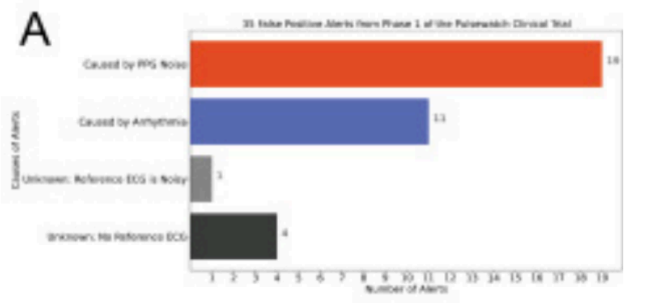

# Desarrollar o mejorar un algoritmo capaz de diferenciar entre movimientos rutinarios, como rascarse el pecho o cepillarse los dientes, y las arritmias cardíacas 

## Introducción
Actualmente para el diagnóstico de enfermedades cardiacas y/o arritmias se hacen uso de diferentes dispositivos. Entre los más reconocidos se encuentran ECG (electrocardiograma) [1], Holters [2], Ecocardiograma [3],Tomografía Computarizada [4], entre otros.
Todos estos dispositivos lo que tienen en común es que el médico especialista requiere de las señales e imágenes generadas por estos dispositivos para realizar el diagnóstico.

En el caso de los ECG o Holters, se encargan de detectar los impulsos eléctricos del corazón mediante la inervación del órgano [1]. Lo relevante de estos dispositivos en el5 caso del ECG es que es fundamental una correcta colocación de los electrodos en posiciones específicas del tórax para obtener un registro adecuado (en el caso de las derivaciones precordiales). Además, en el caso de los Holters, que registran la actividad cardíaca durante un período prolongado (generalmente 24 a 48 horas [2]), se requiere que el paciente mantenga un nivel de actividad controlado y evite movimientos bruscos que puedan interferir con la calidad de los datos obtenidos.
Un ejemplo notable de cómo los movimientos pueden afectar la señal del ECG es el fenómeno conocido como "taquicardia por cepillado de dientes"[5]. Este fenómeno ocurre cuando el movimiento al cepillarse los dientes genera interferencias que simulan actividad cardíaca rápida en los registros del ECG.
Ahora que tenemos una gran cantidad de dispositivos wearables que también buscan realizar funciones similares a los software que utilizan Holters y ECG, es notorio que hay una falencia en cómo estos dispositivos llegan a alertar a los pacientes de que tienen cierta enfermedad. Esto es debido a que los parámetros seleccionados llegan a ser ineficientes, o como se mencionó anteriormente, debido a movimientos espontáneos, llevando a falsos positivos[6].     
Para ilustrar este fenómeno, se presenta el caso de un paciente con fibrilación auricular paroxística, quien había comenzado el tratamiento con flecainida tres semanas antes de someterse a un examen de ECG Holter. La grabación mostró dos breves episodios de actividad cardíaca rápida, uno antes de acostarse y otro por la mañana. Tras una investigación más detallada, se descubrió que estos episodios coincidían con la rutina de cepillado de dientes del paciente. En la actualidad, el único método confiable para confirmar o refutar esta observación es mediante la comparación cruzada con el diario del paciente, un detalle que los médicos no siempre tienen fácilmente disponible.[5]

## Estado del arte
### **BeamO**  
Este es un dispositivo comercial multifuncional para el monitoreo en casa. Se basa en la combinación de un ECG de una derivación, un oxímetro de pulso, un termómetro inalámbrico y un estetoscopio digital, de modo que permite el diagnóstico de problemas cardíacos como arritmias. Además, la app permite compartir los datos con un médico, lo que resulta en una mejora en el seguimiento y diagnóstico. [7]

[Fig. 1 Dispositivo BeamO]

### **Apple Watch**  
Este es un dispositivo comercial que consta de un sensor de ECG de una derivación, lo que permite un monitoreo continuo. Además, este dispositivo presenta algoritmos que correlacionan los datos obtenidos con otros sensores como acelerómetro y giroscopio, de modo que se puedan distinguir las variaciones normales causadas por las actividades cotidianas y posibles patologías cardíacas. [8]

 

[Fig. 2 Dispositivo Apple Watch]

## Estadísticas

Al usar los ECG, estos dispositivos usualmente tiene un software como herramienta para que ayude a detectar anomalías en los trazos del ECG. Sin embargo, estos software no logran ser fiables por los error que llega a cometer, en un estudio se vio que el software malinterpreta el infarto de miocardio (STEMI) con condiciones como el bloqueo de rama derecha, hipertrofia ventricular y el patrón de tipo Brugada. Esto se debe a la incapacidad de interpretar correctamente los complejos QRS y las ondas ST [7R]. Entonces, existe cierto antecedente que nos indica ciertas falencias en estos dispositivos, y en particular, al momento de interpretar las bioseñales. Esta falencia no sólo se limita a confundir una enfermedad por otra, sino que puede llegar al punto de notificar una enfermedad cuando el paciente no la posee.

### **Evaluation of atrial fibrillation using wearable device signals and home blood pressure data in the Michigan Predictive Activity & Clinical Trajectories in Health (MIPACT) Study: A Subgroup Analysis (MIPACT-AFib) [8A]**

Con el alza de los dispositivos wearables empezó a surgir evidencia de que los dispositivos wearables con capacidades de detección de arritmias generan en ocasiones falsos positivos. Este estudio buscó evaluar la detección de fibrilación atrial (AF) de dispositivos wearables, y contó con inicialmente 6765 participantes adultos. Se evaluó el desempeño de un modelo de Apple Watch con la capacidad de realizar ECG vía un aplicativo, el OmronBP entre otros. De este total se seleccionaron finalmente 2615. De estos hubo 86 notificados de irregularidades en el ritmo cardíaco, de los cuales 76 pudieron ser evaluados en su totalidad. Solamente 5 fueron confirmados como fibrilación auricular, dando como resultado que alrededor del **93% de alarmas de ritmo cardiaco irregular no correspondían a arritmias.**

![Diagrama de flujo de selección de participantes[8A]
](Imagenes/diagrama_flujo.png) 

Diagrama de flujo de selección de participantes[8A]

\
Estos falsos positivos no solo implican un error en la lectura e interpretación de datos por parte de los dispositivos, sino que también en las personas. El mismo estudio reporta que alrededor del 33% de participantes sufrió de ansiedad media-moderada, por lo que también este problema representa una carga mental considerable para el paciente. 

### **False Atrial Fibrillation Alerts from Smartwatches are Associated with Decreased Perceived Physical Well-being and Confidence in Chronic Symptoms Management [9A]**

Este estudio basó su diseño en el ensayo clínico Pulsewatch (NCT03761394) para su realización. Hoy en día existen multitud de wearables en el ámbito cardiaco diseñados para su uso en la muñeca que han sido aprobados por la FDA. Los dispositivos comerciales más populares, como lo son los smartwatches de Apple, Samsung y Fitbit, se basan en el uso de algoritmos electrocardiográficos y pletismográficos de pulso. Estos algoritmos son capaces de detectar irregularidades en el ritmo. No obstante, existe evidencia de que estos dispositivos no son infalibles. Se hace referencia al estudio realizado por Apple, Apple Heart Study, donde de los 450 participantes que recibieron notificaciones en este estudio, sólo 34% fueron diagnosticados finalmente con AF, dejando un total de 66% falso positivos.

Respecto a su metodología, y como se mencionó anteriormente, se basó en el ensayo Pulsewatch (NCT03761394). Se tuvieron dos grupos, los cuales fueron evaluados durante 14 días:

* Grupo control: Usaron un monitor de parche ECG
* Grupo de testeo: Usaron el sistema Pulsewatch (sistema basado en un smartwatch y smartphone con sistema operativo Android) capaz de detectar arritmias + un monitor de parche ECG

El sensor del smartwatch estaba programado para la lectura cada 10 minutos. En caso de detectarán 1.5 minutos de AF, se enviaba una notificación vía smartwatch de “quedarse quieto” por 1 minuto para mayor análisis, y en caso se siga detectando se enviaba la notificación de “anormalidad”.

Alertas del smartwatch[9A]

El sensor del smartwatch estaba programado para la lectura cada 10 minutos. En caso de detectarán 1.5 minutos de AF, se enviaba una notificación vía smartwatch de “quedarse quieto” por 1 minuto para mayor análisis, y en caso se siga detectando se enviaba la notificación de “anormalidad”. Si estas no coincidían con la lectura del monitor ECG se consideraban como falsos positivos.

De los 85 participantes que recibieron el sistema Pulsewatch, 15 recibieron alertas de AF, de las cuales **67% (10) resultaron falsos positivos**. En este grupo que recibió falsos positivos, algunos pacientes llegaron a recibir hasta 13 alertas falsas, llegando a un total de 35 alertas falsas en todo el grupo de falsos positivos.

Distribución de las alertas falsas en los 10 participantes[9A]

Se menciona de igual manera que uno de los principales motivos de estas notificaciones erróneas se debe a **ruidos o interferencias**, seguido de arritmias menores que no representan un peligro para la persona.

Principales causas de las alertas falsas[9A]

## Problemática detectada

Carencia de softwares especializados para dispositivos cardiacos wearables que permitan distinguir las diferencias entre actividades rutinarias con patologías a nivel de bioseñal.

## Bases de datos

El objetivo es lograr desarrollar o mejorar un algoritmo que sea capaz de  diferenciar los movimientos rutinarios, como rascarse el pecho y/o cepillarse los dientes respecto a las arritmias cardiacas .

Para ello, contamos con las siguientes bases de datos:

- ### A large scale 12-lead electrocardiogram database for arrhythmia study[R1]
  Versión: 1.0.0 (physionet.org).
  
  Esta base de datos proporciona ECG de personas con arritmias cardíacas, junto con su diagnóstico respectivo.

- ### Base de datos de personas sanas con ECG (nosotros), realizando movimientos cotidianos

  En esta base de datos se recopilan ECG de personas sanas realizando ciertas actividades rutinarias, con el propósito de ampliar la base de datos y tener una referencia más extensa.
  
El propósito de este análisis es comparar los trazados ECG de personas con arritmias cardíacas y los trazados en personas sanas con los artefactos producidos por movimientos cotidianos. De esta manera, se busca identificar qué movimientos rutinarios pueden ser confundidos con una arritmia.

## Propuesta frente a la problemática

Entrenar un modelo de Machine Learning para diferenciar entre un trazado de ECG afectado por un movimiento rutinario y un trazado de ECG con una arritmia.

## Bibliografía
    CHECAR ESTO
[1] Biblioteca Nacional de Medicina de EE. UU., "Electrocardiograma," MedlinePlus, [en línea]. Disponible en: https://medlineplus.gov/spanish/pruebas-de-laboratorio/electrocardiograma/. [Accedido: 06-sep-2024].

[2] Biblioteca Nacional de Medicina de EE. UU., "Monitor Holter (24 horas)," MedlinePlus, [en línea]. Disponible en: https://medlineplus.gov/spanish/ency/article/003877.htm. [Accedido: 06-sep-2024].

[3] Mayo Clinic, "Ecocardiograma," [en línea]. Disponible en: https://www.mayoclinic.org/es/tests-procedures/echocardiogram/about/pac-20393856. [Accedido: 06-sep-2024].

[4] Biblioteca Nacional de Medicina de EE. UU., "Tomografía computarizada," MedlinePlus, [en línea]. Disponible en: https://medlineplus.gov/spanish/ctscans.html. [Accedido: 06-sep-2024].

[5] M. Khalili, H. GholamHosseini, A. Lowe, et al., "Motion artifacts in capacitive ECG monitoring systems: a review of existing models and reduction techniques," Med. Biol. Eng. Comput., 2024. [En línea]. Disponible en: https://doi.org/10.1007/s11517-024-03165-1.  [Accedido: 06-sep-2024].

[6] K.-V. Tran et al., "False Atrial Fibrillation Alerts from Smartwatches are Associated with Decreased Perceived Physical Well-being and Confidence in Chronic Symptoms Management," Cardiology and Cardiovascular Medicine, vol. 7, no. 2, p. 97, 2023. [Online]. Available: https://www.fortunejournals.com/articles/false-atrial-fibrillation-alerts-from-smartwatches-are-associated.pdf.

[7] “Descubra beamo: Dispositivo compacto de salud en el hogar 4 en 1 Con Estetoscopio Digital, Termómetro, Oxímetro y Ecg de 1 derivación. perfecto para autochequeos O televisitas en vivo. - beamo”. [En línea]. Disponible en: https://www.withings.com/es/es/beam-o. [Accedido: 06-sep-2024].

[8] “Apple Presenta El Apple watch series 8 y el Nuevo Apple watch se,” Apple Newsroom (España). [En línea]. Disponible en: https://www.apple.com/es/newsroom/2022/09/apple-reveals-apple-watch-series-8-and-the-new-apple-watch-se/ . [Accedido: 06-sep-2024].

[7R]L. Littmann, "Common ECG interpretation software mistakes. Part I: False reporting of myocardial infarction," Journal of Electrocardiology, vol. 81, pp. 32-35, 2023. [Online]. Available: https://doi.org/10.1016/j.jelectrocard.2023.07.011.

[8A] A. Pastapur, N. A. Pescatore, N. Shah, S. Kheterpal, B. K. Nallamothu, and J. R. Golbus, “Evaluation of atrial fibrillation using wearable device signals and home blood pressure data in the Michigan Predictive Activity & Clinical Trajectories in Health (MIPACT) Study: A Subgroup Analysis (MIPACT-AFib),” Frontiers in Cardiovascular Medicine, vol. 10, Dec. 2023, doi: 10.3389/fcvm.2023.1243574.

[9A] K.-V. Tran et al., “False Atrial Fibrillation Alerts from Smartwatches are Associated with Decreased Perceived Physical Well-being and Confidence in Chronic Symptoms Management,” Cardiology and Cardiovascular Medicine, vol. 07, no. 02, Jan. 2023, doi: 10.26502/fccm.92920314. 

[R1]J. Zheng, H. Guo, y H. Chu, "A large scale 12-lead electrocardiogram database for arrhythmia study (version 1.0.0)," PhysioNet, 2022. [En línea]. Disponible en: https://doi.org/10.13026/wgex-er52.  [Accedido: 06-sep-2024]. 