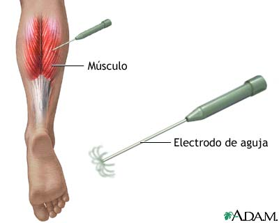
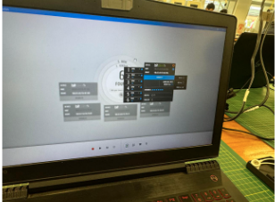

# Uso de BITalino para EMG

## Tabla de contenidos

* [Introducción](#introducción)
* [Objetivos](#objetivos)
* [Materiales y objetivos usados](#materiales-y-equipos-usados)
* [Procedimiento](#procedimiento)
* [Resultados](#resultados)
* [Referencias bibliográficas](#referencias-bibliográficas)
* [Anexos](#anexos)
  
## Introducción
El BITalino es una placa electrónica diseñada y fabricada por la empresa PLUX Biosignals. El principal atractivo de este dispositivo es su utilidad en lo que respecta a aplicaciones en ingeniería biomédica, por su capacidad de captar distintas señales fisiológicas del cuerpo y digitalizarlas para un procesamiento posterior. Entre los algunos tipos de bioseñales que el BITalino puede adquirir, encontramos electroencefalograma (EEG), electrocardiograma (ECG), electromiografía (EMG) y actividad electrodérmica (EDA). Los distintos implementos físicos para capturar estas señales también están incluidos en el kit del BITalino: electrodos con sus respectivos cables. 

 

<b>
Figura 1: Electrodos incluidos en el kit BITalino
</b>

 

<b>
Figura 2: Leyenda del significado de los colores de los electrodos
</b>

  

De igual manera, cuenta con otros elementos electrónicos como un acelerómetro, buzzer, LEDs, etc.

<b>
Figura 3: Esquema de BITalino. Se puede apreciar cómo están dispuestos los sensores y elementos como el acelerómetro y módulo Bluetooth
</b>

  

Las señales captadas por la placa pueden ser visualizadas en tiempo real mediante el software OpenSignals para PC. Este hace uso de la conectividad Bluetooth que posee la placa (puede ser Bluetooth 2.0 + EDR, que mejora la velocidad de transferencia o Bluetooth 4.1 BLE) para poder así enviar los datos de forma inalámbrica hacia el ordenador, graficando amplitud vs tiempo. Estos datos pueden ser exportados en distintos formatos para su visualización y análisis en otros programas externos. Respecto a especificaciones más técnicas, el BITalino tiene la capacidad de muestrear a distintas frecuencias de muestreo: 1, 10, 100 y 1000 Hz, las cuales pueden ser seleccionadas vía el OpenSignals. La elección de la frecuencia está condicionada por la precisión y exactitud deseada, al igual que la capacidad del sensor. Por otro lado, el BITalino posee una batería recargable de polímero de litio de  3.7V, 700 mAh. Teniendo en cuenta su consumo promedio de 65mA, el BITalino tiene una autonomía de entre 8-10 horas. Su voltaje de operación es de 3.3V, y acepta en sus pines de entrada un rango de voltaje de entre 3V a 5.5V, lo que significa que cuenta con reguladores de voltaje internos.

La electromiografìa (EMG) es una prueba que se realiza para evaluar al mùsculo esquelètico y a las neuronas motoras mediante el anàlisis de las señales elèctricas enviadas por los nervios para el control de los mùsculos, como al ejecutar un movimiento [1]. Para la mediciòn de las señales del EMG, hay dos tipos principales de electrodos: electrodos de aguja, los cuales, se introducen directamente al mùsculo y registran actividad elèctrica [2], y electrodos superficiales, que se basan en detectar cambios quìmicos entre la superficie muscular y la piel, referidos a la conducciòn electrolìtica [3]. 

<b>
Figura 4: EMG mediante el uso de electrodos de aguja [4]
</b>

  

<b>
Figura 5: EMG mediante el uso de electrodos superficiales [5]
</b>

  

Ambas tècnicas, ademàs de diferenciarse por la invasividad, se diferencian en la informaciòn que proporcionan, por ejemplo, la electromiografìa de agujas ofrece informaciòn sobre estructura y daño muscular, mientras que la electromiografìa de superficie (uso de electrodo superficial) ofrece informaciòn sobre activaciòn de los mùsculos en una actividad o postura determinada. Esto ofrece oportunidades en el campo de la medicina, puesto que permite evaluar patologìas en la marcha, fatiga muscular (en medicina deportiva), coactivaciòn muscular (para el estudio de pacientes, por ejemplo, con Sìndrome de Down), ayuda en el proceso de rehabilitacòn (tècnica de biofeedback), anàlisis de movilidad articular, mejorar la ergonomìa (para anàlisis de riesgos en ambiente laboral) y entre otros [6]. Cabe destacar que, al realizar una prueba EMG en un mùsculo sano, se espera obtener señales elèctricas cuando el mùsculo està en uso y ninguna señal cuando el mùsculo està en reposo [1]; ademàs, que estas señales son esperadas en un rango de 0 a 500 Hz, ademàs de una amplitud de voltaje que varìe de 0 a 6 mV [7].

## Objetivos
* Aprender a usar el BITalino para la captura de señales de EMG superficial
* Analizar los EMG del tricep, bícep y gastrocnemio y ver cómo varía respecto a sus contracciones
* Analizar los movimientos en reposo, movimientos simples y aquellos que aumentan gradualmente en intensidad, en función de su frecuencia 

## Materiales y equipos usados
* BITalino
* Electrodos (superficiales)
* Open Signals (programa)
* Laptop
* Python (lenguaje de programación)

## Procedimiento
1. Conectamos los electrodos en el cable del sensor de EMG
2. Conectamos el cable en el puerto de EMG [A]
3. Colocamos la batería del BITalino y lo encendemos [B]
4. Enlazamos el BITalino mediante bluetooth a una laptop/pc
5. Se abre el Open Signals y se vincula con el BITalino [C]
6. Realizar la configuración del canal y sensor a usar, en este caso es EMG [D]
7. Conectamos los electrodos en los músculos que se analizarán [E]
8. Se inicia la adquisición de datos en el Open Signals [F]
9. Cada participante ejecutará, según el músculo que le corresponde: reposo, ejecución de fuerza sin carga y ejecución de fuerza con carga.
10. Se detiene la adquisición de datos cuando cada participante finalice la ejecución de cada acción. Se guardan los datos en formato txt.
11. Se vuelve a adquirir datos y el participante ejecutará la siguiente acción. Se detiene la adquisición al finalizar la acción. Se repetirá este proceso hasta que cada participante haya realizado las 3 acciones.
12. Se realiza el procesamiento de datos utilizando el lenguaje de programación Python [8] [9] (mediante el aplicativo Visual Studio Code) y se entregarán las gráficas de la señal obtenida, filtrada y su espectro.

## Resultados

## Referencias bibliográficas
[1] “Electromiografía y estudios de conducción nerviosa: Prueba de laboratorio de MedlinePlus”. Disponible en: https://medlineplus.gov/spanish/pruebas-de-laboratorio/electromiografia-y-estudios-de-conduccion-nerviosa/.

[2] “Electromiografía - Mayo Clinic”. Disponible en: https://www.mayoclinic.org/es/tests-procedures/emg/about/pac-20393913. 

[3] V. Gohel y N. Mehendale, “Review on electromyography signal acquisition and processing”, Biophys Rev, vol. 12, núm. 6, pp. 1361–1367, nov. 2020, doi: 10.1007/s12551-020-00770-w. Disponible en: https://www.ncbi.nlm.nih.gov/pmc/articles/PMC7755956/.

[4] “Electromiografía: MedlinePlus enciclopedia médica”. Disponible en: https://medlineplus.gov/spanish/ency/article/003929.htm.

[5]“came: Grupo de Investigación Biomédica - Electromiografía (EMG) - Dal”. Disponible en: https://www.dalcame.com/emg.html. 

[6] F. Javier y F. Juan-Garcia, “UTILIDAD DE LA ELECTROMIOGRAFÍA DE SUPERFICIE EN REHABILITACIÓN”, mar. 2017.

[7] E. Garcìa, G. Rojas, O. Nava y J. Ramiro, “Diseño y construcción de un prototipo de detecciòn de señales mioelèctricas de bajo costo”, Revista Electrònica ANFEI Digit., vol. 7, n.º 12, p. 10, 2020. [En línea]. Disponible: https://anfei.mx/revista/index.php/revista/article/view/661/1302

[8] J. A. Cortés Gómez, D. S. Acebes Moreno, L. M. Peñuela Calderón, y A. Velasco Vivas, «Detección de fuerza y posición para los movimientos de flexión-extensión de codo a partir de señales de EMG», reveia, vol. 20, n.º 39, pp. 3924 pp. 1–20, feb. 2023. 

[9] R. Guzmán-Venegas et al., “Efecto de la Amplitud de la Onda M sobre la Concordancia entre Evaluadores y el Número de Zonas de Inervación Detectadas en el Gastrocnemio Medial Mediante Electromiografía Multicanal”, International Journal of Morphology, vol. 41, núm. 6, pp. 1775–1780, 2023, doi: 10.4067/S0717-95022023000601775. Disponible en: http://www.scielo.cl/scielo.php?script=sci_abstract&pid=S0717-95022023000601775&lng=es&nrm=iso&tlng=en

## Anexos
--- 
[A] Conexión de los cables de los electrodos del EMG

---
[B] Conexión de la batería al BITalino

--- 
[C] Vinculación del Open Signals con el BITalino

---
[D] Realizar la configuración del canal

---
[E] Conexiones a los músculos que se analizarán

---
[F] Open Signals capturando la data

