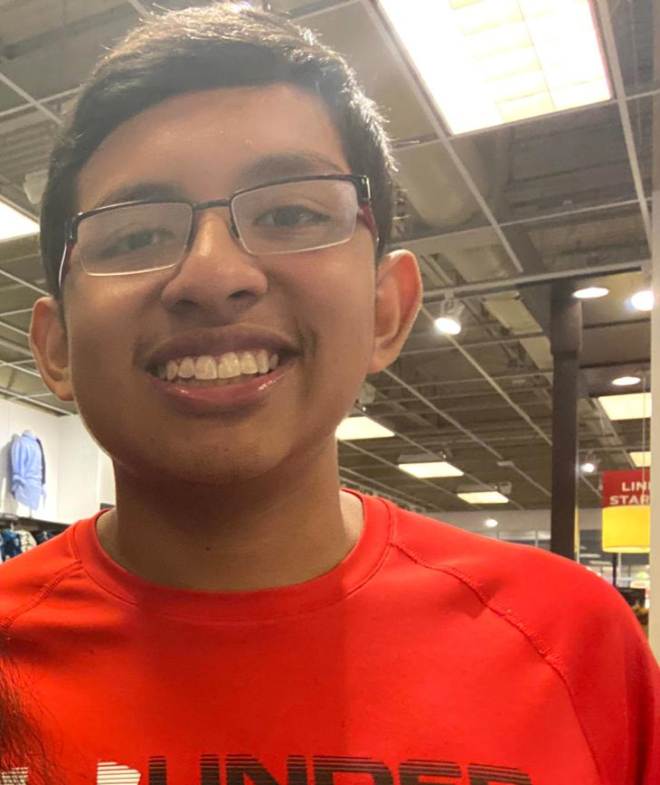

# Bienvenidos al repositorio del Grupo 6 del curso "Introducción a señales Biomédicas"

# Tabla de contenidos 
- [Participantes](#participantes)

#Participantes
- [Rogger Anthony Huaman Gonzales](INTEGRANTES_IMAGENES/ROGGER.png)
- 