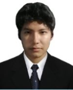
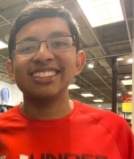
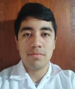
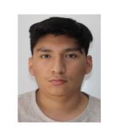
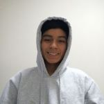

# Bienvenidos al repositorio del Grupo 6 del curso "Introducción a señales Biomédicas"

# Tabla de contenidos 
- [Participantes](#participantes)
- [Docentes](#docentes)

## Participantes
- [Rogger Anthony Huaman Gonzales](Otros/INTEGRANTES_IMAGENES/ROGGER.jpg) (colaborador) ► rogger.huaman@upch.pe
- [Alejandro Javier Rosas Gonzalez Zuñiga](Otros/INTEGRANTES_IMAGENES/alejandro.jpg) (colaborador) ► alejandro.rosas@upch.pe
- [Hiroshi Julio Kameya Inafuku](Otros/INTEGRANTES_IMAGENES/Hiroshi.jpg) (colaborador) ► hiroshi.kameya@upch.pe
- [David Sebastian Puma Silva](Otros/INTEGRANTES_IMAGENES/Deivid.jpg) (colaborador) ► david.puma@upch.pe
- [Diego Alberto Cuba Monterola](Otros/INTEGRANTES_IMAGENES/EvidenciaDiego.jpg) (colaborador) ► diego.cuba@upch.pe

| Rogger Huaman | Alejandro Rosas | Hiroshi Kameya|
| :-------: | :-------: | :-------: |
|| | 

|David Puma| Diego Cuba |
|:-------: | :-------:|
| | |

## Docentes
- Moises Stevend Meza Rodriguez
- Umbert Lewis De la Cruz Rodriguez
- Jose Alonso Caceres Del Aguila

